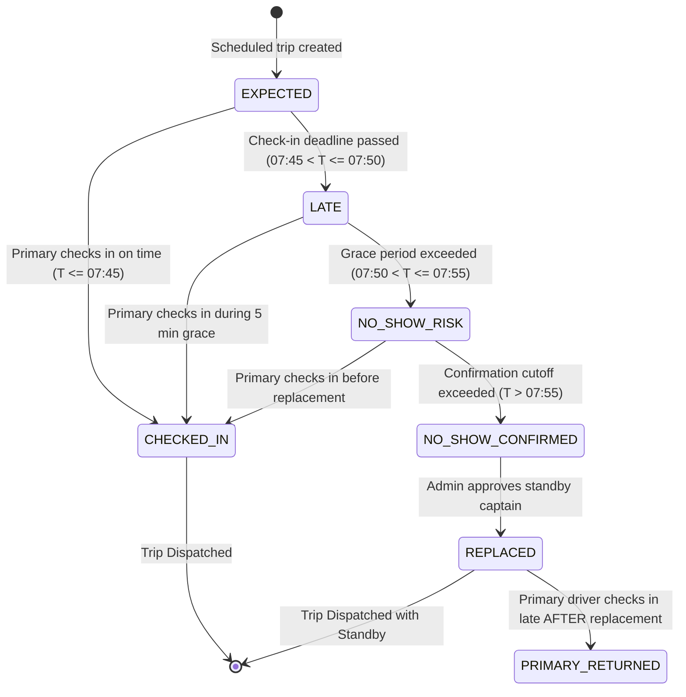

# 🔄 DRIVER NO-SHOW & AUTOMATED CONTINGENCY ENGINE

## Technical Specification & Academic Architecture Documentation

> **Academic Integrity Notice (MCA Defense / Viva Voce)**:
> The driver suitability score is **an operational suitability score based on configured business criteria**. It is **NOT** a prediction of driver performance or safety. All candidate rankings, eligibility filters, and causal justifications are calculated deterministically using clear business rules and interval mathematics.

---

## 1. Problem Statement

In corporate commute transit networks, unpredictable driver absence or late arrival without notice ("no-show") causes severe service degradation:
- Dispatchers discover missing drivers only after commuters report stranded shuttles at pickup stops.
- Manual emergency replacements are made in an ad-hoc rush without assessing driver corridor familiarity, proximity, or vehicle capacity.
- Commuters wait at bus stops without clear updates, increasing anxiety and safety risks.

The **Driver No-Show & Automated Contingency Engine** introduces pre-dispatch check-in monitoring, deterministic grace-period state progression, automated standby driver search and multi-factor ranking, and automated commuter notifications.

---

## 2. Check-In Monitoring & Grace Period Policies

Check-in parameters are centralized in [`src/lib/operations/driver-monitor-config.ts`](file:///c:/Users/Ideapad/Documents/antigravity/fearless-galileo/src/lib/operations/driver-monitor-config.ts):

| Parameter | Configured Value | Description |
|---|---|---|
| `CHECK_IN_DEADLINE_MINUTES_PRIOR` | $15\text{ minutes}$ | Driver must confirm availability 15 minutes before scheduled route departure (e.g. 07:45 AM for an 08:00 AM trip). |
| `GRACE_PERIOD_MINUTES` | $5\text{ minutes}$ | $0$–$5\text{ min}$ past deadline: classified as `LATE` 🟡. Advisory alert; no premature replacement. |
| `NO_SHOW_RISK_MINUTES` | $10\text{ minutes}$ | $5$–$10\text{ min}$ past deadline: classified as `NO_SHOW_RISK` 🟠. Admin alerted; standby candidate pool evaluated. |
| `NO_SHOW_CONFIRMATION_MINUTES` | $> 10\text{ minutes}$ | $> 10\text{ min}$ past deadline: classified as `NO_SHOW_CONFIRMED` 🔴. Standby captain replacement becomes mandatory. |

---

## 3. No-Show State Machine



---

## 4. Standby Candidate Filtering (Hard Constraints)

A driver in the standby pool is strictly deemed **ineligible** ($Score = 0$) if ANY of the following rules are violated:
1. **Verification Compliance**: `isVerified === false` (Must possess verified commercial driving license and KYC documents).
2. **Current Operational Status**: Driver status is `OFFLINE` or `ON_TRIP` (Must be `AVAILABLE` or `STANDBY`).
3. **Approved Leave Exclusion**: Driver has an active approved `LeaveRequest` spanning the trip date.
4. **Concurrent Trip Conflict**: Driver is already assigned to a concurrent trip on the same date and shift (`MORNING_PICKUP` / `EVENING_DROP`).
5. **Vehicle Capacity**: Vehicle capacity must meet or exceed route active subscriptions ($C_{\text{veh}} \ge N_{\text{passengers}}$).
6. **Maximum Proximity Distance**: Distance from driver standby location to route origin exceeds $15.0\text{ km}$.

---

## 5. Candidate Suitability Ranking Formula

For all candidates satisfying hard constraints, the engine computes an **Operational Suitability Score** ($0$–$100$):

$$\text{SuitabilityScore} = w_{\text{avail}} \cdot S_{\text{avail}} + w_{\text{route}} \cdot S_{\text{route}} + w_{\text{prox}} \cdot S_{\text{prox}} + w_{\text{shift}} \cdot S_{\text{shift}} + w_{\text{veh}} \cdot S_{\text{veh}}$$

Configured weights ($\sum w = 1.0$):
- **Availability ($w_1 = 0.30$)**: $100$ for registered standby drivers; $85$ for available off-duty drivers.
- **Corridor Compatibility ($w_2 = 0.25$)**: $100$ if previously operated the same corridor; $80$ for adjacent corridor; $55$ for general verified driver.
- **Proximity Distance ($w_3 = 0.20$)**: Linear scale based on Haversine distance:
  $$S_{\text{prox}} = \max\left(0, \min\left(100, 100 \cdot \left(1 - \frac{\text{DistanceKm}}{15.0}\right)\right)\right)$$
- **Shift Compatibility & Rating ($w_4 = 0.15$)**: Scaled from driver rating: $\frac{\text{Rating}}{5.0} \times 100$.
- **Vehicle Document Match ($w_5 = 0.10$)**: $100$ for approved RC and insurance documents.

### Score Similarity & Tie-Break Detection
If the difference between the top candidate and the second-ranked candidate is $\le 3.0$ points ($|Score_A - Score_B| \le 3.0$), the system alerts Admin:
> *"⚠️ Standby captains Arun (94) and Vijay (93) have comparable operational suitability (1 pt diff). Admin discretion recommended."*

---

## 6. Recommendation Explanation Generator

Every recommendation provides human-readable causal justifications citing actual metrics:
- **Why Arun?**: *"✓ Available standby captain with verified credentials • ✓ Qualified for HSR Layout to ITPB Whitefield corridor • ✓ 2.1 km from pickup origin • ✓ Verified vehicle documents with 6-seat capacity • ✓ Strong operational rating (4.9/5.0)"*
- **Why Not Vijay?**: *"✓ Available • ⚠ Different primary corridor qualification • ⚠ Proximity distance (5.8 km) may add slight initial transit time"*

---

## 7. Race Condition & Concurrency Strategy

1. **Optimistic Pre-Assignment Revalidation**:
   Before updating database records, the system re-validates:
   - Trip has not already been marked `in_transit`.
   - Another administrator has not already assigned a replacement.
   - Selected standby driver has not accepted another route in the last minute.
2. **Primary Driver Late Arrival Guard (`PRIMARY_RETURNED`)**:
   If the primary driver checks in *after* a standby replacement has been assigned:
   - The system **does NOT** automatically revert the trip or overwrite the replacement.
   - It transitions the check-in to `PRIMARY_RETURNED`.
   - An alert is logged in `CoverageAuditLog` and displayed to Admin for manual review.

---

## 8. Cross-Feature Integrations

1. **Smart ETA**: Adds configured substitution delay ($+7\text{ min}$) to the route's traffic-adjusted ETA without altering the core Haversine speed model.
2. **Safety Score**: Replacement drivers must be KYC/license-verified. Because the driver is verified, the Driver Verification dimension remains **20/20** (operational substitution is not penalized as a safety violation).
3. **Anomaly Detection**: Missed check-ins past the grace period emit a `DRIVER_VERIFICATION_ISSUE` safety event into `prisma.safetyEvent`.
4. **Commuter Notifications**: Commuters receive neutral, reassuring notifications via `prisma.notification`:
   > *"🔄 Shuttle Captain Update: Your SmartRide captain has been updated for today's SR-101 trip. Captain Arun is operating your shuttle. Your reserved seat remains Seat #4."*
5. **Driver Leaves**: Approved driver leaves automatically exclude drivers from being selected as standby candidates.

---

## 9. Database Architecture (`prisma/schema.prisma`)

```prisma
model DriverCheckIn {
  id                String    @id @default(cuid())
  tripId            String
  routeId           String
  driverId          String
  driverName        String
  scheduledDispatch String
  checkInDeadline   String
  status            String    @default("EXPECTED")
  checkedInAt       DateTime?
  date              String
  tripType          String    @default("MORNING_PICKUP")
  notes             String?
  createdAt         DateTime  @default(now())
  updatedAt         DateTime  @updatedAt
  coverageEvents    DriverCoverageEvent[]
}

model DriverCoverageEvent {
  id                    String         @id @default(cuid())
  tripId                String
  routeId               String
  checkInId             String?
  primaryDriverId       String
  primaryDriverName     String
  replacementDriverId   String?
  replacementDriverName String?
  status                String         @default("NO_SHOW_RISK")
  suitabilityScore      Float?
  noShowReason          String?
  dispatchDelayMinutes  Int            @default(0)
  detectedAt            DateTime       @default(now())
  resolvedAt            DateTime?
  resolvedBy            String?
  auditLogs             CoverageAuditLog[]
}

model CoverageAuditLog {
  id                  String   @id @default(cuid())
  coverageEventId     String?
  tripId              String
  routeId             String
  action              String
  actorId             String
  actorName           String
  primaryDriverId     String
  replacementDriverId String?
  suitabilityScore    Float?
  candidatesEvaluated String?
  justification       String
  timestamp           DateTime @default(now())
}
```

---

## 10. API Specification

| Method | Endpoint | Access | Purpose |
|---|---|---|---|
| `POST` | `/api/driver/check-in` | Driver / Admin | Driver check-in for upcoming trip with deadline evaluation. |
| `GET` | `/api/admin/driver-coverage` | Admin | Fleet-wide check-in KPIs and active coverage alerts. |
| `GET` | `/api/admin/driver-coverage/[tripId]` | Admin | Detailed trip check-in state, primary driver, and timeline. |
| `POST` | `/api/admin/driver-coverage/[tripId]/recommend` | Admin | Evaluates standby driver pool and returns ranked candidates. |
| `POST` | `/api/admin/driver-coverage/[tripId]/assign` | Admin | Transactionally assigns replacement, updates route, notifies commuters. |
| `POST` | `/api/admin/driver-coverage/simulate` | Admin (Demo) | Viva testing simulator (`CHECK_IN`, `LATE`, `NO_SHOW`, `RESET`). |

---

## 11. Role-Based Access Control (RBAC)

- **Operations Admin**: Full access to view fleet coverage, search standby pool, approve/assign replacements, and inspect audit trails.
- **Route Captain (Driver)**: Can confirm their own pre-dispatch check-in and view assigned standby replacement notices. Cannot modify scoring or assign other drivers.
- **Commuter**: Receives neutral notifications when a captain changes. Has zero access to internal suitability scores or driver disciplinary records.
- **Public Tracker**: Views only sanitized public trip projections.

---

## 12. Viva Voce Defense Q&A

**Q1: How does the system prevent premature replacement of a driver stuck in traffic?**
*Answer: The 5-minute grace period (`LATE` state) acts as a buffer between the check-in deadline (07:45 AM) and no-show risk (07:50 AM). During this window, dispatchers are alerted without initiating replacements.*

**Q2: Does driver substitution negatively impact the Smart Trip Safety Score?**
*Answer: No. Operational substitution is not treated as a safety violation. Standby candidates are strictly filtered to require verified KYC credentials (`isVerified = true`), preserving the 20/20 Driver Verification score.*

**Q3: How are race conditions handled if two dispatchers assign different replacements simultaneously?**
*Answer: The assignment API performs pre-assignment revalidation within a database transaction. If the trip's status has already transitioned to `REPLACED` or `in_transit`, subsequent assignment attempts are rejected.*
