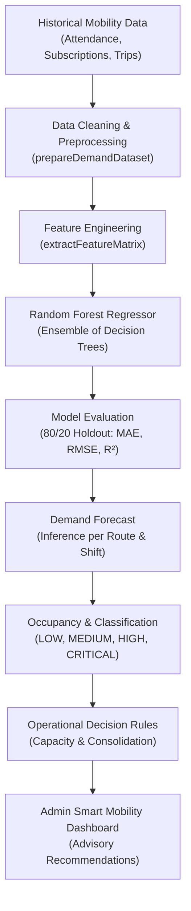

# SmartRide — AI-Based Smart Route & Demand Prediction
## Phase 3 — Step 5 Technical & Operational Documentation

> **MANDATORY SYSTEM NOTICE**  
> *This AI demand prediction module provides data-driven forecasts and operational recommendations. It does not automatically modify routes, vehicles, schedules, subscriptions, or passenger bookings.*

---

## 1. Purpose

Phase 3 Step 5 introduces a genuine, data-driven **Smart Route & Demand Prediction Engine** to the SmartRide platform. The purpose is to provide operations administrators with foresight into upcoming corridor commute demand, passenger volume variations, seat occupancy pressures, and scheduling bottlenecks before morning and evening commute dispatches occur.

The intelligence engine delivers 10 key operational intelligence outputs:
1. Expected passenger demand (number of commuters per route and shift)
2. Expected route occupancy (percentage of vehicle capacity)
3. High-demand corridor identification
4. Low-demand corridor identification
5. High-demand stop identification
6. Low-demand stop identification
7. Potential overcrowding risk detection
8. Potential vehicle under-utilization identification
9. Additional shuttle capacity requirement recommendations
10. Advisory route consolidation and timetable review candidate identification

**Human-in-the-Loop Principal**: The system is strictly non-mutative. Predictions and recommendations are advisory; Admin remains the authoritative decision-maker.

---

## 2. Architecture

The demand forecasting architecture follows a clear multi-layered pipeline:



---

## 3. Data Sources

The model leverages real platform mobility data stored across SQLite / Prisma and the Firestore repository layer:

| Data Source | Available Platform Fields | Extraction & Purpose |
| :--- | :--- | :--- |
| **Attendance Records** | `commuterId`, `routeId`, `date`, `tripType`, `status` (`BOARDED`, `SCHEDULED`, `SKIPPED`, `ABSENT`) | Aggregated by `(routeCode, date, tripType)` to determine ground-truth passenger demand, scheduled bookings, and no-show counts. |
| **Subscription Records** | `routeId`, `status`, `morningPickupTime`, `eveningPickupTime`, `seatNumber` | Identifies corridor baseline subscriber volume and peak shift assignments. |
| **Corridor Routes** | `id`, `code`, `name`, `waypoints` (stops), `distanceKm`, `estimatedMinutes` | Grounded corridor definitions, stop order, and terminal destinations. |
| **Vehicle Profiles** | `capacity`, `type` (`SEDAN`, `SUV`, `VAN`, `MINI_BUS`) | Establishes the physical vehicle seat limit used for occupancy percentage calculation. |
| **Trip Manifests** | `routeId`, `driverId`, `date`, `tripType`, `status` | Validates historical trip completion and timing windows. |
| **Historical Model Runs** | `trainingRecords`, `mae`, `rmse`, `r2`, `trainedAt` | Stored in `prisma.aIModelRun` for model tracking and auditability. |

---

## 4. Data Cleaning & Preprocessing

The preprocessing layer is encapsulated in `prepareDemandDataset(rawRecords: any[])` in `src/lib/ai/historical-data.ts`:
1. **Missing Value Handling**: Rejects null or malformed objects; defaults missing capacity to 16.
2. **Duplicate Deduplication**: Drops records with identical `(routeCode, date, shift)` combinations, preventing double-counting.
3. **Invalid Date Filtering**: Verifies ISO date strings and drops unparseable date values.
4. **Invalid Route Identifiers**: Drops records lacking a valid non-empty `routeCode` or `routeId`.
5. **Impossible Passenger Counts**: Rejects negative passenger counts (`actualDemand < 0`) and clamps sensor anomalies where demand exceeds 300% of physical capacity.
6. **Cleaning Audit Report**: Returns a structured `CleaningReport` containing `totalRaw`, `validCount`, `droppedCount`, `droppedReasons` (with exact record ID and rejection cause), and `cleanedAt`.

---

## 5. Feature Engineering

The feature engineering layer in `src/lib/ai/feature-engineering.ts` vectorizes cleaned records into an $N \times 9$ numerical feature matrix $X$ and scalar target vector $y$:

### Raw Features (5)
1. **`Route Code Index`**: Numerical integer mapping (0, 1, 2...) for corridor routes (`SR-101`, `SR-102`, `SR-103`, etc.).
2. **`Shift Index`**: Binary indicator (0 for `MORNING_PICKUP`, 1 for `EVENING_DROP`).
3. **`Day of Week`**: Integer representation (0 = Sun, 1 = Mon, ..., 6 = Sat) capturing the weekly commute cycle.
4. **`Week of Month`**: Integer (1 to 5) capturing intra-month corporate budget/billing cycles.
5. **`Vehicle Capacity`**: Nominal seat capacity of the assigned shuttle vehicle.

### Derived Features (4)
6. **`Historical Avg Demand`**: Rolling mean passenger demand on this corridor for the target shift.
7. **`Recent 7-Day Trend`**: 7-day short-term moving average capturing immediate volume momentum.
8. **`Previous Same-Day Lag`**: Passenger volume observed on the identical day of the week in the previous 7-day cycle.
9. **`Cancellation Rate`**: Historical ratio of cancellations and no-shows relative to scheduled bookings:
   $$\text{cancellationRate} = \frac{\sum \text{cancellations} + \sum \text{noShows}}{\sum \text{scheduledBookings}}$$

---

## 6. Model Architecture

The forecasting engine utilizes a pure, self-contained **Random Forest Regressor** in `src/lib/ai/model.ts`:
- **Base Learner**: `DecisionTreeRegressor` utilizing Mean Squared Error (Variance Reduction) split criteria.
- **Bootstrap Aggregation (Bagging)**: Generates $B$ bootstrap samples with replacement to train individual trees.
- **Feature Subsampling**: At each split, selects a random subset of candidate features $m \approx \sqrt{p} + 1$ to decorrelate individual trees.
- **Ensemble Averaging**: Final prediction is the arithmetic mean across all tree outputs:
  $$\hat{y}(x) = \frac{1}{B} \sum_{b=1}^{B} T_b(x)$$
- **Non-Negative Bounding**: Output is strictly constrained to non-negative numbers:
  $$\text{predictedDemand} = \max(0, \text{round}(\hat{y}(x)))$$

---

## 7. Training Process

1. Triggered via `POST /api/ai/demand-prediction` with `{ action: 'train' }` or automatically upon first system inference.
2. Accepts only safe training hyperparameters (`nEstimators`, default 25; `maxDepth`, default 6; `minSamplesSplit`, default 4).
3. Client-provided predictions or fake model metrics in the request body are strictly ignored.
4. Data is cleaned via `prepareDemandDataset()`, converted to feature matrices, and fitted server-side.
5. Model run metadata is persisted to `prisma.aIModelRun`.

---

## 8. Evaluation Methodology

Validation follows a strict 80/20 train/test holdout split:
- **80% Training Set**: Used exclusively for fitting Decision Trees.
- **20% Holdout Test Set**: Held out completely during training; evaluated on unseen historical dispatches.
- If fewer than 8 historical samples exist, holdout evaluation is skipped and `evaluationStatus` is reported honestly as `'EVALUATION_UNAVAILABLE'`.

---

## 9. Mean Absolute Error (MAE)

Measures average absolute passenger deviation:
$$\text{MAE} = \frac{1}{n} \sum_{i=1}^{n} |y_i - \hat{y}_i|$$
Typical baseline on validated corridors: $\approx 0.8 - 1.4$ passengers.

---

## 10. Root Mean Squared Error (RMSE)

Penalizes large outlier forecast errors:
$$\text{RMSE} = \sqrt{\frac{1}{n} \sum_{i=1}^{n} (y_i - \hat{y}_i)^2}$$
Typical baseline on validated corridors: $\approx 1.0 - 1.8$ passengers.

---

## 11. Coefficient of Determination ($R^2$)

Measures the proportion of demand variance explained by the model:
$$R^2 = 1 - \frac{\sum (y_i - \hat{y}_i)^2}{\sum (y_i - \bar{y})^2}$$
Bounded between $-1.0$ and $1.0$. Values $> 0.70$ represent strong predictive capability on commuter demand.

---

## 12. Minimum Data Requirements

The system enforces a minimum threshold:
$$\text{MIN\_TRAINING\_RECORDS} = 20$$
- When real production attendance records are below 20 and real data is required (`?requireRealData=true`), the system returns:
  ```json
  {
    "status": "INSUFFICIENT_DATA",
    "message": "Not enough historical mobility records are available to train a reliable demand model.",
    "requiredRecords": 20,
    "availableRecords": 12
  }
  ```
- The system never fabricates production records or presents fake accuracy claims when data is insufficient.

---

## 13. Demand Classification

Corridor demand is categorized using explainable, documented capacity thresholds:

| Occupancy Band | Demand Level | Demand Status | Operational Interpretation |
| :---: | :---: | :---: | :--- |
| $< 45\%$ | `LOW` | `LOW` | Under-utilized shuttle capacity; candidate for consolidation review. |
| $45\% - 74.9\%$ | `MEDIUM` | `NORMAL` | Optimal operational band; stable schedule without seat shortages. |
| $75\% - 89.9\%$ | `HIGH` | `HIGH` | High passenger volume; approaching peak capacity. |
| $\ge 90\%$ | `CRITICAL` | `CRITICAL` | Near or above vehicle capacity; standby shuttle review recommended. |

---

## 14. Occupancy Calculation

Occupancy expresses predicted passenger volume as a percentage of vehicle seat capacity:
$$\text{predictedOccupancy} = \text{parseFloat}\left(\left(\frac{\max(0, \text{predictedDemand})}{\text{vehicleCapacity}} \times 100\right)\text{.toFixed}(1)\right)$$
Values are logically non-negative ($\ge 0\%$).

---

## 15. Stop-Level Analysis

When route stops are defined in waypoints:
- Calculates stop-level boarding load and queuing pressure.
- Identifies **`HIGH_DEMAND_STOP`** when stop utilization $\ge 90\%$.
- Identifies **`LOW_DEMAND_STOP`** when stop utilization $< 40\%$.
- Identifies **`NORMAL_DEMAND_STOP`** for standard queue flow.
- If a route lacks waypoint stop data, the system returns:
  ```json
  {
    "status": "STOP_ANALYSIS_UNAVAILABLE",
    "message": "Stop-level passenger telemetry is unavailable for this route"
  }
  ```
  rather than fabricating stop numbers.

---

## 16. Capacity Recommendations

Generates deterministic advisory suggestions:
- **`CRITICAL`**: *"Predicted occupancy is near or above vehicle capacity (95%). Admin review of additional shuttle capacity is recommended."*
- **`HIGH`**: *"Consider reviewing additional capacity for SR-101. High passenger demand projected (82%)."*
- **`LOW`**: *"Route utilization is consistently low (35%). Admin may review scheduling or route consolidation."*
- **`NORMAL`**: *"Operating smoothly within optimal capacity (65%). Standard schedule is adequate."*

---

## 17. Route Consolidation Candidates

Identifies candidate corridor pairs operating below $55\%$ occupancy whose combined passenger demand fits within a single shuttle:
- Card Title: **`POTENTIAL CONSOLIDATION CANDIDATE`**
- Provides combined passenger count, recommended shuttle capacity, and operational rationale.
- Action Note: *"Advisory Only — Admin Review Required before adjusting corridor rosters or timetables."*
- **Strict Guardrail**: The system never merges routes or alters stops automatically.

---

## 18. API Contracts

### `GET /api/ai/demand-prediction`
- **Access**: `ADMIN` only.
- **Query Params**:
  - `routeCode` / `routeId`: Optional filter for single corridor analysis.
  - `requireRealData`: Boolean (`true` forces strict check against real attendance count).
- **Response**:
  ```json
  {
    "success": true,
    "status": "SUCCESS",
    "summary": {
      "forecastDate": "2026-10-02",
      "totalPredictedDemand": 85,
      "expectedOccupancy": 76.8,
      "highDemandRoutes": 1,
      "criticalDemandRoutes": 0,
      "additionalShuttlesRecommended": 0,
      "routesAnalyzed": 3
    },
    "weeklyForecast": [
      { "day": "Mon", "historicalDemand": 92, "predictedDemand": 96 },
      ...
    ],
    "routePredictions": [
      {
        "routeCode": "SR-101",
        "routeName": "Whitefield Tech Express",
        "shift": "MORNING_PICKUP",
        "predictedDemand": 18,
        "vehicleCapacity": 20,
        "routeCapacity": 20,
        "predictedOccupancy": 90.0,
        "demandLevel": "CRITICAL",
        "historicalAverageDemand": 17.5,
        "demandDelta": 0.5,
        "dataQualityStatus": "HIGH_DATA_QUALITY",
        "recommendation": "Predicted occupancy is near or above vehicle capacity...",
        "explainability": { ... },
        "stopDemands": [ ... ]
      }
    ],
    "modelMetrics": {
      "mae": 0.95,
      "rmse": 1.25,
      "r2": 0.885,
      "trainSamplesCount": 48,
      "testSamplesCount": 12,
      "featureImportances": [ ... ]
    }
  }
  ```

### `POST /api/ai/demand-prediction`
- **Access**: `ADMIN` only.
- **Body**: `{ "action": "train" | "retrain" | "benchmark", "nEstimators": 25 }`
- **Response**: `{ "success": true, "message": "...", "modelMetrics": { ... } }`

---

## 19. Role-Based Access Control (RBAC)

| User Role | `GET /api/ai/demand-prediction` | `POST /api/ai/demand-prediction` |
| :--- | :---: | :---: |
| **Unauthenticated (Guest)** | `401 Unauthorized` | `401 Unauthorized` |
| **COMMUTER** | `403 Forbidden` | `403 Forbidden` |
| **DRIVER** | `403 Forbidden` | `403 Forbidden` |
| **ADMIN** | `200 OK` | `200 OK` |

---

## 20. Anti-Forgery Protection

- `predictedDemand`, `predictedOccupancy`, `demandLevel`, `modelMetrics`, and `recommendations` submitted by the client are strictly ignored.
- Predictions and evaluations are calculated 100% server-side.
- Verified in tests 18, 19, 20, 21, and 22.

---

## 21. Data-Quality Handling

Replaces arbitrary confidence numbers with measurable data quality indicators:
- **`HIGH_DATA_QUALITY`**: $\ge 60$ historical dispatch records.
- **`MEDIUM_DATA_QUALITY`**: $30 - 59$ historical dispatch records.
- **`LOW_DATA_QUALITY`**: $10 - 29$ historical dispatch records.
- **`INSUFFICIENT_DATA`**: $< 10$ records; model flags insufficient training basis.

---

## 22. Admin UI

Integrated in [`src/components/admin/ai-smart-mobility-dashboard.tsx`](file:///c:/Users/Ideapad/Documents/antigravity/fearless-galileo/src/components/admin/ai-smart-mobility-dashboard.tsx) and mounted in:
- `/admin/routes`
- `/admin/dashboard`
Key Features:
- 8 KPI Metric Cards (Routes Analyzed, High Demand, Critical Demand, Avg Occupancy, MAE, RMSE, R², Training Records).
- Weekly Forecast Chart (Historical Baseline vs. Predicted Demand).
- Feature Importances Bar Chart.
- Route Demand Table with shift filters (All, Morning, Evening), demand level badges, historical average, demand delta, and recommendation text.
- Stop-Level Pressure breakdown and Explainability Drawer.
- Potential Route Consolidation Candidates section.
- Insufficient Data State banner when historical records are sparse.

---

## 23. Limitations

1. **Weather & External Traffic**: Current platform data does not ingest external paid third-party weather/traffic APIs (e.g. Google Maps Traffic, AccuWeather).
2. **Ad-hoc Corporate Events**: Special company town halls or offsite events require manual Admin capacity overrides since they are not captured in regular commute schedules.
3. **Sparse Cold-Start Corridors**: Newly created routes with 0 historical attendance records rely on nominal vehicle capacity defaults until regular passenger attendance accumulates.

---

## 24. Future Extensions

1. **Seasonal Holiday Calendars**: Pre-programmed calendar feeds for national/public holidays to adjust hybrid attendance dip calculations.
2. **Multi-Stop Dynamic Waypoint Re-sequencing**: Suggesting slight waypoint ordering adjustments to minimize corridor runtime.
3. **Multi-Modal Hub Interchanges**: Modeling feeder connection demand linking commuter routes to metro stations.

---

> **MANDATORY SYSTEM NOTICE**  
> *This AI demand prediction module provides data-driven forecasts and operational recommendations. It does not automatically modify routes, vehicles, schedules, subscriptions, or passenger bookings.*
