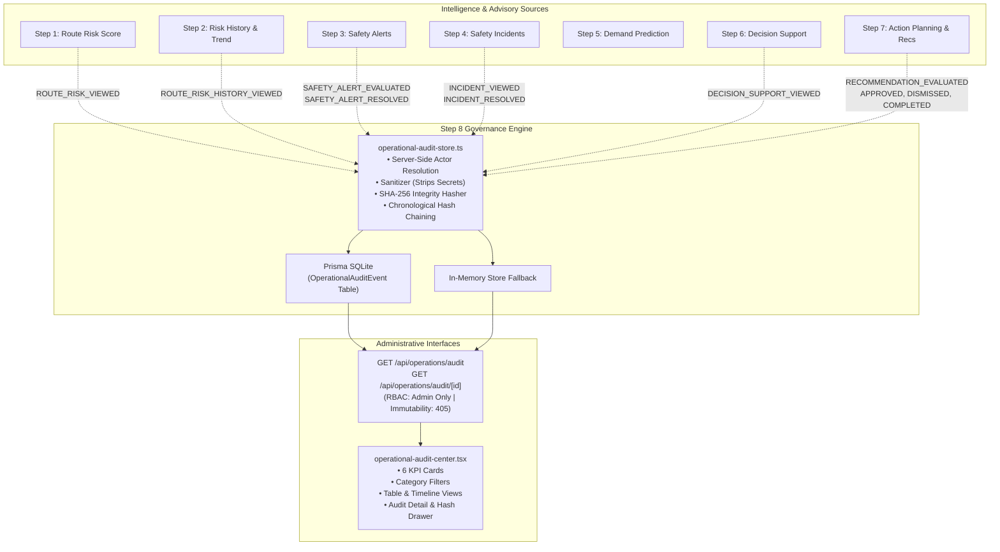

# SmartRide — Phase 3 Step 8: Operational Action Audit & Governance Center

## 1. Purpose
The **Operational Action Audit & Governance Center** introduces a complete, immutable, server-authoritative audit trail for operational intelligence and human administrative decisions across Phase 3 (Steps 1 through 7).

The governance layer definitively answers:
> *"What operational intelligence was generated, what did the administrator do with it, when did they do it, and what evidence supported that decision?"*

### Mandatory Governance Principle
> **Official Operational Statement:**
> *"Phase 3 Step 8 is an audit and governance layer. It records verified operational intelligence and administrative actions. It does not automatically execute operational changes."*
>
> *"Recommendations remain advisory and human-approved."*

---

## 2. Architecture & Upstream Integration



---

## 3. Controlled Audit Event Types

| Event Type | Source Module | Resource Type | Trigger |
| :--- | :--- | :--- | :--- |
| `RECOMMENDATION_EVALUATED` | `RECOMMENDATIONS` | `RECOMMENDATION` | Admin requests route recommendation evaluation |
| `RECOMMENDATION_APPROVED` | `RECOMMENDATIONS` | `RECOMMENDATION` | Admin approves an advisory recommendation |
| `RECOMMENDATION_DISMISSED` | `RECOMMENDATIONS` | `RECOMMENDATION` | Admin dismisses an advisory recommendation |
| `RECOMMENDATION_COMPLETED` | `RECOMMENDATIONS` | `RECOMMENDATION` | Admin marks an approved action plan as completed |
| `SAFETY_ALERT_EVALUATED` | `SAFETY_ALERTS` | `SAFETY_ALERT` | Admin evaluates corridor safety alerts |
| `SAFETY_ALERT_RESOLVED` | `SAFETY_ALERTS` | `SAFETY_ALERT` | Admin resolves an active safety alert |
| `INCIDENT_VIEWED` | `INCIDENTS` | `INCIDENT_CASE` | Admin inspects incident case details |
| `INCIDENT_UPDATED` | `INCIDENTS` | `INCIDENT_CASE` | Admin acknowledges, assigns, or adds notes to a case |
| `INCIDENT_RESOLVED` | `INCIDENTS` | `INCIDENT_CASE` | Admin resolves an operational incident case |
| `DECISION_SUPPORT_VIEWED` | `DECISION_SUPPORT` | `DECISION_SUPPORT` | Admin explicitly reviews corridor or fleet intelligence |
| `ROUTE_RISK_HISTORY_VIEWED` | `ROUTE_RISK` | `ROUTE_RISK` | Admin explicitly reviews historical risk snapshots & trends |
| `ROUTE_RISK_VIEWED` | `ROUTE_RISK` | `ROUTE_RISK` | Admin explicitly reviews corridor risk score & factors |
| `AUDIT_LOG_VIEWED` | `AUDIT` | `AUDIT_LOG` | Admin accesses operational audit logs |

---

## 4. Data Model (`prisma/schema.prisma`)

```prisma
model OperationalAuditEvent {
  id                  String   @id @default(cuid())
  eventType           String   // Controlled event types
  actorUserId         String
  actorRole           String   @default("ADMIN")
  actorEmail          String?
  actorName           String?
  routeId             String?
  routeCode           String?
  routeName           String?
  resourceType        String   // RECOMMENDATION, SAFETY_ALERT, INCIDENT_CASE, etc.
  resourceId          String?
  action              String
  description         String
  previousStateJson   String?  // Sanitized previous state
  resultingStateJson  String?  // Sanitized resulting state
  evidenceJson        String?  // Sanitized evidence
  sourceModule        String   // RECOMMENDATIONS, SAFETY_ALERTS, INCIDENTS, etc.
  correlationId       String?
  requestId           String?
  ipAddress           String?
  userAgent           String?
  integrityHash       String   // SHA-256 fingerprint
  previousEventHash   String?  // Cryptographic audit chain link
  createdAt           DateTime @default(now())

  @@index([actorUserId])
  @@index([eventType])
  @@index([routeId])
  @@index([resourceType])
  @@index([resourceId])
  @@index([createdAt])
  @@index([correlationId])
  @@index([sourceModule])
}
```

---

## 5. Immutability
Audit records are strictly append-only:
- The system exposes no update, edit, patch, or delete APIs for audit events.
- HTTP `PUT /api/operations/audit/[id]`, `PATCH /api/operations/audit/[id]`, and `DELETE /api/operations/audit/[id]` return **HTTP 405 Method Not Allowed**.
- HTTP `POST /api/operations/audit` returns **HTTP 405 Method Not Allowed** (events are recorded strictly via verified internal server workflows).

---

## 6. Cryptographic Integrity Hash
Each event contains an immutable SHA-256 cryptographic fingerprint calculated server-side from core immutable fields:

$$\text{integrityHash} = \text{SHA-256}(\text{eventType} \parallel \text{actorUserId} \parallel \text{resourceType} \parallel \text{resourceId} \parallel \text{routeId} \parallel \text{createdAt} \parallel \text{previousStateJson} \parallel \text{resultingStateJson} \parallel \text{evidenceJson} \parallel \text{correlationId} \parallel \text{previousEventHash})$$

The `verifyAuditEventIntegrity(event)` utility dynamically recomputes the fingerprint to detect database tampering.

---

## 7. Cryptographic Audit Chaining
To detect record deletion, truncation, or reordering, events are chained chronologically:
- The genesis event links to `previousEventHash: "GENESIS"`.
- Each subsequent event queries the `integrityHash` of the immediately preceding record and includes it as `previousEventHash` in its own hash computation:
  $$H_n = \text{SHA-256}(P_n \parallel H_{n-1})$$
- Modifying or deleting any historical record breaks the entire forward chain.

---

## 8. Correlation IDs
Every audit event tracks an operational correlation identifier enabling complete end-to-end lineage:
- Recommendation actions correlate by `dedupKey` or recommendation `id`.
- Alert actions correlate by alert `dedupKey` or `id`.
- Incident actions correlate by incident case `id`.
- Route queries correlate by corridor `routeId`.

---

## 9. Recommendation Auditing (Step 7 Integration)
Integrated into `src/lib/operations/recommendation-engine.ts`:
- **Evaluation**: Emits `RECOMMENDATION_EVALUATED` detailing generated vs active count.
- **Approval**: Emits `RECOMMENDATION_APPROVED` with previous state `PENDING` and resulting state `APPROVED` with server timestamp.
- **Dismissal**: Emits `RECOMMENDATION_DISMISSED` with previous state `PENDING` and resulting state `DISMISSED`.
- **Completion**: Emits `RECOMMENDATION_COMPLETED` with previous state `APPROVED` and resulting state `COMPLETED`.

---

## 10. Safety Alert Auditing (Step 3 Integration)
Integrated into alert routes:
- **Evaluation (`/api/safety/alerts/evaluate`)**: Emits `SAFETY_ALERT_EVALUATED` with generated alert types, active count, and critical count.
- **Resolution (`/api/safety/alerts/[id]/resolve`)**: Emits `SAFETY_ALERT_RESOLVED` capturing previous status `ACTIVE` and resulting status `RESOLVED` with authenticated resolver identity.

---

## 11. Incident Auditing (Step 4 Integration)
Integrated into incident routes:
- **Detail Inspection (`/api/safety/incidents/[id]?audit=true`)**: Emits `INCIDENT_VIEWED`.
- **Resolution (`/api/safety/incidents/[id]/resolve`)**: Emits `INCIDENT_RESOLVED` recording resolution summary and verified risk score.

---

## 12. Decision Support Auditing (Step 6 Integration)
Integrated into `/api/operations/decision-support`:
- Avoids noise from automated UI background polling.
- Emits `DECISION_SUPPORT_VIEWED` only on explicit admin reviews (`?audit=true`).

---

## 13. Route Risk Auditing (Step 1 & 2 Integration)
- Integrated into `/api/safety/route-risk`: Emits `ROUTE_RISK_VIEWED` on explicit review (`?audit=true`).
- Integrated into `/api/safety/route-risk/history`: Emits `ROUTE_RISK_HISTORY_VIEWED` on explicit review (`?audit=true`).

---

## 14. API Contracts

### `GET /api/operations/audit`
- **Role**: `ADMIN` (401 Guest, 403 Commuter/Driver).
- **Query Parameters**:
  - `routeId`: Filter by route identifier or code.
  - `eventType`: Filter by controlled event type.
  - `actorUserId`: Filter by administrative user ID.
  - `resourceType`: Filter by resource type.
  - `resourceId`: Filter by target resource ID.
  - `correlationId`: Filter by correlation identifier.
  - `limit`: Integer (default 50, capped at 200).
  - `from` / `to`: ISO timestamps.
- **Response**:
  ```json
  {
    "success": true,
    "events": [
      {
        "id": "aud_1790918000_abc123",
        "eventType": "RECOMMENDATION_APPROVED",
        "actorUserId": "cmtmljtu6000ueljgm2m18qrr",
        "actorRole": "ADMIN",
        "actorName": "Elena Rostova",
        "actorEmail": "admin@smartride.com",
        "routeCode": "SR-101",
        "resourceType": "RECOMMENDATION",
        "action": "APPROVE_RECOMMENDATION",
        "description": "Approved operational recommendation...",
        "previousState": { "status": "PENDING" },
        "resultingState": { "status": "APPROVED" },
        "evidence": { ... },
        "sourceModule": "RECOMMENDATIONS",
        "correlationId": "cmtmljtu6000ueljgm2m18qrr_INCIDENT_REVIEW_PENDING",
        "integrityHash": "a1b2c3d4...",
        "previousEventHash": "e5f6g7h8...",
        "createdAt": "2026-10-02T05:25:00.000Z"
      }
    ],
    "summary": {
      "total": 12,
      "recommendations": 4,
      "alerts": 3,
      "incidents": 2,
      "decisionSupport": 2,
      "riskAnalysis": 1
    }
  }
  ```

### `GET /api/operations/audit/[id]`
- **Role**: `ADMIN`.
- **Response**: Authoritative audit record + cryptographic integrity status:
  ```json
  {
    "success": true,
    "event": { ... },
    "integrity": {
      "isValid": true,
      "hash": "a1b2c3d4...",
      "previousEventHash": "e5f6g7h8..."
    }
  }
  ```

---

## 15. RBAC Enforcement
All audit endpoints verify session role strictly via `getSessionFromRequest(req)`:
- Unauthenticated requests $\to$ **HTTP 401 Unauthorized**.
- Commuter role $\to$ **HTTP 403 Forbidden**.
- Driver role $\to$ **HTTP 403 Forbidden**.
- Admin role $\to$ **HTTP 200 OK**.

---

## 16. Anti-Forgery Protections
- Actor identity (`actorUserId`, `actorRole`, `actorEmail`, `actorName`) is derived exclusively from the signed HMAC-SHA256 JWT cookie.
- Timestamps (`createdAt`) are created server-side (`new Date()`).
- Client-supplied overrides in request bodies (e.g. `actorUserId`, `riskScore`, `severity`, `evidence`) are discarded.

---

## 17. Privacy & Security Considerations
The sanitizer function `sanitizeAuditData()` strips sensitive credentials before persistence:
- Passwords and password hashes $\to$ `[REDACTED_SENSITIVE_SECRET]`
- Tokens, JWTs, and authentication cookies $\to$ `[REDACTED_SENSITIVE_SECRET]`
- Secrets and API keys $\to$ `[REDACTED_SENSITIVE_SECRET]`

---

## 18. Retention Considerations
Audit events are persisted to SQLite with indexing on `actorUserId`, `eventType`, `routeId`, `resourceType`, `createdAt`, and `correlationId`. Safe pagination limits (max 200 per page) prevent memory spikes.

---

## 19. Admin UI Component (`src/components/admin/operational-audit-center.tsx`)
Mounted on `/admin/security` with:
- **Top 6 KPI Metric Cards**: Total Audit Events, Recommendations, Safety Alerts, Incidents, Decision Support, Risk Analysis.
- **Category Filter Tabs**: ALL, RECOMMENDATIONS, SAFETY ALERTS, INCIDENTS, DECISION SUPPORT, RISK ANALYSIS.
- **Search Bar**: Instant client filtering by route, event, action, administrator, or ID.
- **Main Audit Table**: Timestamp, Administrator, Event Type, Resource & Route, Action/Description, Source Module, Integrity Hash badge, and Details button.
- **Slide-Out Evidence Drawer**: Detailed inspector displaying Actor details, Corridor info, State Transition diffs, Evidence JSON, and Cryptographic Hash verification.

---

## 20. Chronological Operational Timeline View
A toggle in the header switches between Table View and Timeline View, displaying real persisted events in chronological sequence with corridor tags, timestamps, and deep links to the audit inspector.

---

## 21. Limitations
- Single-node SQLite ledger: Hash chaining is maintained per database instance. Distributed Byzantine fault tolerance is not required for single-tenant corporate commute deployments.
- Local time synchronization relies on server system clock.

---

## 22. Technical Debt
- Audit log archiving for deployments exceeding 1,000,000 records may require periodic cold storage offloading.
- In-memory fallback is currently capped at 1,000 recent items.

---

## 23. Test Results
Automated verification suite `scratch/verify_step18.mjs` executed **50 tests**:
- **Test 1–4**: RBAC authentication (Admin 200, Guest 401, Commuter 403, Driver 403) — **PASSED**
- **Test 5–6**: Audit detail & 404 handling — **PASSED**
- **Test 7–11**: Query filtering (routeId, eventType, resourceType, correlationId, limit) — **PASSED**
- **Test 12–13**: Ordering newest first & authenticated admin identity — **PASSED**
- **Test 14–20**: Anti-forgery protections (actorUserId, actorRole, timestamp, riskScore, riskLevel, severity, evidence) — **PASSED**
- **Test 21–23**: Step 7 Recommendation audit events (Approval, Dismissal, Completion) — **PASSED**
- **Test 24–25**: Step 3 Safety Alert audit events (Evaluation, Resolution) — **PASSED**
- **Test 26**: Step 4 Incident audit events — **PASSED**
- **Test 27**: Step 6 Decision Support explicit review audit events — **PASSED**
- **Test 28**: Step 1 & 2 Route Risk review audit events — **PASSED**
- **Test 29–30**: Immutability protection (PUT/PATCH/DELETE $\to$ 405) — **PASSED**
- **Test 31–32**: Cryptographic integrity hash & verification — **PASSED**
- **Test 33**: Duplicate lifecycle rejection — **PASSED**
- **Test 34–40**: Backward compatibility checks with Steps 1–7 APIs — **PASSED**
- **Test 41**: `/admin/security` page load — **PASSED**
- **Test 42–45**: Phase 1 core invariants (Admin, Commuter, Guest, Subscriptions) — **PASSED**
- **Test 46**: Summary counts consistency (total === sum of categories) — **PASSED**
- **Test 47**: Pagination limit protection (max 200) — **PASSED**
- **Test 48**: Timeline uses only persisted events — **PASSED**
- **Test 49**: No authentication secrets in audit records — **PASSED**
- **Test 50**: Production build & type validation — **PASSED**

**Step 18 Verification Score: 50 / 50 tests passed (100%)**

---

## 24. Regression Results
All prior phase test suites were executed sequentially:
- `scratch/verify_step17.mjs` (Step 7: Recommendations): **44 / 44 PASSED (100%)**
- `scratch/verify_step16.mjs` (Step 6: Decision Support): **30 / 30 PASSED (100%)**
- `scratch/verify_step15.mjs` (Step 5: Demand Prediction): **35 / 35 PASSED (100%)**
- `scratch/verify_step14.mjs` (Step 4: Incidents): **40 / 40 PASSED (100%)**
- `scratch/verify_step13.mjs` (Step 3: Safety Alerts): **30 / 30 PASSED (100%)**
- `scratch/verify_step12.mjs` (Step 2: Risk History): **21 / 21 PASSED (100%)**
- `scratch/verify_step18.mjs` (Step 8: Audit & Governance): **50 / 50 PASSED (100%)**

**Total Combined Test Total: 250 / 250 tests passed (100%)**

---

## 25. Build Results
- `npx tsc --noEmit`: Clean exit code 0, 0 TypeScript errors.
- `npm run build`: Clean exit code 0, optimized production bundles generated, all API endpoints registered.
