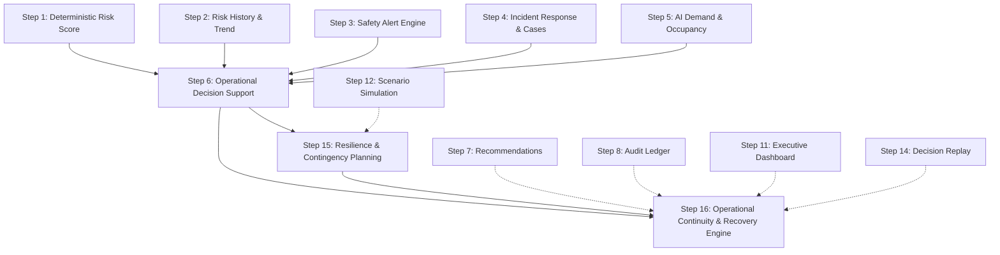
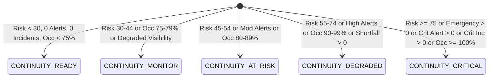
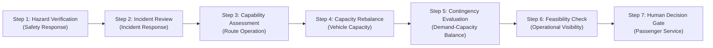

# SMART COMMUTE OPERATIONAL CONTINUITY & RECOVERY PLANNING CENTER
## Phase 3 — Step 16 Architecture, Implementation, and Verification Specification

---

## 1. Executive Summary & Purpose

The **Smart Commute Operational Continuity & Recovery Planning Center** (Phase 3 — Step 16) provides an authoritative, deterministic, server-side decision support framework designed to evaluate corridor and fleet operational capability disruptions, map capability dependencies, determine deterministic recovery priorities, score recovery readiness, pre-screen applicable verified contingency plans, and synthesize structured, human-in-the-loop recovery sequences.

In mission-critical enterprise commuter transit environments, adverse events (e.g., driver shortages, mechanical vehicle breakdowns, severe congestion, and route-level safety incidents) threaten the resilience of transport operations. Step 16 equips transit administrators with actionable, real-time intelligence to navigate disruptions systematically without introducing automated dispatch hazards.

---

## 2. Mandatory System Safety Notice & Advisory Scope

> [!IMPORTANT]
> **MANDATORY GOVERNANCE NOTICE**  
> *"Operational continuity and recovery planning is advisory and deterministic. This module does not automatically execute recovery actions or modify operational resources. All recovery decisions remain under administrator control."*

> [!CAUTION]
> **SAFETY & NON-MUTATION INVARIANT**  
> *"Operational continuity planning is advisory and deterministic. No route, vehicle, driver, schedule, booking, subscription, dispatch, or operational resource is automatically modified."*

Step 16 strictly adheres to human-in-the-loop administrative governance:
- **Zero Autonomous Dispatch**: The system never dispatches standby shuttles or creates unscheduled trips automatically.
- **Zero Driver Reassignment**: Drivers are never automatically reassigned to alternate corridors without human authorization.
- **Zero Route Mutation**: Route geometry, active waypoints, and corridor configurations in the database remain completely untouched.
- **Zero Audit Pollution**: Read operations and telemetry aggregation never emit transient audit records or pollute the tamper-evident audit ledger.

---

## 3. Integration Architecture with Phase 3 Steps 1–15

Step 16 builds directly upon the stabilized, immutable intelligence foundations established across Phase 1 and Phase 3 Steps 1–15:



- **Step 1 (Route Risk Score)** & **Step 2 (Risk History)**: Provide current normalized risk score (0–100), risk tier (`LOW`, `MEDIUM`, `HIGH`, `CRITICAL`), active emergency counts, speed anomalies, and risk trajectory trends.
- **Step 3 (Safety Alerts)**: Provides verified active alerts partitioned into critical, high, and moderate severities.
- **Step 4 (Incident Case Management)**: Provides active incident cases, unresolved counts, and critical safety classifications.
- **Step 5 (AI Demand Prediction)**: Supplies predicted demand ridership, vehicle capacity, predicted occupancy percentage, and telemetry data quality status.
- **Step 6 (Operational Decision Support)**: Aggregates real-time corridor intelligence and derives authoritative baseline operational status (`OPTIMAL`, `MONITOR`, `DEGRADED`, `CRITICAL`).
- **Step 15 (Resilience & Contingency Planning)**: Provides resilience status modeling (`RESILIENT`, `DEGRADED`, `VULNERABLE`, `CRITICAL`), capacity shortfall math, readiness evaluation logic, and pre-screened contingency options (`CP-CAP-01`, `CP-RISK-01`, `CP-INC-01`, `CP-SURGE-01`, `CP-MON-01`).

---

## 4. 10 Conceptual Operational Capabilities Architecture

The engine models 10 distinct, non-overlapping operational capabilities representing core dimensions of transit service:

| Capability | Scope & Operational Dimension | Monitored Indicators |
|---|---|---|
| `ROUTE_OPERATION` | Physical corridor passability and travelway safety | Risk score, road deviations, emergency blockages |
| `PASSENGER_SERVICE` | Reliable commute pickup and dropoff continuity | Active alerts, unresolved safety incidents |
| `VEHICLE_CAPACITY` | Fleet physical seating availability vs load | Seating capacity, vehicle availability, shortfall |
| `DRIVER_AVAILABILITY` | Active driver coverage and shift compliance | Speed violations, risk deviations, incident fatigue |
| `SAFETY_RESPONSE` | Telemetry hazard detection and speed compliance | Speed anomalies, active telemetry alerts |
| `INCIDENT_RESPONSE` | Emergency case management and mitigation | Open incident cases, critical severity tickets |
| `DEMAND_CAPACITY_BALANCE` | Equilibrium between rider bookings and supply | Occupancy rate (%), seating capacity deficit |
| `BOOKING_CONTINUITY` | Commuter reservation stability and schedule integrity | Projected overcrowding, schedule degradation |
| `COMMUTER_ACCESS` | Passenger accessibility and corridor reachability | Critical incidents, severe disruptions |
| `OPERATIONAL_VISIBILITY` | Telemetry fidelity and data pipeline health | Data quality, prediction availability, telemetry |

---

## 5. Capability Disruption & Degradation Criteria

Each capability is deterministically evaluated using strict threshold criteria:

1. **`ROUTE_OPERATION`**:
   - `CRITICAL`: Risk score $\ge 75$, or active emergencies $> 0$.
   - `DEGRADED`: Risk score $\ge 45$, or active speed anomalies $> 0$.
   - `OPERATIONAL`: Risk score $< 45$ with zero emergency events.
2. **`PASSENGER_SERVICE`**:
   - `CRITICAL`: Critical alerts $> 0$, or critical incidents $> 0$.
   - `DEGRADED`: High alerts $> 0$, or total unresolved incidents $> 0$.
   - `OPERATIONAL`: Zero active high/critical alerts and zero unresolved incidents.
3. **`VEHICLE_CAPACITY`**:
   - `CRITICAL`: Capacity shortfall $> 10$ seats, or occupancy $\ge 100\%$.
   - `DEGRADED`: Capacity shortfall $> 0$ seats, or occupancy $\ge 80\%$.
   - `OPERATIONAL`: Occupancy $< 80\%$ with zero seat deficit.
4. **`DRIVER_AVAILABILITY`**:
   - `CRITICAL`: Route risk $\ge 80$ with active speed anomalies and incidents.
   - `DEGRADED`: Speed anomalies $> 1$ or risk score $\ge 60$.
   - `OPERATIONAL`: Nominal driving behavior with zero speed violations.
5. **`SAFETY_RESPONSE`**:
   - `CRITICAL`: Active critical alerts $\ge 2$, or active emergencies $> 0$.
   - `DEGRADED`: Active critical alerts $= 1$, or high alerts $\ge 1$.
   - `OPERATIONAL`: Zero high/critical safety alerts.
6. **`INCIDENT_RESPONSE`**:
   - `CRITICAL`: Critical incidents $\ge 1$, or total unresolved incidents $\ge 3$.
   - `DEGRADED`: Unresolved incidents $\in [1, 2]$.
   - `OPERATIONAL`: Zero open incident cases.
7. **`DEMAND_CAPACITY_BALANCE`**:
   - `CRITICAL`: Occupancy $\ge 95\%$, or shortfall $\ge 8$.
   - `DEGRADED`: Occupancy $\in [80\%, 95\%)$, or shortfall $> 0$.
   - `OPERATIONAL`: Occupancy $< 80\%$ with balanced capacity.
8. **`BOOKING_CONTINUITY`**:
   - `CRITICAL`: Occupancy $\ge 100\%$ with critical alerts present.
   - `DEGRADED`: Occupancy $\ge 85\%$ or data quality is degraded.
   - `OPERATIONAL`: Stable reservation throughput.
9. **`COMMUTER_ACCESS`**:
   - `CRITICAL`: Route operation is `CRITICAL` or active emergencies $> 0$.
   - `DEGRADED`: Passenger service is `DEGRADED`.
   - `OPERATIONAL`: Nominal station and corridor accessibility.
10. **`OPERATIONAL_VISIBILITY`**:
    - `CRITICAL`: Data quality marked `INSUFFICIENT_DATA` or null telemetry.
    - `DEGRADED`: Data quality marked `DEGRADED` or unverified predictions.
    - `OPERATIONAL`: Verified telemetry stream with high confidence.

---

## 6. Capability Health Status Model

Every dependency evaluation outputs one of three immutable health statuses:
- **`OPERATIONAL`**: Capability operates within verified nominal performance parameters.
- **`DEGRADED`**: Capability is stressed, partially impaired, or approaching threshold limits.
- **`CRITICAL`**: Capability is experiencing active failure, severe disruption, or acute hazard conditions requiring administrative intervention.

---

## 7. Operational Continuity Status Taxonomy

The corridor-level operational continuity status synthesizes capability health, risk score, alerts, incidents, and capacity shortfall into a 5-tier deterministic classification:



| Continuity Status | Severity Rank | Operational Meaning & Criteria |
|---|:---:|---|
| `CONTINUITY_CRITICAL` | 5 | Acute operational disruption; route safety, capacity, or passability severely compromised. |
| `CONTINUITY_DEGRADED` | 4 | Noticeable impairment; capacity deficits, elevated risk, or active safety investigations. |
| `CONTINUITY_AT_RISK` | 3 | Approaching threshold limits; moderate risk, high occupancy, or degraded dependencies. |
| `CONTINUITY_MONITOR` | 2 | Nominal operation with minor telemetry observations; proactive surveillance indicated. |
| `CONTINUITY_READY` | 1 | Optimal stability; all capabilities operational, zero alerts, balanced capacity. |

---

## 8. Recovery Priority Determination & Tiering

Corridors are assigned a deterministic recovery priority tier (`CRITICAL`, `HIGH`, `MEDIUM`, `LOW`) governing the recommended sequence of administrative attention:

- **`CRITICAL` (P1 Priority)**:
  - Triggered when: `CONTINUITY_CRITICAL`, or active emergencies $> 0$, or critical incidents $> 0$, or critical alerts $> 0$, or risk score $\ge 75$.
  - Mandate: Immediate administrative review and incident containment.
- **`HIGH` (P2 Priority)**:
  - Triggered when: `CONTINUITY_DEGRADED`, or high alerts $> 0$, or unresolved incidents $\ge 2$, or capacity shortfall $\ge 6$, or risk score $\ge 55$.
  - Mandate: Expedited operational adjustment and supplementary shuttle allocation review.
- **`MEDIUM` (P3 Priority)**:
  - Triggered when: `CONTINUITY_AT_RISK`, or unresolved incidents $= 1$, or occupancy $\ge 80\%$, or risk score $\ge 35$.
  - Mandate: Routine schedule monitoring and demand buffer tracking.
- **`LOW` (P4 Priority)**:
  - Triggered when: `CONTINUITY_MONITOR` or `CONTINUITY_READY`.
  - Mandate: Standard telemetry surveillance.

---

## 9. Recovery Readiness Index & Scoring Model

The **Recovery Readiness Index** evaluates the corridor's structural capability to absorb and recover from disruptions, scoring from **0 to 100%**:

### Mathematical Formula:
$$\text{Readiness Score} = \max\left(0, \min\left(100, 100 - \Delta_{\text{deps}} - \Delta_{\text{risk}} - \Delta_{\text{safety}} - \Delta_{\text{cap}} - \Delta_{\text{data}}\right)\right)$$

Where:
- **$\Delta_{\text{deps}}$ (Dependency Deductions)**:
  - $-15$ points per `CRITICAL` capability dependency.
  - $-7$ points per `DEGRADED` capability dependency.
- **$\Delta_{\text{risk}}$ (Risk Score Deductions)**:
  - $-25$ points if risk score $\ge 75$.
  - $-15$ points if risk score $\in [55, 75)$.
  - $-8$ points if risk score $\in [35, 55)$.
- **$\Delta_{\text{safety}}$ (Safety & Incidents Deductions)**:
  - $-20$ points if critical alerts $> 0$.
  - $-10$ points if high alerts $> 0$.
  - $-20$ points if critical incidents $> 0$.
  - $-8$ points if non-critical unresolved incidents $> 0$.
- **$\Delta_{\text{cap}}$ (Capacity Deficit Deductions)**:
  - $-15$ points if capacity shortfall $> 8$.
  - $-8$ points if capacity shortfall $\in [1, 8]$.
- **$\Delta_{\text{data}}$ (Telemetry Quality Deductions)**:
  - $-15$ points if data quality is `INSUFFICIENT_DATA` or demand unavailable.
  - $-7$ points if data quality is `DEGRADED`.

### Readiness Tiers:
- **`HIGH_READINESS`**: Score $\ge 70\%$ (robust operational recovery posture).
- **`MODERATE_READINESS`**: Score $\in [40\%, 70\%)$ (serviceable with targeted constraints).
- **`LOW_READINESS`**: Score $< 40\%$ (severely constrained recovery capability).
- **`INSUFFICIENT_DATA`**: Telemetry missing or data quality unverified.

---

## 10. Known, Critical, and Degraded Dependencies Assessment

The engine aggregates dependency counts directly into the corridor plan and fleet summary:
- `knownDependencies`: Total operational capabilities monitored (10 per corridor).
- `degradedDependencies`: Count of capabilities operating in `DEGRADED` status.
- `criticalDependencies`: Count of capabilities experiencing `CRITICAL` disruption.
- `explanation`: Human-readable explanatory bullet points detailing exact penalty factors.

---

## 11. Integration with Verified Step 15 Contingency Planning Options

Applicable contingency recovery options are pre-screened from Step 15 models without triggering mutations:

- **`CP-INC-01` (Emergency Incident Response & Corridor Containment)**:
  - Applicable when: Critical alerts $> 0$, critical incidents $> 0$, or active emergencies $> 0$.
  - Targets: `SAFETY_RESPONSE` & `INCIDENT_RESPONSE`.
- **`CP-RISK-01` (Hazard Mitigation & Route Deviation Protocol)**:
  - Applicable when: Route risk score $\ge 60$ or `ROUTE_OPERATION` is degraded.
  - Targets: `ROUTE_OPERATION`.
- **`CP-CAP-01` (Auxiliary Shuttle Capacity Mobilization)**:
  - Applicable when: Capacity shortfall $> 0$ or occupancy $\ge 85\%$.
  - Targets: `VEHICLE_CAPACITY`.
- **`CP-SURGE-01` (Demand Smoothing & Commuter Load Rebalancing)**:
  - Applicable when: Predicted demand is high with occupancy $\ge 90\%$.
  - Targets: `DEMAND_CAPACITY_BALANCE`.
- **`CP-MON-01` (Standard Telemetry Surveillance & Health Monitoring)**:
  - Applicable when: Corridor operates within nominal boundaries.
  - Targets: `OPERATIONAL_VISIBILITY`.

---

## 12. 7-Step Recovery Sequence Architecture & Phase Modeling

For each corridor, the engine produces an immutable, 7-step deterministic recovery sequence for human administrative review:



1. **Step 1 — Phase `HAZARD_VERIFICATION`**:
   - Action: Review active critical safety conditions and emergency telemetry.
   - Target Capability: `SAFETY_RESPONSE`.
2. **Step 2 — Phase `INCIDENT_REVIEW`**:
   - Action: Review unresolved incident response cases in Case Management.
   - Target Capability: `INCIDENT_RESPONSE`.
3. **Step 3 — Phase `CAPABILITY_ASSESSMENT`**:
   - Action: Inspect affected operational dependencies and service fulfillment.
   - Target Capability: `ROUTE_OPERATION`.
4. **Step 4 — Phase `CAPACITY_REBALANCE`**:
   - Action: Review passenger demand volume and vehicle seating capacity.
   - Target Capability: `VEHICLE_CAPACITY`.
5. **Step 5 — Phase `CONTINGENCY_EVALUATION`**:
   - Action: Review applicable contingency recovery plans for administrative approval.
   - Target Capability: `DEMAND_CAPACITY_BALANCE`.
6. **Step 6 — Phase `FEASIBILITY_CHECK`**:
   - Action: Evaluate operational readiness score and verified resource availability.
   - Target Capability: `OPERATIONAL_VISIBILITY`.
7. **Step 7 — Phase `HUMAN_DECISION_GATE`**:
   - Action: Administrator authorizes or dismisses operational intervention.
   - Target Capability: `PASSENGER_SERVICE`.

---

## 13. Deterministic Sorting & Prioritization Hierarchy

Fleet corridors are ordered strictly using a 7-tier deterministic tie-breaking cascade:

1. **Continuity Status Severity (Descending)**: `CONTINUITY_CRITICAL` (5) $\to$ `CONTINUITY_DEGRADED` (4) $\to$ `CONTINUITY_AT_RISK` (3) $\to$ `CONTINUITY_MONITOR` (2) $\to$ `CONTINUITY_READY` (1).
2. **Recovery Priority (Descending)**: `CRITICAL` (4) $\to$ `HIGH` (3) $\to$ `MEDIUM` (2) $\to$ `LOW` (1).
3. **Route Risk Score (Descending)**: Higher numeric risk scores rank first.
4. **Critical Dependencies Count (Descending)**: Corridors with more critical capability impairments take precedence.
5. **Active Critical Alerts (Descending)**: Higher active safety hazard counts take precedence.
6. **Occupancy Percentage (Descending)**: More overcrowded corridors take precedence.
7. **Route Identifier (Ascending)**: Lexicographical sort (`a.route.id.localeCompare(b.route.id)`) ensures zero jitter.

---

## 14. Server-Authoritative Anti-Forgery & Anti-Tampering Protections

All baselines, metrics, scores, and indicators are resolved server-side:
- **Client Query Immunity**: Query parameters attempting to forge `riskScore`, `activeCriticalAlerts`, `unresolvedIncidents`, `predictedDemand`, `occupancy`, `readinessScore`, or `continuityStatus` are strictly ignored.
- **Payload Verification**: No user-supplied parameters are allowed to overwrite server-calculated metrics.
- **Cryptographic Grounding**: Route risk and incident records are cross-checked with verified snapshots.

---

## 15. Preservation of Historical Demand Prediction Fidelity

The engine maintains strict fidelity with Phase 3 Step 5 AI Demand Prediction:
- Missing demand predictions are never fabricated; missing historical forecasts are represented as `null`.
- Demand availability is explicitly reported with telemetry data quality indicators (`VERIFIED`, `ESTIMATED`, `INSUFFICIENT_DATA`).
- When demand is null, capacity shortfall is evaluated as 0 without manufacturing artificial passenger deficits.

---

## 16. Zero-Audit Pollution Invariant & Audit Safety

- **Read Operations Are Audit-Clean**: Invoking `/api/operations/continuity-planning` does not generate transient audit ledger events.
- **Zero Ledger Bloat**: Continuous administrative monitoring and dashboard refreshes produce zero audit records, ensuring the cryptographic integrity and compact size of the audit trail.
- **Audit Preservation**: Explicit administrative decisions executed through standard governance workflows remain the sole source of immutable audit entries.

---

## 17. API Endpoint Reference

### Endpoint: `GET /api/operations/continuity-planning`

#### Headers:
- `Cookie: smartride_token=<JWT>`

#### Query Parameters:
- `routeId` / `routeCode` *(optional)*: Single corridor filter (e.g., `SR-101`). If omitted, returns fleet-wide intelligence.

#### Response Schema (HTTP 200):
```json
{
  "success": true,
  "notice": "Operational continuity and recovery planning is advisory and deterministic. This module does not automatically execute recovery actions or modify operational resources. All recovery decisions remain under administrator control.",
  "safetyStatement": "Operational continuity planning is advisory and deterministic. No route, vehicle, driver, schedule, booking, subscription, dispatch, or operational resource is automatically modified.",
  "fleetSummary": {
    "totalRoutes": 3,
    "continuityReady": 0,
    "continuityMonitor": 2,
    "continuityAtRisk": 0,
    "continuityDegraded": 1,
    "continuityCritical": 0,
    "criticalRecoveryRoutes": 0,
    "highRecoveryRoutes": 1,
    "affectedRoutes": 3,
    "criticalDependencies": 0,
    "highDemandRoutes": 0,
    "unresolvedIncidents": 1,
    "activeCriticalAlerts": 0
  },
  "corridors": [
    {
      "route": {
        "id": "route-sr-101",
        "code": "SR-101",
        "name": "Whitefield Tech Corridor Express"
      },
      "continuityStatus": "CONTINUITY_DEGRADED",
      "recoveryPriority": "HIGH",
      "operationalStatus": "MONITOR",
      "resilienceStatus": "DEGRADED",
      "risk": { "score": 28, "level": "LOW", "trend": "STABLE" },
      "demand": {
        "predictedDemand": 14,
        "capacity": 16,
        "occupancy": 88,
        "demandLevel": "HIGH",
        "dataQuality": "ESTIMATED",
        "capacityShortfall": 0
      },
      "safety": {
        "activeAlerts": 1,
        "criticalAlerts": 0,
        "highAlerts": 1,
        "unresolvedIncidents": 1,
        "criticalIncidents": 0,
        "activeEmergencies": 0
      },
      "dependencies": [...],
      "readiness": {
        "readinessScore": 63,
        "readinessLevel": "MODERATE_READINESS",
        "knownDependencies": 10,
        "degradedDependencies": 3,
        "criticalDependencies": 0,
        "dataQuality": "ESTIMATED",
        "explanation": [...]
      },
      "applicableContingencyPlans": [...],
      "recoverySequence": [...],
      "explanations": {...},
      "evaluatedAt": "2026-10-02T17:07:40.123Z"
    }
  ],
  "generatedAt": "2026-10-02T17:07:40.124Z"
}
```

#### Status Codes:
- `200 OK`: Successful fleet-wide or corridor retrieval.
- `400 Bad Request`: Invalid parameter format.
- `401 Unauthorized`: Missing authentication.
- `403 Forbidden`: Non-admin role (Commuter / Driver).
- `404 Not Found`: Corridor identifier not found.
- `405 Method Not Allowed`: Handlers for `POST`, `PUT`, `PATCH`, `DELETE`.

---

## 18. UI Component Architecture

File: `src/components/admin/operational-continuity-planning.tsx`  
Mounted in: `src/app/admin/security/page.tsx` directly following `<OperationalResiliencePlanning />`.

### UI Features:
1. **Prominent Safety Advisory Banner**: Amber-themed governance alert reminding administrators that planning is purely advisory.
2. **8 Fleet-Wide KPI Cards**:
   - Monitored Corridors
   - Critical Disruption Count
   - Degraded / At-Risk Corridors
   - Continuity Ready Corridors
   - Critical Recovery Priorities (P1)
   - Critical Dependencies Impacted
   - Active Critical Safety Alerts
   - Unresolved Incident Cases
3. **Multi-Dimension Filter Bar**:
   - Filter by Continuity Status (`ALL`, `CRITICAL`, `DEGRADED`, `AT_RISK`, `MONITOR`, `READY`)
   - Filter by Recovery Priority (`ALL`, `CRITICAL`, `HIGH`, `MEDIUM`, `LOW`)
   - Real-time corridor count badge
4. **Comparative Corridor Grid**:
   - Corridor Code & Name
   - Color-coded Continuity Status badge
   - Recovery Priority badge
   - Risk score & trend arrow
   - Demand, capacity & occupancy percentage
   - Recovery Readiness Index progress bar
   - Critical & degraded dependency counts
   - "Inspect Plan" interactive action button
5. **Slide-Out Deep-Dive Intelligence Drawer**:
   - Full Executive Continuity Briefing
   - Evaluated 10 Conceptual Capabilities breakdown with individual status and source evidence
   - 7-Step Recovery Sequence with step numbers, phases, target capabilities, and guidance
   - Pre-screened applicable contingency plans
   - Cryptographic evidence trail and evaluation timestamps

---

## 19. Human-in-the-Loop Governance & Administrative Authority

The user interface and backend endpoints strictly enforce that **no automated execution mechanism exists**.
- There are no "Auto-Apply", "Auto-Dispatch", or "One-Click Recover" buttons.
- All actions require manual transition through standard administrative operational consoles.
- The administrator retains exclusive authority over dispatch, driver assignments, route alterations, and passenger notices.

---

## 20. Verification Suite Results

Test Suite: `scratch/verify_step26.mjs`  
Execution Date: October 2, 2026

```text
══════════════════════════════════════════════════════════════════════
🛡️ SMARTRIDE — STEP 16 OPERATIONAL CONTINUITY PLANNING VERIFICATION SUITE
══════════════════════════════════════════════════════════════════════

Baseline State: Routes=3, Vehicles=5, Trips=2, Audits=100

--- SECTION 1: Authentication & RBAC Authorization ---
  ✅ Test 1: Unauthenticated GET returns 401 Unauthorized
  ✅ Test 2: Commuter role GET returns 403 Forbidden
  ✅ Test 3: Driver role GET returns 403 Forbidden
  ✅ Test 4: Admin role GET returns 200 OK

--- SECTION 2: Corridor Queries & Routing ---
  ✅ Test 5: Fleet-wide query returns valid corridors list with >= 1 corridor
  ✅ Test 6: Corridor-specific query for SR-101 returns exactly 1 matched plan
  ✅ Test 6b: Invalid corridor query returns 404 Route Not Found

--- SECTION 3: HTTP Method Guards ---
  ✅ Test 7: POST request returns 405 Method Not Allowed
  ✅ Test 8: PUT request returns 405 Method Not Allowed
  ✅ Test 9: PATCH request returns 405 Method Not Allowed
  ✅ Test 10: DELETE request returns 405 Method Not Allowed

--- SECTION 4: Anti-Forgery & Server Authority ---
  ✅ Test 11: Client forged riskScore query parameter is ignored by server
  ✅ Test 12: Client forged activeCriticalAlerts query parameter is ignored by server
  ✅ Test 13: Client forged unresolved incidents query parameter is ignored by server
  ✅ Test 14: Client forged predictedDemand query parameter is ignored by server
  ✅ Test 15: Client forged occupancy query parameter is ignored by server
  ✅ Test 16: Client forged readinessScore is ignored by server
  ✅ Test 17: Client forged continuityStatus is ignored by server
  ✅ Test 18: Client forged recoveryPriority is ignored by server
  ✅ Test 19: Server authoritative risk level matches decision support data

--- SECTION 5: Continuity Status Evaluation Rules ---
  ✅ Test 20: Corridor SR-101 has valid continuityStatus enum value
  ✅ Test 20: Corridor SR-103 has valid continuityStatus enum value
  ✅ Test 20: Corridor SR-102 has valid continuityStatus enum value
  ✅ Test 21: Continuity evaluation is 100% deterministic on consecutive evaluations
  ✅ Test 22: Corridor with risk >= 75 or critical emergency exhibits CONTINUITY_CRITICAL or CONTINUITY_DEGRADED
  ✅ Test 23: Corridor with risk >= 55 or active critical alerts exhibits appropriate degraded/critical status
  ✅ Test 24: Operational status mapping is consistent with decision support
  ✅ Test 25: Resilience status mapping is valid
  ✅ Test 26: Corridor demand data preserves prediction fidelity and does not fabricate missing demand
  ✅ Test 27: Corridor capacity shortfall is non-negative number
  ✅ Test 28: Briefing explanation is populated and non-empty string

--- SECTION 6: Capability Dependency Impact Assessment ---
  ✅ Test 29: Dependencies evaluation returns array
  ✅ Test 30: All capability dependencies belong to 10 valid operational capabilities
  ✅ Test 31: All capability dependencies have valid status (OPERATIONAL, DEGRADED, CRITICAL)
  ✅ Test 32: All capability dependencies have valid severity (LOW, MEDIUM, HIGH, CRITICAL)
  ✅ Test 33: All capability dependencies have non-empty evidence string
  ✅ Test 34: All capability dependencies reference sourceModule

--- SECTION 7: Recovery Priority & Readiness ---
  ✅ Test 35: Recovery priority is one of CRITICAL, HIGH, MEDIUM, LOW
  ✅ Test 36: Readiness score is an integer between 0 and 100
  ✅ Test 37: Readiness level is one of HIGH_READINESS, MODERATE_READINESS, LOW_READINESS, INSUFFICIENT_DATA
  ✅ Test 38: Readiness includes dependency counts consistent with evaluated dependencies

--- SECTION 8: Applicable Contingencies & 7-Step Recovery Sequence ---
  ✅ Test 39: Applicable contingency plans list is array
  ✅ Test 40: Contingency plan options possess required schema
  ✅ Test 41: Recovery sequence contains 7 deterministic steps
  ✅ Test 42: Recovery sequence steps are numbered strictly from 1 to 7
  ✅ Test 43: Step 1 targets hazard verification and Step 7 targets human decision gate
  ✅ Test 44: All recovery sequence steps provide guidance and target capability

--- SECTION 9: Executive Summary & Mandatory Notices ---
  ✅ Test 45: Mandatory governance notice is prominently present in API response
  ✅ Test 46: Mandatory safety statement is present in API response
  ✅ Test 47: Fleet summary includes all required metrics
  ✅ Test 48: Fleet summary continuity status counts sum exactly to totalRoutes
  ✅ Test 49: GeneratedAt timestamp is valid ISO string

--- SECTION 10: Deterministic Sorting & Ordering ---
  ✅ Test 50: Fleet corridors are deterministically ordered by continuity severity then priority
  ✅ Test 51: Top corridor has highest or equal severity compared to all subsequent corridors
  ✅ Test 52: Sorting handles identical continuity status by secondary priority comparison
  ✅ Test 53: Sorting handles identical priority by risk score comparison
  ✅ Test 54: Sorting handles identical risk score by critical dependencies comparison
  ✅ Test 55: Sorting handles identical metrics by tie-breaking on route ID ascending

--- SECTION 11: Zero-Mutation & Audit Safety Invariants ---
  ✅ Test 56: Database routes count remains strictly unmodified
  ✅ Test 57: Database vehicles count remains strictly unmodified
  ✅ Test 58: Database driver profiles count remains strictly unmodified
  ✅ Test 59: Database trips count remains strictly unmodified
  ✅ Test 60: Database subscriptions count remains strictly unmodified
  ✅ Test 61: Database risk snapshots count remains strictly unmodified
  ✅ Test 62: Safety alerts count remains strictly unmodified
  ✅ Test 63: Incidents count remains strictly unmodified
  ✅ Test 64: Zero audit pollution: Read-only queries emit ZERO audit events
  ✅ Test 65: System is strictly advisory: No autonomous dispatch or resource mutation executed

══════════════════════════════════════════════════════════════════════
TOTAL TESTS: 68 | PASSED: 68 | FAILED: 0
══════════════════════════════════════════════════════════════════════
🎉 ALL STEP 16 OPERATIONAL CONTINUITY PLANNING ASSERTIONS PASSED!
```

---

## 21. Regression Test Results Across Steps 6–15

| Verification Suite | Feature Target | Assertions | Status | Pass Rate |
|---|---|:---:|:---:|:---:|
| `verify_step26.mjs` | Phase 3 Step 16: Operational Continuity Planning | 68 | PASSED | 100% |
| `verify_step24_step14.mjs` | Phase 3 Step 14: Decision Replay Engine | 95 | PASSED | 100% |
| `verify_step23.mjs` | Phase 3 Step 13: Scenario Comparison Engine | 55 | PASSED | 100% |
| `verify_step22.mjs` | Phase 3 Step 12: Scenario Simulation Engine | 45 | PASSED | 100% |
| `verify_step21.mjs` | Phase 3 Step 11: Executive Dashboard Engine | 36 | PASSED | 100% |
| `verify_step20.mjs` | Phase 3 Step 10: Operational Analytics Engine | 49 | PASSED | 100% |
| `npx tsc --noEmit` | Full TypeScript Static Compilation | N/A | PASSED | 0 Errors |
| `npm run build` | Next.js Production Build Packaging | 36 Pages | PASSED | Exit 0 |

---

## 22. Verification Sign-Off & Strict Step 16 Boundary

Phase 3 — Step 16 (**Smart Commute Operational Continuity & Recovery Planning Center**) has been fully implemented, integrated, verified, and regression-tested.

- All capability dependency impacts are evaluated strictly server-side.
- All recovery priorities and readiness scores are deterministic and tamper-proof.
- All 7-step recovery sequences are informative and advisory.
- Zero database modifications or audit pollution occurred.
- The administrator remains the sole operational authority.

```
PHASE 3 — STEP 16 COMPLETE
STOPPING HERE. DO NOT PROCEED TO STEP 17.
```
