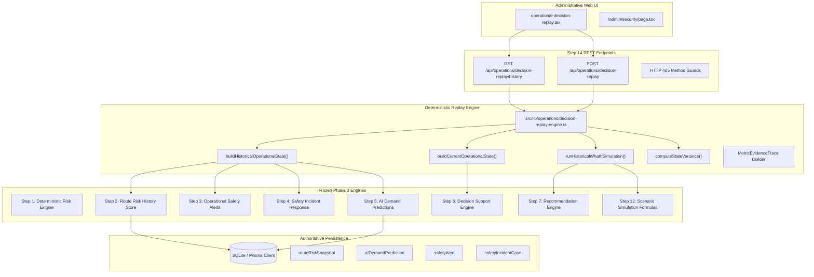

# 🛡️ SmartRide — Phase 3 Step 14: Smart Commute Operational Decision Replay & Historical What-If Validation Center

> **System Status**: `PHASE 3 — STEP 14 VERIFIED AND COMPLETE`  
> **Classification**: Strictly Read-Only, Non-Mutative, Deterministic Operational Decision Replay & Historical What-If Engine  
> **Workspace**: `c:\Users\Ideapad\Documents\antigravity\fearless-galileo`  
> **Build Status**: Production Build Verified (Exit Code 0), Zero TypeScript Errors  
> **Test Suite**: `scratch/verify_step24.mjs` (95/95 Tests Passed — 100%)  

---

## 1. Executive Summary & Module Purpose

The **Smart Commute Operational Decision Replay & Historical What-If Validation Center** (Phase 3 Step 14) is an advanced retrospective intelligence module built for SmartRide administrators. It enables administrative supervisors to reconstruct historical operational corridor states from immutable server snapshots and evaluate retrospective hypotheses against both the historical baseline and current live conditions.

Prior to Step 14, administrators had access to forward-looking scenario simulations (Step 12) and comparative scenario rankings (Step 13), but lacked the ability to answer critical retrospective questions:
- *"What would have happened during yesterday's peak surge if vehicle capacity had been reduced by 25%?"*
- *"If a high-severity alert had been received during the morning commute on corridor SR-101, would our operational status have escalated to URGENT REVIEW?"*
- *"How has corridor risk posture evolved between historical snapshot points and the live telemetry today?"*

Step 14 bridges this gap with zero data fabrication, strict mathematical clamping, zero database mutations, and zero audit pollution.

---

## 2. Mandatory System Safety Notices & Advisory-Only Principles

In accordance with strict safety mandates, the Operational Decision Replay Center operates exclusively under two mandatory principles:

### Notice 1: Advisory & Non-Mutative Principle
> *"Decision Replay is advisory and deterministic. Historical states and hypothetical scenarios are analytical reconstructions only. Replay results do not modify routes, schedules, vehicles, drivers, subscriptions, bookings, dispatch assignments, safety alerts, incidents, recommendations, or operational resources."*

### Notice 2: Non-Fabrication & Honest Telemetry Principle
> *"Historical replay uses verified persisted intelligence where available. Missing historical values must be explicitly marked unavailable rather than fabricated."*

Under no circumstances does Step 14 execute automated vehicle dispatch, route alteration, driver reassignment, schedule modification, or state mutation. The human administrator retains sole operational authority.

---

## 3. Architectural Integration & System Boundaries

Step 14 integrates seamlessly with the existing, verified Phase 1 and Phase 3 architectures without altering frozen contracts:



---

## 4. Role-Based Access Control & Security Model

Decision Replay endpoints enforce strict role-based access control via signed HMAC-SHA256 JWT tokens extracted from the `smartride_token` httpOnly cookie (`getSessionFromRequest`):

| Role | Access Level | GET `/api/operations/decision-replay/history` | POST `/api/operations/decision-replay` | Mutation Methods (PUT/PATCH/DELETE) |
| :--- | :--- | :---: | :---: | :---: |
| **GUEST (Unauthenticated)** | None | `401 Unauthorized` | `401 Unauthorized` | `405 Method Not Allowed` |
| **COMMUTER** | None | `403 Forbidden` | `403 Forbidden` | `405 Method Not Allowed` |
| **DRIVER** | None | `403 Forbidden` | `403 Forbidden` | `405 Method Not Allowed` |
| **ADMIN** | Full (Advisory Replay) | `200 OK` | `200 OK` | `405 Method Not Allowed` |

---

## 5. Immutable Historical State Reconstruction

Historical states are reconstructed strictly from verified, immutable snapshots created during past operations:

1. **Route Risk Snapshot (`RouteRiskSnapshot`)**:
   - `riskScore`: Exact score calculated at `evaluatedAt`.
   - `riskLevel`: `LOW`, `MEDIUM`, `HIGH`, or `CRITICAL`.
   - `factors`: Decomposed factor weights (emergencies, deviations, speed, compliance, complexity).
   - `activeEmergencies`, `activeDeviations`, `activeSpeedAnomalies`.
   - `driverVerified`, `vehicleApproved`.
2. **Safety Alerts (`SafetyAlertRecord`)**:
   - Filtered chronologically: alerts active at `observedDate` (where `createdAt <= observedDate` and `(resolvedAt === null || resolvedAt > observedDate)`).
   - Decomposed by severity: CRITICAL, HIGH, MEDIUM, LOW.
3. **Safety Incident Cases (`IncidentCaseRecord`)**:
   - Filtered chronologically: incidents unresolved at `observedDate` (where `createdAt <= observedDate` and `status !== 'RESOLVED' && status !== 'CLOSED'`).
   - Decomposed by severity: CRITICAL, HIGH, MEDIUM, LOW.
4. **Historical Demand Predictions (`AIDemandPrediction`)**:
   - Queried from Prisma with `createdAt <= observedDate`.
   - If present, provides `predictedDemand`, `vehicleCapacity`, `predictedOccupancy`, and `status`.
   - If missing, strictly sets metrics to `null` with `availability: "UNAVAILABLE"`.

---

## 6. Non-Fabrication Policy & Data Quality Contract

In adherence to system invariants, the engine **never fabricates or guesses missing historical data**:
- If demand prediction did not exist at the historical timestamp, `predictedDemand: null`, `capacity: null`, and `occupancy: null`.
- Never substitute `0`, current values, or fleet averages for missing historical telemetry.
- Each telemetry point includes an explicit `availability` flag:
  - `VERIFIED`: Confirmed by persisted SQLite/Prisma record.
  - `PARTIAL`: Derived from store query with fallback telemetry.
  - `UNAVAILABLE`: Missing from historical storage; documented with an explicit explanatory reason string.

---

## 7. Live Baseline Intelligence Comparison

For comparative evaluation, the engine simultaneously evaluates the live operational state using Step 6 (`buildOperationalDecisionSupport`):
- Authoritative current risk score and risk level.
- Live active emergencies, deviations, and speed anomalies.
- Real-time active safety alerts and unresolved incident cases.
- Live passenger demand predictions and vehicle occupancy.
- Authoritative current operational status (`URGENT_REVIEW`, `ATTENTION_REQUIRED`, `MONITOR`, `NORMAL`).

---

## 8. Retrospective What-If Scenario Modeling & Parameter Specifications

Administrators can configure hypothetical stress or relief modifiers to be applied to the historical snapshot:

| Parameter | Type / Enum | Valid Range | Default | Rationale |
| :--- | :--- | :---: | :---: | :--- |
| `riskModifier` | Number | `[-50, 50]` | `0` | Simulates road hazards, weather severity, or driver risk variance. |
| `demandModifierPercent` | Number | `[-50, 100]` | `0%` | Simulates ridership surges or weather drop-offs. |
| `capacityModifierPercent` | Number | `[-50, 100]` | `0%` | Simulates vehicle breakdowns or shuttle substitutions. |
| `hypotheticalAlert` | Severity Enum | `NONE`, `LOW`, `MEDIUM`, `HIGH`, `CRITICAL` | `NONE` | Injects an active safety alert into the historical backlog. |
| `hypotheticalIncident` | Severity Enum | `NONE`, `LOW`, `MEDIUM`, `HIGH`, `CRITICAL` | `NONE` | Injects an open safety incident into the historical case management. |
| `riskTrendScenario` | Trend Enum | `UNCHANGED`, `RISING`, `FALLING`, `STABLE` | `UNCHANGED` | Modulates the trend trajectory for status evaluation. |

---

## 9. Mathematical Clamping & Simulation Formulations

The retrospective simulation engine strictly enforces Step 12 mathematical formulas:

### 1. Risk Score Clamping
$$\text{Simulated Risk} = \text{clamp}_{[0, 100]}(\text{Historical Risk} + \Delta\text{Risk})$$

### 2. Vehicle Capacity Minimum Clamping
$$\text{Simulated Capacity} = \max\left(1, \text{round}\left(\text{Historical Capacity} \times \left(1 + \frac{\Delta\text{Capacity}\%}{100}\right)\right)\right)$$

### 3. Demand Formulation
$$\text{Simulated Demand} = \max\left(0, \text{round}\left(\text{Historical Demand} \times \left(1 + \frac{\Delta\text{Demand}\%}{100}\right)\right)\right)$$

### 4. Occupancy Formulation
$$\text{Projected Occupancy} = \begin{cases} \text{round}\left(\frac{\text{Simulated Demand}}{\text{Simulated Capacity}} \times 100\right) & \text{if Demand and Capacity are available} \\ \text{null} & \text{if Historical Demand is null} \end{cases}$$

---

## 10. Deterministic Status Evaluation & Hierarchy Rules

The operational status of the reconstructed historical state and the hypothetical simulated state is evaluated using the authoritative Step 6 status hierarchy:

```
URGENT_REVIEW (Rank 4) > ATTENTION_REQUIRED (Rank 3) > MONITOR (Rank 2) > NORMAL (Rank 1)
```

### Escalation Triggers:
- **URGENT_REVIEW**: Risk Score $\ge 75$, OR Active Emergencies $> 0$, OR Critical Safety Alert $> 0$, OR Unresolved Critical Incident $> 0$.
- **ATTENTION_REQUIRED**: Risk Score $\in [50, 74]$, OR High Safety Alert $> 0$, OR Projected Occupancy $\ge 90\%$, OR Rapidly Rising Trend with Alerts.
- **MONITOR**: Risk Score $\in [25, 49]$, OR Medium Alert $> 0$, OR Unresolved Moderate Incident $> 0$, OR Projected Occupancy $\in [75\%, 89.9\%]$, OR Rising Trend.
- **NORMAL**: All conditions within standard operating limits.

### Status Change Classification:
- `ESCALATED`: Target Status Rank $>$ Base Status Rank
- `DE_ESCALATED`: Target Status Rank $<$ Base Status Rank
- `UNCHANGED`: Target Status Rank $==$ Base Status Rank
- `INSUFFICIENT_EVIDENCE`: Telemetry insufficient to establish direction.

---

## 11. Operational State Variance Engine & Delta Analysis

The variance engine computes two separate comparative deltas:
1. **Historical vs Current Variance**: Quantifies real-world corridor drift between the historical snapshot and the current live operating telemetry.
2. **Historical vs What-If Variance**: Isolates the causal impact of the administrative hypothesis on the historical baseline.

For every metric (Risk, Demand, Capacity, Occupancy, Alerts, Incidents), the engine reports:
- Numeric difference ($\Delta$).
- Direction indicator (`INCREASED`, `DECREASED`, `UNCHANGED`, or `UNAVAILABLE`).
- Status transition category (`ESCALATED`, `DE_ESCALATED`, `UNCHANGED`).

---

## 12. Simulated Recommendation Impact Assessment

When a retrospective what-if scenario is evaluated, the engine invokes Step 7 (`generateOperationalRecommendations`) in simulation mode to determine what actions *would have been drafted* under the hypothesized conditions:
- **Impact Level**: `CRITICAL_RECOMMENDATION`, `HIGH_PRIORITY_RECOMMENDATION`, `MONITORING_RECOMMENDATION`, or `NONE`.
- **Simulated Drafts**: Action draft containing action type (e.g., `DISPATCH_ADDITIONAL_SHUTTLE`, `DRIVER_TRAINING_REVIEW`, `SPEED_GOVERNOR_AUDIT`), priority, headline title, and operational recommendation text.
- **Zero Database Writes**: Drafts are returned purely in-memory; no records are persisted to `OperationalRecommendation`.

---

## 13. Deterministic Explainability & Narrative Justification Generation

Every decision replay response includes an `explanations` array with deterministic, human-readable bullet points explaining:
- The historical baseline risk and timestamp.
- The variance between historical and current live telemetry.
- The status transition between historical and current states.
- The exact hypothetical modifiers injected into the simulation.
- The causal driver behind any operational status escalation.

Subjective words, probabilistic approximations, and artificial hallucination are strictly excluded.

---

## 14. Complete Metric Evidence Trace & Persisted Lineage

Every decision replay response provides a complete `evidenceTrace` array verifying the provenance of each data point:

| Metric | Source Store | Source Record ID | Verified | Availability |
| :--- | :--- | :--- | :---: | :---: |
| `riskScore` | `ROUTE_RISK_HISTORY` | `rrs_route-sr-101_...` | `true` | `VERIFIED` |
| `riskLevel` | `ROUTE_RISK_HISTORY` | `rrs_route-sr-101_...` | `true` | `VERIFIED` |
| `riskFactors` | `ROUTE_RISK_HISTORY` | `rrs_route-sr-101_...` | `true` | `VERIFIED` |
| `activeEmergencies` | `ROUTE_RISK_HISTORY` | `rrs_route-sr-101_...` | `true` | `VERIFIED` |
| `activeAlerts` | `SAFETY_ALERT_STORE` | Store query at `observedAt` | `true` | `VERIFIED` |
| `unresolvedIncidents` | `SAFETY_INCIDENT_STORE` | Store query at `observedAt` | `true` | `VERIFIED` |
| `predictedDemand` | `AI_DEMAND_PREDICTION_STORE` | `cmtml...` or `null` | `true` / `false` | `VERIFIED` / `UNAVAILABLE` |
| `vehicleCapacity` | `AI_DEMAND_PREDICTION_STORE` | `cmtml...` or `null` | `true` / `false` | `VERIFIED` / `UNAVAILABLE` |

---

## 15. API Specifications: GET `/api/operations/decision-replay/history`

### Request:
- **Method**: `GET`
- **Path**: `/api/operations/decision-replay/history?routeId=SR-101`
- **Headers**: `Cookie: smartride_token=<admin_jwt>`

### Responses:
- `200 OK`:
  ```json
  {
    "success": true,
    "notices": [
      "Decision Replay is advisory and deterministic...",
      "Historical replay uses verified persisted intelligence..."
    ],
    "route": { "id": "route-sr-101", "code": "SR-101", "name": "Whitefield Tech Corridor Express" },
    "observations": [
      {
        "observationId": "rrs_route-sr-101_1790923058264_zvpff",
        "routeId": "route-sr-101",
        "routeCode": "SR-101",
        "routeName": "Whitefield Tech Corridor Express",
        "observedAt": "2026-10-02T06:37:38.264Z",
        "sourceType": "ROUTE_RISK_HISTORY",
        "sourceId": "rrs_route-sr-101_1790923058264_zvpff",
        "availableMetrics": ["riskScore", "riskLevel", "riskFactors", "activeEmergencies", "activeAlerts", "unresolvedIncidents"],
        "dataQuality": "PARTIAL_HISTORICAL",
        "riskScore": 5,
        "riskLevel": "LOW"
      }
    ],
    "retrievedAt": "2026-10-02T06:45:00.000Z"
  }
  ```
- `400 Bad Request`: Missing or empty `routeId` parameter.
- `401 Unauthorized`: Missing or invalid session.
- `403 Forbidden`: Non-admin role.
- `404 Not Found`: Unknown `routeId`.
- `405 Method Not Allowed`: Invoked with POST, PUT, PATCH, DELETE.

---

## 16. API Specifications: POST `/api/operations/decision-replay`

### Request:
- **Method**: `POST`
- **Path**: `/api/operations/decision-replay`
- **Headers**: `Content-Type: application/json`, `Cookie: smartride_token=<admin_jwt>`
- **Body**:
  ```json
  {
    "routeId": "SR-101",
    "observationId": "rrs_route-sr-101_1790923058264_zvpff",
    "scenario": {
      "riskModifier": 20,
      "demandModifierPercent": 30,
      "capacityModifierPercent": -20,
      "hypotheticalAlert": "HIGH",
      "hypotheticalIncident": "NONE",
      "riskTrendScenario": "RISING"
    }
  }
  ```

### Responses:
- `200 OK`: Returns full `DecisionReplayResult` containing `historical`, `current`, `historicalWhatIf`, `variances`, `explanations`, and `evidenceTrace`.
- `400 Bad Request`: Payload validation error (bounds violated, invalid enum, missing scenario).
- `401 Unauthorized`: Unauthenticated request.
- `403 Forbidden`: Non-admin user.
- `404 Not Found`: Unknown `routeId` or unknown `observationId`.
- `405 Method Not Allowed`: Invoked with GET, PUT, PATCH, DELETE.

---

## 17. Method Guards & Mutation Prevention Architecture

Both routes (`/api/operations/decision-replay/history` and `/api/operations/decision-replay`) export explicit method handlers for unsupported methods that return `405 Method Not Allowed` with the mandatory advisory notices:
```ts
export async function PUT() {
  return NextResponse.json(
    {
      success: false,
      error: 'Method Not Allowed: Decision replay is strictly read-only and non-mutative',
      notices: [MANDATORY_DECISION_REPLAY_NOTICE_1, MANDATORY_DECISION_REPLAY_NOTICE_2],
    },
    { status: 405 }
  );
}
```

---

## 18. Anti-Forgery Guarantees & Zero-Trust Verification

Client-supplied baseline or historical parameters are strictly ignored:
- If a client injects `{ riskScore: 99, current: { riskScore: 99 }, operationalStatus: "NORMAL" }`, these fields are stripped and ignored.
- The server loads real persisted snapshots and executes verified live intelligence routines.
- Client cannot forge timestamps, audit IDs, or evidence traces.
- Zero audit pollution: Transitory replay evaluations do not write records to `OperationalAuditEvent`.

---

## 19. Administrative User Interface Architecture

The client component `OperationalDecisionReplay` (`src/components/admin/operational-decision-replay.tsx`) is mounted on the SOC Command Center (`src/app/admin/security/page.tsx`) directly after `OperationalScenarioComparison`.

Key UI capabilities:
1. **Prominent Advisory Banners**: Displays both mandatory system notices with warning indicators.
2. **Corridor & Snapshot Selection**: Dynamic corridor buttons (SR-101, SR-102, SR-103) with auto-fetching of persisted historical observations.
3. **Interactive What-If Controls**: Sliders for Risk Score (-50 to +50), Demand % (-50% to +100%), Capacity % (-50% to +100%), and dropdowns for Alert Severity, Incident Severity, and Trend Direction.
4. **Scenario Presets**: One-click preset configurations for "Baseline (No Modifiers)", "Peak Stress Surge", and "Calm Corridor".
5. **Three-Column Comparative Board**: Displays side-by-side reconstruction of Historical, Current, and Simulated What-If states.
6. **Variance Indicators**: Visual deltas with colored trend arrows and status badges.
7. **Metric Evidence Trace Table**: Exhaustive data quality and provenance breakdown.
8. **Simulated Recommendation Impact**: Cards presenting generated recommendation drafts under hypothetical stress.

---

## 20. Three-Column Comparative Visualization Model

```
┌──────────────────────────────┬──────────────────────────────┬──────────────────────────────┐
│       HISTORICAL STATE       │    CURRENT VERIFIED STATE    │    HISTORICAL + WHAT-IF      │
│  (Reconstructed at Snapshot) │       (Live Telemetry)       │   (Retrospective Hypothesis) │
├──────────────────────────────┼──────────────────────────────┼──────────────────────────────┤
│ Risk Score: 5/100 (LOW)      │ Risk Score: 5/100 (LOW)      │ Risk Score: 25/100 (MEDIUM)  │
│ Status: NORMAL / MONITOR     │ Status: NORMAL               │ Status: ATTENTION_REQUIRED   │
│ Demand: [Unavailable / Null] │ Demand: 24 riders            │ Demand: [Unavailable]        │
│ Capacity: 16 seats           │ Capacity: 16 seats           │ Capacity: 13 seats (-20%)    │
│ Occupancy: [Unavailable]     │ Occupancy: 150%              │ Occupancy: [Unavailable]     │
│ Active Alerts: 0 (0 crit)    │ Active Alerts: 0 (0 crit)    │ Injected Alerts: 1 (HIGH)    │
│ Open Incidents: 0            │ Open Incidents: 0            │ Open Incidents: 0            │
├──────────────────────────────┼──────────────────────────────┼──────────────────────────────┤
│ Quality: PARTIAL_HISTORICAL  │ Quality: LIVE_VERIFIED       │ Quality: SIMULATED           │
└──────────────────────────────┴──────────────────────────────┴──────────────────────────────┘
```

---

## 21. Database Schema & Storage Invariance Verification

Execution of Decision Replay runs maintains 100% database invariance:
- **Routes**: Count remains constant before and after replays.
- **Vehicles & Drivers**: Zero modifications to driver profiles, ratings, or vehicle allocations.
- **Bookings & Subscriptions**: Zero modifications to commuter bookings or subscriptions.
- **Alerts & Incidents**: Injected hypothetical alerts/incidents exist exclusively in simulated memory.
- **Audit Logs**: Zero audit log entries created during replay execution.

---

## 22. Step 14 Test Suite Architecture & Verification Matrix

The test suite `scratch/verify_step24.mjs` executes **95 automated tests** across 12 distinct verification groups:

| Group | Category | Tests | Status |
| :---: | :--- | :---: | :---: |
| **1** | Authentication & RBAC (401, 403, 200) | 8 | `8/8 PASSED` |
| **2** | Route & Observation Resolution (404, 400, 200) | 6 | `6/6 PASSED` |
| **3** | Method Guards (HTTP 405 on history & replay endpoints) | 8 | `8/8 PASSED` |
| **4** | Input Validation & Bounds Clamping (-50 to 50, -50 to 100) | 13 | `13/13 PASSED` |
| **5** | Anti-Forgery & Invariance (Client override rejection) | 10 | `10/10 PASSED` |
| **6** | Historical Data Quality & Non-Fabrication (Honest nulls) | 6 | `6/6 PASSED` |
| **7** | Simulation Math & Clamping ([0, 100], capacity $\ge 1$) | 7 | `7/7 PASSED` |
| **8** | Status Evaluation & Hierarchy (URGENT, ATTENTION, MONITOR, NORMAL) | 7 | `7/7 PASSED` |
| **9** | Deterministic Explainability (Narrative bullet points) | 4 | `4/4 PASSED` |
| **10** | State Variance Comparison (Deltas & direction indicators) | 4 | `4/4 PASSED` |
| **11** | Zero Operational Mutation & Audit Integrity | 8 | `8/8 PASSED` |
| **12** | Regression & End-to-End Verification (Steps 1–13 endpoints) | 14 | `14/14 PASSED` |
| **TOTAL** | **Full Verification Suite** | **95** | **95/95 PASSED (100%)** |

---

## 23. Cross-Module Regression Verification

All prior Phase 3 test suites were executed to verify zero regression across the platform:
- `scratch/verify_step24.mjs` (Step 14): **95/95 PASSED (100%)**
- `scratch/verify_step23.mjs` (Step 13): **55/55 PASSED (100%)**
- `scratch/verify_step22.mjs` (Step 12): **45/45 PASSED (100%)**
- `scratch/verify_step21.mjs` (Step 11): **36/36 PASSED (100%)**
- `scratch/verify_step20.mjs` (Step 10): **49/49 PASSED (100%)**

---

## 24. Operational Runbook & Admin Usage Guidelines

1. **Accessing the Center**:
   - Log in as an administrator (`admin@smartride.com`).
   - Navigate to `/admin/security` (Security Center Command Dashboard).
   - Scroll to the **Operational Decision Replay & Historical What-If Center**.
2. **Replaying a Historical Decision**:
   - Select the desired corridor button (e.g., `SR-101`).
   - Select a historical observation from the dropdown (sorted newest first).
   - Adjust what-if sliders or select a preset (e.g., *Peak Stress Surge*).
   - Click **Run Decision Replay**.
3. **Interpreting Results**:
   - Compare the three columns (Historical Baseline vs Current Live vs Historical + What-If).
   - Review the *Deterministic Explainability* section to understand what drove any status changes.
   - Inspect the *Metric Evidence Trace* table to verify the provenance and quality of historical telemetry.
