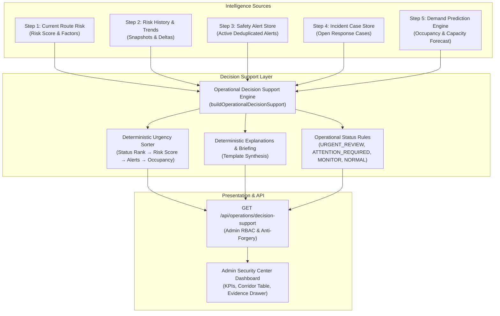

# SmartRide — Operational Decision Support Center
## Phase 3 — Step 6 Technical & Operational Documentation

> **MANDATORY SYSTEM NOTICE**  
> *This Step 6 operational decision-support module is advisory and deterministic. It does not automatically modify routes, vehicles, schedules, subscriptions, bookings, or driver assignments.*

---

## 1. Purpose

The **Smart Commute Operational Decision Support Center** unifies all verified intelligence generated across Phase 3 into a single, explainable operational picture for SmartRide administrators.

Rather than requiring dispatchers and operations managers to independently cross-reference disconnected screens (route risk scores, historical risk trends, active safety alerts, open incident response cases, and ML demand forecasts), the Decision Support Engine deterministically synthesizes these server-side intelligence streams to answer the core operational question:

> *"Which corridors currently require administrative attention, why, and what verified operational information should the Admin review?"*

Under a strict **Human-in-the-Loop** model, the engine provides advisory briefings, operational status categorizations, and evidence inspection. The administrator retains authoritative operational control over all dispatch, scheduling, and routing decisions.

---

## 2. Architecture



The system operates strictly server-side within the Next.js runtime. No black-box machine learning models or probabilistic guesswork determine operational statuses; all classifications and briefings are derived from explainable, rule-based logic evaluated on verified server data.

---

## 3. Data Sources

The decision-support engine aggregates data from five existing, verified platform modules:

| Component | Source Store / Service | Retrieved Intelligence |
| :--- | :--- | :--- |
| **Current Route Risk (Step 1)** | `route-risk-engine.ts` | Numerical risk score (0–100), risk level (`LOW`, `MEDIUM`, `HIGH`, `CRITICAL`), active emergency counts, corridor deviations, speed anomalies. |
| **Risk History & Trends (Step 2)** | `route-risk-history-store.ts` | Chronological snapshots, trend direction (`RISING`, `FALLING`, `STABLE`, `NO_HISTORY`), score delta, factor point breakdowns. |
| **Safety Alerts (Step 3)** | `safety-alert-store.ts` | Active alerts, severity counts (`CRITICAL`, `HIGH`, `MEDIUM`, `LOW`), alert titles, messages, and raw telemetry evidence. |
| **Incident Management (Step 4)** | `safety-incident-store.ts` | Open response cases, unresolved case counts, critical incident counts, case statuses (`OPEN`, `ACKNOWLEDGED`, `INVESTIGATING`, `MITIGATED`). |
| **Demand Prediction (Step 5)** | `prediction-engine.ts` | Predicted passenger demand, vehicle seat capacity, predicted occupancy percentage, demand level band, data quality state, and capacity recommendations. |

---

## 4. Operational Status Rules

Every corridor route is deterministically classified into one of four operational statuses based on verified conditions. Evaluation proceeds strictly from highest urgency to lowest:

```
URGENT_REVIEW  >  ATTENTION_REQUIRED  >  MONITOR  >  NORMAL
```

### 1. `URGENT_REVIEW`
Triggered if **ANY** of the following conditions are true:
- Route risk is `CRITICAL` ($\text{riskScore} \ge 75$)
- Active emergency detected ($\text{activeEmergencies} > 0$)
- Active `CRITICAL` safety alert ($\text{activeCriticalAlerts} > 0$)
- Unresolved `CRITICAL` incident case ($\text{criticalIncidents} > 0$)

### 2. `ATTENTION_REQUIRED`
Triggered if **ANY** of the following conditions are true (and not `URGENT_REVIEW`):
- Route risk is `HIGH` ($50 \le \text{riskScore} < 75$)
- Active `HIGH` safety alert ($\text{activeHighAlerts} > 0$)
- High demand / capacity pressure ($\text{predictedOccupancy} \ge 90\%$ or `demandLevel === 'CRITICAL'`)
- Rapidly deteriorating risk trend ($\text{riskTrend} === \text{'RISING'}$ with $\text{scoreDelta} \ge 10$)
- Multiple active safety alerts ($\text{totalActiveAlerts} \ge 2$)
- Rising risk trend accompanied by active safety alerts

### 3. `MONITOR`
Triggered if **ANY** of the following conditions are true (and not above):
- Route risk is `MEDIUM` ($25 \le \text{riskScore} < 50$)
- High passenger demand ($75\% \le \text{predictedOccupancy} < 90\%$ or `demandLevel === 'HIGH'`)
- Non-critical active safety alert (`activeMediumAlerts > 0` or `activeLowAlerts > 0`)
- Moderate unresolved incident case (`unresolvedIncidents > 0` with no critical incidents)
- Rising risk trend ($\text{riskTrend} === \text{'RISING'}$)

### 4. `NORMAL`
Assigned when **NONE** of the above triggers occur:
- No `CRITICAL` or `HIGH` active safety alerts
- No active emergencies
- Route risk is `LOW` ($\text{riskScore} < 25$)
- Passenger demand is within normal capacity bounds ($< 75\%$ occupancy)
- No unresolved critical incidents

---

## 5. Fleet Sorting Rules

Fleet-wide corridor lists are deterministically sorted to prioritize administrator attention:

1. **Operational Status Urgency**:
   - `URGENT_REVIEW` (Rank 4)
   - `ATTENTION_REQUIRED` (Rank 3)
   - `MONITOR` (Rank 2)
   - `NORMAL` (Rank 1)
2. **Within the same status**:
   - Sort by `risk.score` descending (higher risk first)
3. **If risk scores are identical**:
   - Sort by `alerts.activeCount` descending (more alerts first)
4. **If alert counts are identical**:
   - Sort by `demand.predictedOccupancy` descending (higher occupancy first)

This sorting reflects an operational triage order, not a qualitative or punitive driver/route ranking.

---

## 6. Alert Integration

The engine consumes existing records from [`src/lib/safety/safety-alert-store.ts`](file:///c:/Users/Ideapad/Documents/antigravity/fearless-galileo/src/lib/safety/safety-alert-store.ts) without creating duplicates:
- Queries active alerts using `getSafetyAlerts({ routeId, status: 'ACTIVE' })`.
- Matches both corridor database UUIDs and human-readable codes (`SR-101`, `SR-102`).
- Aggregates severity counts: `criticalCount`, `highCount`, `mediumCount`, `lowCount`.
- Embeds alert records and telemetry evidence in the corridor detail evidence payload.

---

## 7. Incident Integration

The engine integrates with Step 4 operational case management from [`src/lib/safety/safety-incident-store.ts`](file:///c:/Users/Ideapad/Documents/antigravity/fearless-galileo/src/lib/safety/safety-incident-store.ts):
- Queries incident records using `getIncidentCases()`.
- Identifies unresolved cases: all cases where $\text{status} \notin \{\text{'RESOLVED'}, \text{'CLOSED'}\}$.
- Categorizes unresolved cases by severity to detect unresolved `CRITICAL` escalations.
- Surfaces active cases in the drawer evidence list with status badges and investigation notes.

---

## 8. AI Demand Integration

The engine accesses the Step 5 Random Forest Regressor and demand forecasting pipeline via [`src/lib/ai/prediction-engine.ts`](file:///c:/Users/Ideapad/Documents/antigravity/fearless-galileo/src/lib/ai/prediction-engine.ts):
- Retrieves `predictedDemand`, `predictedOccupancy`, `demandLevel`, `dataQualityStatus`, and `recommendation`.
- Evaluates capacity pressure against physical vehicle seating capacity.
- Uses singleton cached models during evaluation to avoid redundant training overhead.

---

## 9. Data Quality Handling

The engine strictly preserves the four-tier data quality semantics established in Step 5:
- **`HIGH_DATA_QUALITY`**: Corridor has $\ge 60$ historical dispatch records.
- **`MEDIUM_DATA_QUALITY`**: Corridor has $30 - 59$ historical dispatch records.
- **`LOW_DATA_QUALITY`**: Corridor has $10 - 29$ historical dispatch records.
- **`INSUFFICIENT_DATA`**: Corridor has $< 10$ records.

When demand data is insufficient, the system:
1. Sets `demand.predictedDemand: null` and `demand.predictedOccupancy: null`.
2. Sets `demand.dataQuality: 'INSUFFICIENT_DATA'`.
3. Adds an honest explanation: *"Demand intelligence unavailable due to insufficient historical data."*
4. Refuses to invent synthetic predictions or placeholder numbers.

---

## 10. Explainability & Multi-Condition Synthesis

Every corridor decision includes two layers of human-readable explainability:

### 1. Deterministic Executive Briefing (`briefing`)
A synthesized sentence highlighting all coexistence conditions:
- **Example (Urgent Review)**:  
  *"Route SR-101 requires urgent administrative review because route risk is CRITICAL (78/100), an active emergency alert exists, and 1 critical incident remains unresolved."*
- **Example (Attention Required)**:  
  *"Route SR-102 requires administrative attention because route risk is HIGH (62/100) and predicted occupancy is 92% (CRITICAL demand level)."*
- **Example (Normal)**:  
  *"Route SR-103 is operating normally: no active high-severity safety conditions were detected and predicted occupancy remains within the normal operating range (54%)."*

### 2. Verified Contributing Factors List (`explanation[]`)
Individual bullet points detailing:
- Risk score, level, and trend direction with exact point deltas.
- Active safety alert breakdown across severity levels.
- Open incident case counts and critical case statuses.
- Passenger demand, vehicle occupancy percentage, and demand level band.
- Advisory capacity and scheduling recommendations.

---

## 11. API Contracts

### `GET /api/operations/decision-support`

#### Query Parameters:
- `routeId`: Optional. Unique route UUID or corridor code (e.g. `SR-101`).

#### Fleet-Wide Response (Without `routeId`):
```json
{
  "success": true,
  "summary": {
    "totalRoutes": 3,
    "normal": 1,
    "monitor": 1,
    "attentionRequired": 1,
    "urgentReview": 0,
    "criticalRiskRoutes": 0,
    "highRiskRoutes": 1,
    "activeCriticalAlerts": 0,
    "activeHighAlerts": 1,
    "unresolvedIncidents": 1,
    "highDemandRoutes": 1,
    "criticalDemandRoutes": 1
  },
  "routes": [
    {
      "routeId": "cmtmljtu6000ueljgm2m18qrr",
      "routeCode": "SR-101",
      "routeName": "Whitefield Tech Express",
      "operationalStatus": "ATTENTION_REQUIRED",
      "risk": {
        "score": 62,
        "level": "HIGH",
        "trend": "RISING",
        "scoreDelta": 12,
        "previousScore": 50,
        "activeEmergencies": 0,
        "activeDeviations": 1,
        "activeSpeedAnomalies": 0
      },
      "alerts": {
        "activeCount": 1,
        "criticalCount": 0,
        "highCount": 1,
        "mediumCount": 0,
        "lowCount": 0
      },
      "incidents": {
        "activeCount": 1,
        "criticalCount": 0,
        "unresolvedCount": 1
      },
      "demand": {
        "predictedDemand": 18,
        "predictedOccupancy": 90.0,
        "demandLevel": "CRITICAL",
        "dataQuality": "HIGH_DATA_QUALITY"
      },
      "capacity": {
        "recommendation": "Predicted occupancy is near or above vehicle capacity (90%). Admin review of additional shuttle capacity is recommended.",
        "vehicleCapacity": 20
      },
      "explanation": [
        "Route risk is HIGH at 62/100 and rising by 12 points.",
        "1 active safety alert(s) recorded: 0 CRITICAL, 1 HIGH, 0 MEDIUM.",
        "1 unresolved incident case(s) open in case management (0 CRITICAL).",
        "Predicted passenger demand is 18 commuters (90% vehicle occupancy, CRITICAL demand band).",
        "Predicted occupancy is near or above vehicle capacity (90%). Admin review of additional shuttle capacity is recommended."
      ],
      "briefing": "Route SR-101 requires administrative attention because route risk is HIGH (62/100), 1 active HIGH-severity safety alert(s), predicted occupancy is 90% (CRITICAL demand level).",
      "evidence": { ... },
      "generatedAt": "2026-10-02T04:52:29.143Z"
    }
  ],
  "generatedAt": "2026-10-02T04:52:29.143Z"
}
```

#### Single Route Response (With `?routeId=SR-101`):
```json
{
  "success": true,
  "route": { ... }
}
```

#### Nonexistent Route:
Returns HTTP `404 Not Found`:
```json
{
  "error": "Route not found with identifier 'NONEXISTENT_ROUTE'"
}
```

---

## 12. Role-Based Access Control (RBAC)

Access to `/api/operations/decision-support` is strictly restricted to verified `ADMIN` sessions:

| Client Identity | HTTP Status | Response |
| :--- | :---: | :--- |
| **Unauthenticated (Guest)** | `401 Unauthorized` | `{ "error": "Unauthorized: Authentication required" }` |
| **COMMUTER Role** | `403 Forbidden` | `{ "error": "Forbidden: Admin access required" }` |
| **DRIVER Role** | `403 Forbidden` | `{ "error": "Forbidden: Admin access required" }` |
| **ADMIN Role** | `200 OK` | Fleet decision support payload |

---

## 13. Anti-Forgery Protection

All intelligence fields are computed strictly server-side:
- Parameters such as `riskScore`, `riskLevel`, `operationalStatus`, `predictedDemand`, `predictedOccupancy`, and `recommendation` submitted in request queries or bodies are completely ignored.
- Only authenticated admin credentials in `smartride_token` and the target corridor identifier are evaluated.
- Verified in automated tests 14, 15, and 16.

---

## 14. Admin UI Component

The decision-support interface is implemented in [`src/components/admin/operational-decision-support.tsx`](file:///c:/Users/Ideapad/Documents/antigravity/fearless-galileo/src/components/admin/operational-decision-support.tsx) and mounted at the top of the **Admin Security Center** (`/admin/security`):

1. **Header & System Notice**: Prominently displays the advisory system notice and a non-mutative *"Refresh Operational Intelligence"* action.
2. **Top 6 KPI Cards**:
   - *Routes Analyzed*: Total corridors in scope.
   - *Urgent Review*: Corridors with critical safety triggers.
   - *Attention Required*: Corridors with high risk, alerts, or critical demand.
   - *Active Critical Alerts*: High-severity alerts requiring immediate attention.
   - *Unresolved Incidents*: Open case-management tickets.
   - *Critical Demand Routes*: Corridors with $\ge 90\%$ vehicle occupancy.
3. **Corridor Decision Table**:
   - Status filter tabs (`All Corridors`, `Urgent Review`, `Attention Required`, `Monitor`, `Normal`).
   - Columns: Route identity, Operational Status, Risk Score & Level, Trend Direction & Delta, Active Alerts, Open Cases, Occupancy Progress Bar, Demand Level, Data Quality, and Evidence Action.
4. **Evidence & Briefing Drawer**:
   - Slide-out side drawer with complete corridor identity.
   - Prominently styled *Deterministic Operational Briefing*.
   - Checkmark factor list of all verified contributing factors.
   - Dual-card breakdown for Route Risk (Step 1 & 2) and Demand Forecast (Step 5).
   - Expandable lists of Active Safety Alerts and Open Incident Cases.
   - Capacity and scheduling recommendation footer.

---

## 15. Limitations & Technical Debt

1. **Weather & External Traffic Telemetry**: Does not ingest external third-party traffic or weather APIs (relies purely on platform internal telemetry).
2. **Cold-Start Corridors**: Corridors with fewer than 10 historical dispatch records display `INSUFFICIENT_DATA` for demand forecasting until commuter volume accumulates.
3. **Real-Time Push**: Relies on user-triggered refresh rather than WebSocket push notifications to preserve zero-overhead server architecture.

---

## 16. Future Extensions

1. **Automated Notification Dispatch**: Optional webhook/SMS notifications to operations managers when a corridor transitions to `URGENT_REVIEW`.
2. **Cross-Corridor Dynamic Resource Balancing**: Identifying available shuttles on `NORMAL` routes that could support `ATTENTION_REQUIRED` routes.
3. **Geographic Weather Overlay**: Ingesting city-wide weather warnings into route risk factor calculations.

---

> **MANDATORY SYSTEM NOTICE**  
> *This Step 6 operational decision-support module is advisory and deterministic. It does not automatically modify routes, vehicles, schedules, subscriptions, bookings, or driver assignments.*
