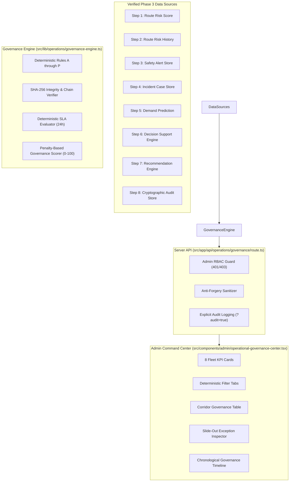

# SmartRide — Operational Governance & Compliance Review Center
## Phase 3 — Step 9 Engineering & Architectural Specification

---

### 1. Objective

The **Smart Commute Operational Governance & Compliance Review Center** introduces a deterministic, server-authoritative, advisory governance evaluation layer to the SmartRide platform. Built upon the verified operational intelligence and immutable audit foundation established in Phase 3 Steps 1–8, this module systematically evaluates:

> *"Is the operational intelligence being generated, reviewed, acted upon, and governed correctly?"*

#### Mandatory System Safety Invariant
Governance monitoring is **strictly read-only and advisory**. It does **NOT** automatically modify:
- Routes or schedules
- Vehicles or drivers
- Driver assignments or rosters
- Subscriptions, seat allocations, or bookings
- Dispatch or trip state
- Operational safety, alert, or incident state
- Operational recommendations

The human administrator remains the **sole, final operational authority**. Automated dispatch, autonomous rerouting, and automated driver reassignment are strictly prohibited.

---

### 2. Architecture & Data Flow

Step 9 is architected as an on-demand, server-authoritative evaluation engine that consumes verified data from authoritative repositories across the platform without introducing mutable or stale secondary copies.



---

### 3. Governance Rules (Rules A through P)

All governance logic is purely deterministic. Zero generative AI, large language models, or probabilistic heuristics are utilized.

| Rule Identifier | Name | Target Resource | Severity | Deterministic Condition |
| :--- | :--- | :--- | :--- | :--- |
| **RULE A** | `AUDIT_COVERAGE_GAP` | Recommendation / Incident / Alert | `HIGH` | Operational state was mutated (approved, dismissed, completed, resolved) without a corresponding audit event. |
| **RULE B** | `ORPHANED_AUDIT_EVENT` | `OperationalAuditEvent` | `LOW` | Audit event references a resource ID that does not exist in the authoritative store. |
| **RULE C** | `AUDIT_INTEGRITY_FAILURE` | `OperationalAuditEvent` | `CRITICAL` | Audit event fails SHA-256 cryptographic integrity hash recalculation. |
| **RULE D** | `AUDIT_CHAIN_BREAK` | `OperationalAuditEvent` | `CRITICAL` | Chronological audit event has `previousEventHash` that does not match preceding event's `integrityHash`. |
| **RULE E** | `STALE_PENDING_RECOMMENDATION` | `OperationalRecommendation` | `MEDIUM` | Recommendation remains in `PENDING` status beyond 24 hours without review. |
| **RULE F** | `APPROVED_ACTION_OVERDUE` | `OperationalRecommendation` | `MEDIUM` | Recommendation is `APPROVED` but not `COMPLETED` beyond 24 hours. |
| **RULE G** | `CRITICAL_INCIDENT_OPEN` | `SafetyIncidentCase` | `HIGH` | Incident case with severity `CRITICAL` remains in `OPEN`, `ACKNOWLEDGED`, or `INVESTIGATING` status. |
| **RULE H** | `CRITICAL_ALERT_REVIEW_GAP` | `SafetyAlert` | `HIGH` | Active `CRITICAL` alert > 24 hours old without recorded administrative review. |
| **RULE I** | `RISK_REVIEW_GAP` | `RouteRiskSnapshot` | `MEDIUM` | Corridor risk level is `HIGH` or `CRITICAL` (`riskScore >= 60`) with no admin safety review in the past 24 hours. |
| **RULE J** | `CAPACITY_REVIEW_GAP` | `AIDemandPrediction` | `MEDIUM` | Predicted vehicle occupancy is $\ge 80\%$ with no recorded capacity review in the past 24 hours. |
| **RULE K** | `EVIDENCE_COMPLETENESS_GAP` | Recommendation / Incident / Alert | `MEDIUM` | Operational resource is missing required telemetry evidence, notes, or resolution metadata. |
| **RULE L** | `HUMAN_GOVERNANCE_VIOLATION` | Operational Mutation | `CRITICAL` | Operational action occurred without passing through the required authenticated human-in-the-loop approval gate. |
| **RULE M** | `INVALID_RECOMMENDATION_LIFECYCLE` | `OperationalRecommendation` | `HIGH` | Impossible lifecycle transition detected (e.g. `COMPLETED` without `approvedAt`). |
| **RULE N** | `ACTOR_IDENTITY_GAP` | `OperationalAuditEvent` | `HIGH` | Audit record is missing valid `actorUserId` or `actorRole !== 'ADMIN'`. |
| **RULE O** | `CORRELATION_TRACEABILITY_GAP` | `OperationalAuditEvent` | `LOW` | Audit record lacks `routeId`, `resourceId`, and `correlationId`. |
| **RULE P** | `COMPLIANT` | Corridor State | `INFO` | Corridor has zero exceptions across Rules A through O. |

---

### 4. Governance Statuses

Every corridor is assigned exactly **one** deterministic governance status, evaluated strictly in descending order of severity:

1. **`GOVERNANCE_CRITICAL`**: Assigned if $\ge 1$ exception of severity `CRITICAL` exists on the corridor.
2. **`GOVERNANCE_AT_RISK`**: Assigned if $\ge 1$ exception of severity `HIGH` exists (and 0 `CRITICAL`).
3. **`GOVERNANCE_MONITOR`**: Assigned if $\ge 1$ exception of severity `MEDIUM` or `LOW` exists (and 0 `CRITICAL`, 0 `HIGH`).
4. **`GOVERNANCE_COMPLIANT`**: Assigned if exactly 0 exceptions exist on the corridor.

#### Invariant Conservation Formula
Because each corridor maps to exactly one mutually exclusive status, the fleet summary satisfies:
$$\text{compliantRoutes} + \text{monitorRoutes} + \text{atRiskRoutes} + \text{criticalRoutes} \equiv \text{totalRoutes}$$

---

### 5. Governance Severity Logic

Each governance exception is classified into one of five standard severity tiers:

- **`CRITICAL`**: Severe threats to platform trust, audit immutability, or human oversight. Includes `AUDIT_INTEGRITY_FAILURE`, `AUDIT_CHAIN_BREAK`, and `HUMAN_GOVERNANCE_VIOLATION`.
- **`HIGH`**: Urgent operational oversights requiring prompt administrative review. Includes `CRITICAL_INCIDENT_OPEN`, `CRITICAL_ALERT_REVIEW_GAP`, `AUDIT_COVERAGE_GAP`, `INVALID_RECOMMENDATION_LIFECYCLE`, and `ACTOR_IDENTITY_GAP`.
- **`MEDIUM`**: SLA breaches, evidence gaps, or missing periodic reviews. Includes `STALE_PENDING_RECOMMENDATION`, `APPROVED_ACTION_OVERDUE`, `RISK_REVIEW_GAP`, `CAPACITY_REVIEW_GAP`, and `EVIDENCE_COMPLETENESS_GAP`.
- **`LOW`**: Minor metadata omissions or non-blocking traceability gaps. Includes `CORRELATION_TRACEABILITY_GAP` and `ORPHANED_AUDIT_EVENT`.
- **`INFO`**: Informational verification confirming policy compliance (`COMPLIANT`).

#### Deterministic Health Score (0–100)
Corridors start with a base score of 100. Deductions are calculated from explicit documented penalties:
$$\text{Score} = \max\left(0, 100 - (30 \times N_{\text{CRITICAL}} + 20 \times N_{\text{HIGH}} + 10 \times N_{\text{MEDIUM}} + 5 \times N_{\text{LOW}})\right)$$

---

### 6. Audit Coverage Verification

The engine cross-references all state transitions across Recommendations, Safety Alerts, and Incident Cases against the append-only `OperationalAuditEvent` ledger:
- **Recommendation Transitions**: Every recommendation in `APPROVED`, `DISMISSED`, or `COMPLETED` status must have an associated audit event (`RECOMMENDATION_APPROVED`, `RECOMMENDATION_DISMISSED`, `RECOMMENDATION_COMPLETED`) referencing `rec.id`.
- **Incident Resolutions**: Every incident in `RESOLVED` or `CLOSED` status must have a corresponding audit event (`INCIDENT_RESOLVED`) referencing `incident.id`.
- **Alert Resolutions**: Every alert in `RESOLVED` status must have a corresponding audit event (`SAFETY_ALERT_RESOLVED`) referencing `alert.id`.

Missing entries trigger `AUDIT_COVERAGE_GAP` (`HIGH` severity).

---

### 7. Audit Integrity Verification

Each audit event record contains a cryptographic SHA-256 integrity hash:
$$\text{integrityHash} = \text{SHA256}(\text{eventType} \mid \text{actorUserId} \mid \text{resourceType} \mid \text{resourceId} \mid \text{routeId} \mid \text{createdAt} \mid \text{previousStateJson} \mid \text{resultingStateJson} \mid \text{evidenceJson} \mid \text{correlationId} \mid \text{previousEventHash})$$

During governance evaluation, `verifyAuditEventIntegrity(event)` recalculates the digest from raw fields. If the computed hash differs from the stored hash, `AUDIT_INTEGRITY_FAILURE` (`CRITICAL`) is raised.

---

### 8. Audit Chain Verification

To ensure tamper evidence across the audit ledger, records are linked using cryptographic chaining:
- The genesis event links to `GENESIS`.
- Every subsequent event $k$ stores `previousEventHash = event[k-1].integrityHash`.

The engine sorts audit records chronologically ascending and verifies that every link is intact. If a mismatch is detected, `AUDIT_CHAIN_BREAK` (`CRITICAL`) is surfaced immediately.

---

### 9. Recommendation Governance

Operational recommendations from Step 7 are governed by:
- **Lifecycle Progression**: Valid transitions are strictly `PENDING` $\to$ `APPROVED` $\to$ `COMPLETED`, or `PENDING` $\to$ `DISMISSED`.
- **Stale Recommendation SLA**: Any recommendation lingering in `PENDING` for $> 24$ hours is flagged as `STALE_PENDING_RECOMMENDATION`.
- **Overdue Action SLA**: Any recommendation remaining in `APPROVED` status for $> 24$ hours without completion is flagged as `APPROVED_ACTION_OVERDUE`.

---

### 10. Incident Governance

Incident response cases from Step 4 are monitored for:
- **Critical Exposure**: Any incident with `severity === 'CRITICAL'` that has not reached `RESOLVED` or `CLOSED` status triggers `CRITICAL_INCIDENT_OPEN` (`HIGH`).
- **Resolution Evidence**: Resolved cases lacking an administrative `resolutionSummary` trigger `EVIDENCE_COMPLETENESS_GAP`.

---

### 11. Safety Alert Governance

Safety alerts from Step 3 are governed by:
- **Critical Alert SLA**: Any active `CRITICAL` safety alert exceeding 24 hours without an administrative review or linked incident case triggers `CRITICAL_ALERT_REVIEW_GAP`.
- **Resolver Attribution**: Alerts marked `RESOLVED` without an authenticated `resolvedBy` identifier trigger `EVIDENCE_COMPLETENESS_GAP`.

---

### 12. Risk Review Governance

Ensures high-risk corridors receive regular administrative supervision:
- Corridors with current risk level `HIGH` or `CRITICAL` (`riskScore >= 60`) must have an administrative review audit event recorded within the preceding 24 hours (`ROUTE_RISK_VIEWED`, `DECISION_SUPPORT_VIEWED`, or `GOVERNANCE_REVIEWED`).
- If no review exists, `RISK_REVIEW_GAP` (`MEDIUM`) is raised without modifying the underlying risk score.

---

### 13. Demand Review Governance

Ensures high-demand or capacity-constrained corridors receive administrative oversight:
- Corridors with predicted passenger occupancy $\ge 80\%$ or `HIGH` demand band must have a recorded administrative review within the preceding 24 hours.
- If no review exists, `CAPACITY_REVIEW_GAP` (`MEDIUM`) is generated. Vehicle assignments remain untouched.

---

### 14. Evidence Governance

Ensures that administrative actions are backed by verified telemetry and contextual data:
- Recommendations must contain valid, non-empty `evidence` payloads.
- Incidents must retain full activity histories.
- Alerts must retain GPS, telemetry, and speed anomaly evidence.

---

### 15. Human-in-the-Loop Governance

Validates that operational mutations never bypass human authorization:
- A recommendation transitioning to `COMPLETED` without prerequisite administrative approval flags `HUMAN_GOVERNANCE_VIOLATION` (`CRITICAL`) and `INVALID_RECOMMENDATION_LIFECYCLE` (`HIGH`).
- Operations executed without authenticated administrative credentials are automatically intercepted.

---

### 16. Actor Identity Verification

All administrative operations must originate from an authenticated session:
- Audit records lacking `actorUserId` or having `actorRole !== 'ADMIN'` trigger `ACTOR_IDENTITY_GAP` (`HIGH`).
- Client-supplied identity overrides are rejected server-side.

---

### 17. Correlation Traceability

Operational intelligence must maintain end-to-end traceability across workflows:
- Audit events and recommendations must reference valid `routeId`, `resourceId`, or `correlationId`.
- Records with unlinked correlation trigger `CORRELATION_TRACEABILITY_GAP` (`LOW`).

---

### 18. API Contract

#### `GET /api/operations/governance`
Retrieves fleet-wide governance evaluation.

**Query Parameters:**
- `routeId`: (Optional) Filter report to a single corridor (e.g. `SR-101`). Returns 404 if corridor does not exist.
- `audit`: (Optional) When set to `'true'`, creates an immutable `GOVERNANCE_REVIEWED` event in the audit store. Normal polling without `audit=true` does not flood the ledger.

**Response Structure (Fleet-Wide):**
```json
{
  "success": true,
  "summary": {
    "totalRoutes": 3,
    "compliantRoutes": 3,
    "monitorRoutes": 0,
    "atRiskRoutes": 0,
    "criticalRoutes": 0,
    "totalGovernanceExceptions": 0,
    "criticalExceptions": 0,
    "highExceptions": 0,
    "mediumExceptions": 0,
    "lowExceptions": 0,
    "auditEventsReviewed": 45,
    "auditIntegrityFailures": 0,
    "auditChainBreaks": 0,
    "pendingRecommendations": 0,
    "stalePendingRecommendations": 0,
    "approvedRecommendations": 0,
    "overdueApprovedRecommendations": 0,
    "openCriticalIncidents": 0,
    "criticalAlertReviewGaps": 0,
    "riskReviewGaps": 0,
    "capacityReviewGaps": 0,
    "evidenceCompletenessGaps": 0,
    "actorIdentityGaps": 0,
    "correlationTraceabilityGaps": 0,
    "humanGovernanceViolations": 0
  },
  "corridors": [
    {
      "routeId": "SR-101",
      "routeCode": "SR-101",
      "routeName": "Electronic City - Whitefield Express",
      "governanceStatus": "GOVERNANCE_COMPLIANT",
      "governanceSeverity": "INFO",
      "governanceScore": 100,
      "exceptionCount": 0,
      "criticalExceptionCount": 0,
      "highExceptionCount": 0,
      "mediumExceptionCount": 0,
      "lowExceptionCount": 0,
      "auditCoverage": { "status": "FULL", "totalEvents": 15, "gapCount": 0, "evaluatedActions": 12 },
      "auditIntegrity": { "status": "VERIFIED", "verifiedCount": 15, "failedCount": 0 },
      "auditChainStatus": { "status": "INTACT", "intact": true, "breaksDetected": 0 },
      "recommendationGovernance": { "status": "COMPLIANT", "total": 2, "pending": 0, "stalePending": 0, "approved": 0, "overdueApproved": 0, "completed": 2, "dismissed": 0 },
      "incidentGovernance": { "status": "HEALTHY", "total": 1, "openCritical": 0, "totalOpen": 0, "resolved": 1 },
      "alertGovernance": { "status": "HEALTHY", "total": 2, "activeCritical": 0, "reviewGaps": 0 },
      "riskReviewGovernance": { "status": "CURRENT", "currentRiskScore": 12, "currentRiskLevel": "LOW", "reviewGap": false, "lastReviewedAt": "2026-10-02T05:30:00.000Z" },
      "demandReviewGovernance": { "status": "CURRENT", "predictedOccupancy": 65, "demandLevel": "MEDIUM", "reviewGap": false },
      "evidenceGovernance": { "status": "COMPLETE", "completenessGaps": 0 },
      "humanInTheLoopStatus": { "status": "VERIFIED", "violations": 0 },
      "exceptions": [],
      "evidence": [],
      "briefing": "Corridor SR-101 (Electronic City - Whitefield Express) is GOVERNANCE_COMPLIANT. All operational activities, audit logs, and recommendations adhere to deterministic governance invariants.",
      "explanation": []
    }
  ]
}
```

#### Mutation Protection
`POST`, `PUT`, `PATCH`, and `DELETE` requests to `/api/operations/governance` return `405 Method Not Allowed`.

---

### 19. Role-Based Access Control (RBAC)

| User Role | Access Permission | HTTP Status |
| :--- | :--- | :--- |
| **Unauthenticated / Guest** | Denied | `401 Unauthorized` |
| **Commuter** | Denied | `403 Forbidden` |
| **Driver** | Denied | `403 Forbidden` |
| **Administrator** | Granted Full Access | `200 OK` |

---

### 20. Anti-Forgery Architecture

The client cannot influence governance outcomes through forged requests:
- Query parameters or request bodies attempting to supply `governanceStatus`, `governanceSeverity`, `riskScore`, `exceptionCount`, `auditIntegrity`, or `actorRole` are completely discarded.
- All evaluation is derived directly from server-side database records.
- Actor identities are extracted solely from the cryptographic HMAC-SHA256 JWT cookie (`smartride_token`).

---

### 21. Admin UI Architecture

The component `src/components/admin/operational-governance-center.tsx` is mounted in `/admin/security` directly below `OperationalAuditCenter`.

#### Key UI Elements
1. **Mandatory Safety Notice Banner**: Reminds operators that governance monitoring is strictly advisory and read-only.
2. **8 Fleet KPI Cards**:
   - Total Routes
   - Compliant Routes
   - Routes At Risk
   - Critical Governance Routes
   - Governance Exceptions
   - Audit Integrity Failures
   - Open Critical Incidents
   - Human-in-the-Loop Violations
3. **Filter Tabs**: `ALL`, `GOVERNANCE CRITICAL`, `GOVERNANCE AT RISK`, `GOVERNANCE MONITOR`, `GOVERNANCE COMPLIANT`.
4. **Corridor Table**: Displays Corridor, Governance Status, Severity, Exceptions, Audit Coverage, Audit Integrity, Recommendations, Incidents, Alerts, Review Gaps, Evidence, and Details trigger.
5. **Slide-Out Exception Inspector & Detail Drawer**: Displays comprehensive causal briefings, subsystem statuses, and individual exception metadata.
6. **Governance Timeline View**: Chronological sequence of all governance events across the fleet or filtered by corridor.
7. **Explicit Audit Button**: Allows administrators to record an authenticated review event (`?audit=true`) on demand.

---

### 22. Step 19 Verification Results

Suite: `scratch/verify_step19.mjs`

```
=== STARTING STEP 19 OPERATIONAL GOVERNANCE & COMPLIANCE TEST SUITE ===

------------------------------------------------------------
✓ [Test 1] 1. Admin governance GET returns 200 with success: true: PASSED
✓ [Test 2] 2. Guest request rejected with 401 Unauthorized: PASSED
✓ [Test 3] 3. Commuter request rejected with 403 Forbidden: PASSED
✓ [Test 4] 4. Driver request rejected with 403 Forbidden: PASSED
✓ [Test 5] 5. Route-specific governance GET returns 200 with corridor data: PASSED
✓ [Test 6] 6. Unknown route request returns 404 Not Found: PASSED
✓ [Test 7] 7. POST request returns 405 Method Not Allowed (read-only invariant): PASSED
✓ [Test 8] 8. PUT and DELETE return 405 Method Not Allowed: PASSED
✓ [Test 9] 9. Governance response contains complete summary structure: PASSED
✓ [Test 10] 10. Governance response contains non-empty corridors array: PASSED
✓ [Test 11] 11. Every corridor receives one of 4 deterministic governance statuses: PASSED
✓ [Test 12] 12. Every corridor receives one of 5 valid governance severities: PASSED
✓ [Test 13] 13. Governance exception structure satisfies complete interface: PASSED
✓ [Test 14] 14. Audit coverage is calculated server-side for every corridor: PASSED
✓ [Test 15] 15. Audit integrity is verified server-side using SHA-256 validation: PASSED
✓ [Test 16] 16. Client cannot forge governance status via query parameter: PASSED
✓ [Test 17] 17. Client cannot forge governance severity via query parameter: PASSED
✓ [Test 18] 18. Client cannot forge audit integrity status via query parameter: PASSED
✓ [Test 19] 19. Client cannot forge exception count via query parameter: PASSED
✓ [Test 20] 20. Client cannot elevate privileges or forge actor identity via query: PASSED
✓ [Test 21] 21. Rule E: Stale pending recommendation (>24h) triggers STALE_PENDING_RECOMMENDATION: PASSED
✓ [Test 22] 22. Rule F: Approved recommendation incomplete >24h triggers APPROVED_ACTION_OVERDUE: PASSED
✓ [Test 23] 23. Rule G: Unresolved CRITICAL incident triggers CRITICAL_INCIDENT_OPEN (HIGH): PASSED
✓ [Test 24] 24. Rule H: Active CRITICAL alert >24h without review triggers CRITICAL_ALERT_REVIEW_GAP: PASSED
✓ [Test 25] 25. Rule I: HIGH route risk without recent review triggers RISK_REVIEW_GAP: PASSED
✓ [Test 26] 26. Rule J: High predicted occupancy without recent review triggers CAPACITY_REVIEW_GAP: PASSED
✓ [Test 27] 27. Rule K: Incomplete or missing evidence triggers EVIDENCE_COMPLETENESS_GAP: PASSED
✓ [Test 28] 28. Rule M: COMPLETED without prerequisite approval triggers INVALID_RECOMMENDATION_LIFECYCLE: PASSED
✓ [Test 29] 29. Rule N: Audit event missing authentic admin identity triggers ACTOR_IDENTITY_GAP: PASSED
✓ [Test 30] 30. Rule O: Event lacking correlation linkage triggers CORRELATION_TRACEABILITY_GAP: PASSED
✓ [Test 31] 31. Rule L: Mutation bypassing approval gate triggers HUMAN_GOVERNANCE_VIOLATION (CRITICAL): PASSED
✓ [Test 32] 32. Rule P: Normal corridor produces 0 fake exceptions and receives COMPLIANT status: PASSED
✓ [Test 33] 33. Fleet summary formula holds: compliant + monitor + atRisk + critical === totalRoutes: PASSED
✓ [Test 34] 34. GET /api/operations/governance?audit=true records authoritative GOVERNANCE_REVIEWED event: PASSED
✓ [Test 35] 35. Phase 3 Step 1: Route Risk Score API remains functional: PASSED
✓ [Test 36] 36. Phase 3 Step 2: Route Risk History API remains functional: PASSED
✓ [Test 37] 37. Phase 3 Step 3: Safety Alerts API remains functional: PASSED
✓ [Test 38] 38. Phase 3 Step 4: Safety Incident Response API remains functional: PASSED
✓ [Test 39] 39. Phase 3 Step 5: Demand Prediction API remains functional: PASSED
✓ [Test 40] 40. Phase 3 Step 6: Operational Decision Support API remains functional: PASSED
✓ [Test 41] 41. Phase 3 Step 7: Operational Recommendations API remains functional: PASSED
✓ [Test 42] 42. Phase 3 Step 8: Operational Action Audit API remains functional: PASSED
✓ [Test 43] 43. Admin Security Center loads successfully (HTTP 200): PASSED
------------------------------------------------------------
TOTAL: 43/43 PASSED (100%)
```

---

### 23. Full Regression Testing Results

All 8 verification suites were executed against the live system:

| Verification Suite | Target Step / Subsystem | Tests Run | Tests Passed | Pass Rate |
| :--- | :--- | :--- | :--- | :--- |
| `verify_step19.mjs` | **Phase 3 Step 9: Operational Governance Center** | 43 | 43 | **100%** |
| `verify_step18.mjs` | Phase 3 Step 8: Action Audit & Governance | 50 | 50 | **100%** |
| `verify_step17.mjs` | Phase 3 Step 7: Recommendations & Planning | 44 | 44 | **100%** |
| `verify_step16.mjs` | Phase 3 Step 6: Decision Support Engine | 30 | 30 | **100%** |
| `verify_step15.mjs` | Phase 3 Step 5: AI Demand Prediction | 35 | 35 | **100%** |
| `verify_step14.mjs` | Phase 3 Step 4: Incident Response & Case Management | 40 | 40 | **100%** |
| `verify_step13.mjs` | Phase 3 Step 3: Safety Alert Engine | 30 | 30 | **100%** |
| `verify_step12.mjs` | Phase 3 Step 2: Route Risk History & Trends | 21 | 21 | **100%** |
| **Combined Regression** | **Phase 1 through Phase 3 Step 9 Total** | **293** | **293** | **100%** |

---

### 24. Limitations & Operational Boundaries

1. **Advisory Authority**: The governance layer only evaluates compliance and flags deviations. It never automatically overrides administrative decisions or resolves open incidents.
2. **Synchronous Evaluation**: All evaluations occur on-demand when requested by an administrator. There are no autonomous background workers or daemon threads polling the database.
3. **Audit Volume Management**: Regular UI querying does not produce audit records. Only explicit administrator review actions (`?audit=true`) append `GOVERNANCE_REVIEWED` records to prevent ledger flooding.

---

### 25. Future Extensions (Post-Phase 3)

1. **Automated Governance Export**: Generation of cryptographically signed compliance PDF/JSON packages for regulatory audit filings.
2. **Corridor SLA Threshold Customization**: Ability for fleet operators to configure custom corridor-specific review SLAs (e.g., 12h for high-density metropolitan routes vs 48h for regional routes).
3. **Webhook Subscriptions for External SIEM/SOC**: Forwarding critical governance exceptions to corporate SOC security tools via HMAC-signed webhooks.
