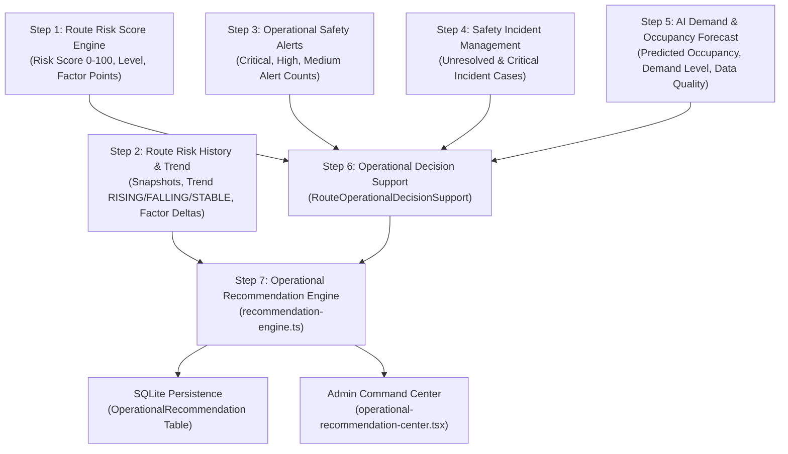
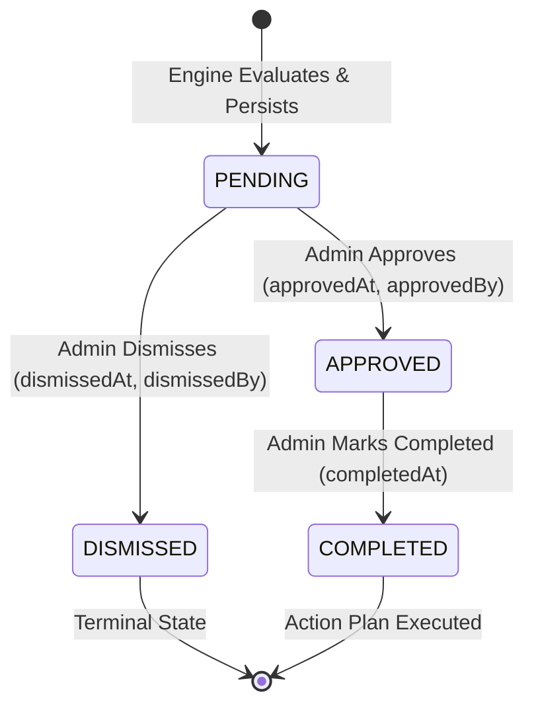

# SmartRide — Phase 3 Step 7: Smart Commute Operational Recommendation & Action Planning Center

## 1. Architectural Role
The **Operational Recommendation & Action Planning Center** serves as the advisory and actionable intelligence layer of the SmartRide platform. Situated directly atop the intelligence pipeline established in Steps 1 through 6, it synthesizes multidimensional corridor telemetry, safety risk assessments, active operational alerts, incident case statuses, historical risk trajectory, and machine learning demand forecasts into structured, deterministic operational recommendations.

Crucially, this system operates under a strict **human-in-the-loop** philosophy:
> **Mandatory Operational Safeguard:**
> *"This Step 7 recommendation engine is advisory and deterministic. It does not automatically modify routes, schedules, vehicles, drivers, subscriptions, bookings, or other operational resources."*

Every recommendation generated provides explicit administrative guidance, structured factual evidence, and auditable action plans for operations managers without triggering destructive or unapproved mutations against the frozen Phase 1 core commute infrastructure.

---

## 2. Upstream Dependency Model (Steps 1–6)
The recommendation engine consumes solely verified server-side intelligence outputs from existing modules, maintaining absolute integrity against client forgery:



1. **Step 1 (Deterministic Route Risk Score)**: Provides real-time corridor risk score ($0$ to $100$), discrete risk level (`LOW`, `MEDIUM`, `HIGH`, `CRITICAL`), active emergency flags, and six-dimensional factor points (deviation, speed, incident, road, time, driver).
2. **Step 2 (Route Risk History & Trend Analysis)**: Supplies historical snapshots over time, directional trajectory (`RISING`, `FALLING`, `STABLE`, `NO_HISTORY`), score deltas, and dimensional factor deltas.
3. **Step 3 (Operational Safety Alert Engine)**: Informs on active, unresolved safety alerts across severity tiers.
4. **Step 4 (Incident Case Management)**: Tracks operational safety incident cases, open investigations, and active mitigations.
5. **Step 5 (AI Demand Prediction)**: Provides demand forecasts, occupancy projections, and explicit `dataQuality` states (`HIGH_DATA_QUALITY` vs `INSUFFICIENT_DATA`).
6. **Step 6 (Operational Decision Support Center)**: Synthesizes overall corridor operational status (`NORMAL_OPERATIONS`, `MONITORING_ADVISED`, `ATTENTION_REQUIRED`, `URGENT_REVIEW`) and corridor briefings.

---

## 3. Data Structures

### TypeScript Types (`src/lib/operations/recommendation-engine.ts`)
```typescript
export type RecommendationPriority = 'CRITICAL' | 'HIGH' | 'MEDIUM' | 'LOW';

export type RecommendationType =
  | 'CRITICAL_SAFETY_REVIEW'
  | 'HIGH_RISK_REVIEW'
  | 'RISK_DETERIORATION_REVIEW'
  | 'EMERGENCY_RESPONSE_REVIEW'
  | 'ROUTE_DEVIATION_REVIEW'
  | 'SPEED_ANOMALY_REVIEW'
  | 'DRIVER_COMPLIANCE_REVIEW'
  | 'VEHICLE_COMPLIANCE_REVIEW'
  | 'CAPACITY_AUGMENTATION_REVIEW'
  | 'DEMAND_MONITORING'
  | 'MULTI_FACTOR_DETERIORATION_REVIEW'
  | 'INCIDENT_REVIEW'
  | 'RISING_RISK_MONITORING';

export type RecommendationStatus = 'PENDING' | 'APPROVED' | 'DISMISSED' | 'COMPLETED';

export interface OperationalRecommendationRecord {
  id: string;
  routeId: string;
  routeCode: string;
  routeName: string;
  type: RecommendationType;
  priority: RecommendationPriority;
  title: string;
  recommendation: string;
  rationale: string;
  evidence: Record<string, any>;
  status: RecommendationStatus;
  dedupKey: string;
  sourceSnapshotId?: string | null;
  sourceDecisionState?: string | null;
  approvedAt?: string | null;
  approvedBy?: string | null;
  dismissedAt?: string | null;
  dismissedBy?: string | null;
  completedAt?: string | null;
  createdAt: string;
  updatedAt: string;
}
```

---

## 4. Recommendation Types & Scope

| Type | Priority | Core Purpose |
| :--- | :--- | :--- |
| `CRITICAL_SAFETY_REVIEW` | CRITICAL | Immediate administrative safety review when risk is critical ($\ge 75$), emergency SOS active, critical alerts active, or critical incidents open. |
| `EMERGENCY_RESPONSE_REVIEW` | CRITICAL | Dedicated review when active emergency SOS signals are recorded on corridor. |
| `HIGH_RISK_REVIEW` | HIGH | Review operating conditions for corridor operating in high risk range ($50 \le \text{score} < 75$). |
| `RISK_DETERIORATION_REVIEW` | HIGH / CRITICAL | Rapid score escalation ($\ge 15$ pts = HIGH, $\ge 25$ pts = CRITICAL). |
| `ROUTE_DEVIATION_REVIEW` | HIGH | Significant route deviation points detected on corridor ($\ge 15$ pts). |
| `SPEED_ANOMALY_REVIEW` | HIGH | Unsafe speed or anomaly telemetry recorded ($\ge 15$ pts). |
| `DRIVER_COMPLIANCE_REVIEW` | HIGH | Driver compliance or document verification issues detected ($\ge 10$ pts). |
| `VEHICLE_COMPLIANCE_REVIEW` | HIGH | Vehicle inspection, fitness, or road safety risk points detected ($\ge 10$ pts). |
| `CAPACITY_AUGMENTATION_REVIEW`| HIGH / MEDIUM | High demand forecast ($\ge 85\%$ occupancy) with verified high data quality. |
| `DEMAND_MONITORING` | LOW | High demand pattern observed with insufficient historical data; flags for telemetry collection. |
| `MULTI_FACTOR_DETERIORATION_REVIEW`| HIGH | Three or more risk factors worsening simultaneously. |
| `INCIDENT_REVIEW` | HIGH / CRITICAL | Unresolved safety incidents or open cases on the corridor. |
| `RISING_RISK_MONITORING` | HIGH / MEDIUM | Consecutive evaluations show upward score trajectory without emergency. |

---

## 5. Deterministic Rule Definitions
All recommendations are produced via pure deterministic logic without stochastic or black-box components:

- **Rule A (Critical Safety Review)**: Triggered if `risk.score >= 75` OR `risk.level === 'CRITICAL'` OR `risk.activeEmergencies > 0` OR `alerts.criticalCount > 0` OR `incidents.criticalCount > 0`. Priority: `CRITICAL`.
- **Rule B (High Risk Corridor Review)**: Triggered if `risk.score >= 50 && risk.score < 75 && risk.level === 'HIGH'`. Priority: `HIGH`.
- **Rule C (Rapid Risk Deterioration)**: Triggered if `risk.scoreDelta >= 15`. Priority is `CRITICAL` if $\Delta \ge 25$, else `HIGH`.
- **Rule D (Active Emergency Response Review)**: Triggered if `risk.activeEmergencies > 0`. Priority: `CRITICAL`.
- **Rule E (Route Deviation Review)**: Triggered if `factors.routeDeviation >= 15`. Priority: `HIGH`.
- **Rule F (Speed Anomaly Review)**: Triggered if `factors.speedAnomaly >= 15`. Priority: `HIGH`.
- **Rule G (Driver Compliance Review)**: Triggered if `factors.driverCompliance >= 10`. Priority: `HIGH`.
- **Rule H (Vehicle Compliance Review)**: Triggered if `factors.roadHazard >= 10`. Priority: `HIGH`.
- **Rule I (Capacity Augmentation Review)**: Triggered if `demand.predictedOccupancy >= 85` AND `demand.dataQuality === 'HIGH_DATA_QUALITY'`. Priority is `HIGH` if $\ge 100\%$, else `MEDIUM`.
- **Rule J (Insufficient Data Safeguard)**: Triggered if `demand.predictedOccupancy >= 85` AND `demand.dataQuality === 'INSUFFICIENT_DATA'`. Generates `DEMAND_MONITORING` at priority `LOW` rather than recommending vehicle changes.
- **Rule K (Multi-Factor Deterioration)**: Triggered if $\ge 3$ factor dimensions exhibit positive score deltas ($\Delta > 0$). Priority: `HIGH`.
- **Rule L (Unresolved Incident Review)**: Triggered if `incidents.unresolvedCount > 0`. Priority is `CRITICAL` if `incidents.criticalCount > 0`, else `HIGH`.
- **Rule M (Rising Risk Trend Monitoring)**: Triggered if `risk.trend === 'RISING'` and not already classified as `CRITICAL_SAFETY_REVIEW`. Priority: `HIGH` if `risk.score >= 50`, else `MEDIUM`.
- **Rule N (Normal Corridor Safeguard)**: For corridors with low risk, no active alerts, zero incidents, normal demand, and stable trend, zero recommendations are emitted. No phantom actions are generated.

---

## 6. Priority Model & Ranking
Priorities are strictly assigned by rule criteria:
1. `CRITICAL`: Immediate safety threat, active SOS emergency, critical alerts, or extreme score escalation.
2. `HIGH`: Elevating risk corridor, active telemetry deviations, severe speed anomalies, compliance lapses, or confirmed capacity deficit.
3. `MEDIUM`: Moderate capacity constraints or rising trends.
4. `LOW`: Telemetry data collection advisory under insufficient data.

Sorting order in queries and views defaults to:
`createdAt DESC` with explicit priority badge visualization.

---

## 7. Lifecycle Model



- **PENDING**: Initial state upon generation.
- **APPROVED**: Admin reviewed and accepted recommendation for administrative execution.
- **DISMISSED**: Admin reviewed and determined recommendation is not actionable.
- **COMPLETED**: Action plan has been physically executed by operations staff outside automated systems. Requires recommendation to be in `APPROVED` status first (cannot complete directly from `PENDING`).
- **Validation**: Attempting to complete a `PENDING` recommendation returns HTTP 400 Bad Request. Attempting to approve an already `DISMISSED` recommendation returns HTTP 400 Bad Request.

---

## 8. Persistence Model

### Prisma Schema (`prisma/schema.prisma`)
```prisma
model OperationalRecommendation {
  id                  String    @id @default(cuid())
  routeId             String
  routeCode           String
  routeName           String
  type                String
  priority            String
  title               String
  recommendation      String
  rationale           String
  evidenceJson        String?
  status              String    @default("PENDING")
  dedupKey            String?
  sourceSnapshotId    String?
  sourceDecisionState String?
  approvedAt          DateTime?
  approvedBy          String?
  dismissedAt         DateTime?
  dismissedBy         String?
  completedAt         DateTime?
  createdAt           DateTime  @default(now())
  updatedAt           DateTime  @updatedAt

  @@index([routeId])
  @@index([priority])
  @@index([status])
  @@index([createdAt])
  @@index([dedupKey])
}
```

Dual-layer persistence guarantees uninterrupted operations: SQLite Prisma storage with automatic fallback and in-memory synchronization.

---

## 9. Deduplication & Idempotency Rules
To prevent notification flooding and duplicate administrative tasking:
1. Each recommendation is keyed by a composite deterministic deduplication string:
   $$\text{dedupKey} = \text{routeId} + \text{"\_"} + \text{type} + \text{"\_PENDING"}$$
2. Before inserting a new record, the engine checks existing records by both `dedupKey` and `(routeCode, type, status: 'PENDING')` across both the SQLite table and memory buffer.
3. If an identical pending recommendation already exists, the engine reuses the active record and returns it without inserting duplicates.

---

## 10. Anti-Forgery Design
Clients cannot fabricate recommendation states:
- `/api/operations/recommendations/evaluate` accepts **only** `{ routeId }`.
- Any client-submitted `riskScore`, `riskLevel`, `priority`, `type`, `evidence`, or `predictedOccupancy` is ignored.
- All evaluation logic pulls current corridor telemetry and Step 1–6 analytics exclusively from server repositories.
- `approvedAt`, `dismissedAt`, and `completedAt` timestamps are generated server-side using `new Date()`.
- `approvedBy` and `dismissedBy` are populated exclusively from the verified HMAC-SHA256 JWT session cookie.

---

## 11. Human-in-the-Loop Model
SmartRide strictly separates decision intelligence from execution:
- The system generates **recommendations**, not automated actions.
- Approving a capacity recommendation does **not** dispatch a vehicle or modify routes.
- Approving a driver compliance review does **not** suspend driver accounts automatically.
- Approving an incident review does **not** alter commuter bookings or charge penalties.
- Operations managers use the recommendations to guide manual scheduling, fleet coordination, and administrative protocols.

---

## 12. Operational Action Center UI
Implemented in `src/components/admin/operational-recommendation-center.tsx` and mounted on `/admin/security`:
- **Top 7 Metric Cards**: Total Plans, Critical, High Priority, Medium Priority, Pending, Approved, Completed.
- **Filter Tabs**: All, Critical, High, Medium, Pending, Approved, Completed, Dismissed.
- **Recommendations Roster**: Interactive table featuring priority indicators, corridor name and code, recommendation summary, rationale, status tags, and action buttons.
- **Interactive Action Controls**:
  - `Approve`: Triggers `POST /api/operations/recommendations/[id]/approve`.
  - `Dismiss`: Triggers `POST /api/operations/recommendations/[id]/dismiss`.
  - `Mark Completed`: Triggers `POST /api/operations/recommendations/[id]/complete` (enabled only for Approved plans).
- **Slide-Out Evidence Drawer**: Detailed slide-out pane showing operational rationale, comprehensive JSON evidence, decision support state, and complete audit history (`approvedBy`, `approvedAt`, `dismissedBy`, `dismissedAt`, `completedAt`).
- **Prominent Advisory Notice**: Displays the mandatory human-in-the-loop statement across the UI.

---

## 13. API Documentation

### 1. `GET /api/operations/recommendations`
- **Auth**: Required, Role: `ADMIN` (401 for Guest, 403 for Commuter/Driver).
- **Query Params**: `routeId` (optional), `priority` (optional), `status` (optional), `limit` (optional).
- **Response**:
  ```json
  {
    "success": true,
    "recommendations": [ ... ],
    "summary": {
      "total": 4,
      "critical": 1,
      "high": 2,
      "medium": 1,
      "low": 0,
      "pending": 2,
      "approved": 1,
      "dismissed": 0,
      "completed": 1
    }
  }
  ```

### 2. `POST /api/operations/recommendations/evaluate`
- **Auth**: Required, Role: `ADMIN`.
- **Body**: `{ "routeId": "SR-101" }`.
- **Response**: `{ "success": true, "recommendations": [ ... ] }`.

### 3. `POST /api/operations/recommendations/[id]/approve`
- **Auth**: Required, Role: `ADMIN`.
- **Response**: `{ "success": true, "message": "...", "recommendation": { ..., "status": "APPROVED", "approvedAt": "...", "approvedBy": "..." } }`.

### 4. `POST /api/operations/recommendations/[id]/dismiss`
- **Auth**: Required, Role: `ADMIN`.
- **Response**: `{ "success": true, "message": "...", "recommendation": { ..., "status": "DISMISSED", "dismissedAt": "...", "dismissedBy": "..." } }`.

### 5. `POST /api/operations/recommendations/[id]/complete`
- **Auth**: Required, Role: `ADMIN`.
- **Response**: `{ "success": true, "message": "...", "recommendation": { ..., "status": "COMPLETED", "completedAt": "..." } }`.

---

## 14. Edge Cases & Safeguards
1. **Missing or Nonexistent Route**: Evaluator returns HTTP 404 with descriptive error message.
2. **Insufficient Data Fallback**: When demand prediction indicates `INSUFFICIENT_DATA`, the engine suppresses vehicle augmentation recommendations and instead logs a low-priority `DEMAND_MONITORING` item.
3. **Invalid State Transitions**:
   - Marking a `PENDING` recommendation as `COMPLETED` returns HTTP 400 Bad Request.
   - Approving an already `DISMISSED` recommendation returns HTTP 400 Bad Request.
4. **Prisma Failure Resilience**: In the event of a SQLite transaction failure, the recommendation engine falls back seamlessly to its synchronized in-memory cache.

---

## 15. Verification Results
Automated test suite `scratch/verify_step17.mjs` executes 44 comprehensive tests:
- **Test 1–4**: RBAC authentication on `GET /api/operations/recommendations` (Admin 200, Guest 401, Commuter 403, Driver 403) — **PASSED**
- **Test 5–8**: RBAC authentication on `POST /api/operations/recommendations/evaluate` (Admin 200, Guest 401, Commuter 403, Driver 403) — **PASSED**
- **Test 9–14**: Anti-forgery protections (client riskScore, riskLevel, priority, type, evidence, demand ignored) — **PASSED**
- **Test 15**: Nonexistent route evaluation returns 404 — **PASSED**
- **Test 16–21**: Approval lifecycle (Admin 200, Guest 401, Commuter 403, Driver 403, server-side approvedAt, authenticated admin identity) — **PASSED**
- **Test 22–23**: Dismissal lifecycle (Admin 200, server-side dismissedAt) — **PASSED**
- **Test 24–26**: Completion lifecycle (Admin 200, cannot complete PENDING 400, cannot approve DISMISSED 400) — **PASSED**
- **Test 27**: Duplicate evaluation idempotency (count does not increase) — **PASSED**
- **Test 28–38**: Deterministic rules A through N verification — **PASSED**
- **Test 39–44**: Backward compatibility checks with Steps 1–6 APIs — **PASSED**

**Step 17 Verification Score: 44 / 44 tests passed (100%)**

---

## 16. Non-Regression Status
All prior phase and step test suites executed cleanly without regressions:
- `scratch/verify_step16.mjs`: **30 / 30 PASSED (100%)** (Operational Decision Support)
- `scratch/verify_step15.mjs`: **35 / 35 PASSED (100%)** (AI Demand Prediction)
- `scratch/verify_step14.mjs`: **40 / 40 PASSED (100%)** (Safety Incident Management)
- `scratch/verify_step13.mjs`: **30 / 30 PASSED (100%)** (Operational Safety Alerts)
- `scratch/verify_step12.mjs`: **21 / 21 PASSED (100%)** (Route Risk History & Trend)

**Combined Regression Suite Total: 200 / 200 tests passed (100%)**
**Production Build (`npm run build`): Exit Code 0, 0 TypeScript errors**

---

## 17. Current Frozen Architecture Status
- **Phase 1 (Core Commuter, Driver, Auth, Routes, Bookings, Subscriptions)**: **FROZEN & PRESERVED**
- **Phase 3 Step 1 (Route Risk Score)**: **FROZEN & VERIFIED**
- **Phase 3 Step 2 (Route Risk History & Trends)**: **FROZEN & VERIFIED**
- **Phase 3 Step 3 (Operational Safety Alerts)**: **FROZEN & VERIFIED**
- **Phase 3 Step 4 (Safety Incidents & Case Management)**: **FROZEN & VERIFIED**
- **Phase 3 Step 5 (AI Demand & Smart Route Prediction)**: **FROZEN & VERIFIED**
- **Phase 3 Step 6 (Operational Decision Support Center)**: **FROZEN & VERIFIED**
- **Phase 3 Step 7 (Operational Recommendations & Action Planning)**: **COMPLETE & VERIFIED**

---

## 18. Mandatory Human-in-the-Loop Statement
> **Official Operational Statement:**
> *"This Step 7 recommendation engine is advisory and deterministic. It does not automatically modify routes, schedules, vehicles, drivers, subscriptions, bookings, or other operational resources."*
