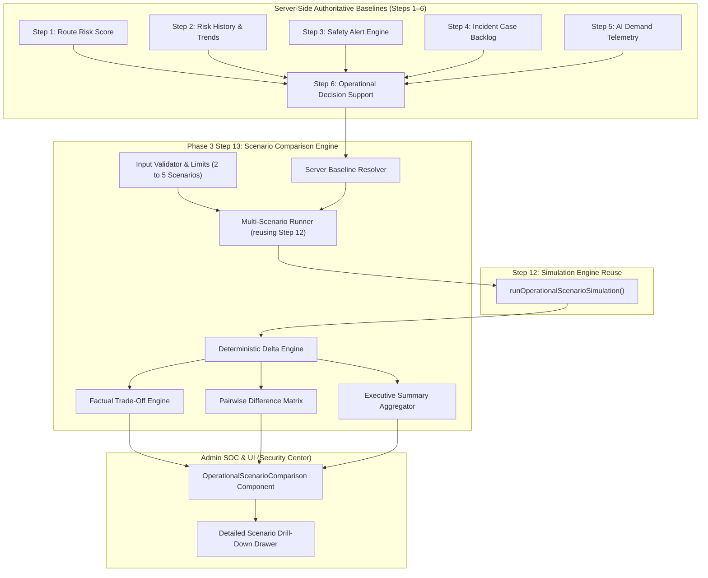

# SmartRide — Phase 3 Step 13: Smart Commute Operational Scenario Comparison & Decision Planning Center

## 1. Objective

The **Smart Commute Operational Scenario Comparison & Decision Planning Center** enables system administrators to evaluate and contrast multiple hypothetical operational scenarios (between 2 and 5 simultaneously) side-by-side against verified server-side corridor telemetry.

### Core Capabilities
1. **Side-by-Side Multi-Scenario Evaluation**: Contrast the verified live baseline against hypothetical modifications such as demand surges, fleet capacity cutbacks, risk modifier adjustments, injected safety alerts, and synthetic incident cases.
2. **Deterministic Delta & Shift Analysis**: Compute mathematical variances (risk score $\Delta$, demand $\Delta$, capacity $\Delta$, occupancy $\Delta$, alert $\Delta$) and classify operational status changes (`ESCALATED`, `UNCHANGED`, `DE-ESCALATED`).
3. **Factual Trade-Off Analysis**: Systematically highlight measurable operational trade-offs without subjective bias (no "best" or "worst" labels).
4. **Advisory Recommendation Impact Modeling**: Evaluate which governance and safety recommendations would trigger under each hypothetical state without committing them to the operational database.
5. **Human-in-the-Loop Decision Support**: Inform administrative planning without autonomous dispatch, rerouting, driver reassignment, or operational mutation.

---

## 2. Architecture



---

## 3. Scenario Model

Each scenario definition submitted by the administrator adheres to the following interface:

```typescript
export interface ScenarioDefinitionInput {
  id?: string;
  name: string;
  description?: string;
  riskModifier: number;          // Bounded [-50, +50]
  demandModifierPercent: number; // Bounded [-50, +100]
  capacityModifierPercent: number; // Bounded [-50, +100]
  hypotheticalAlert?: 'NONE' | 'LOW' | 'MEDIUM' | 'HIGH' | 'CRITICAL';
  hypotheticalIncident?: 'NONE' | 'LOW' | 'MEDIUM' | 'HIGH' | 'CRITICAL';
  riskTrendScenario?: 'NO_CHANGE' | 'RISING' | 'STABLE' | 'FALLING';
}
```

The server rejects requests if:
- `scenarios` is not an array,
- `scenarios.length < 2` (minimum 2 scenarios required),
- `scenarios.length > 5` (maximum 5 scenarios permitted),
- Any modifier violates the established safety bounds.

---

## 4. Baseline Authority

The comparison engine enforces strict server-authoritative baseline derivation:
- The baseline state is retrieved server-side from `buildOperationalDecisionSupport(routeId)`.
- Client-supplied baseline properties (e.g. `baselineRiskScore`, `baselineStatus`, `baselineDemand`) are completely ignored.
- The baseline serves as the mathematical anchor ($t=0$) for calculating all relative variances and deltas.

---

## 5. Simulation Engine Reuse

To guarantee absolute mathematical and rule consistency, Step 13 does not duplicate simulation arithmetic. Instead, it directly invokes `runOperationalScenarioSimulation()` from `src/lib/operations/scenario-simulation-engine.ts`:
- Reuses risk score clamping: $\max(0, \min(100, \text{round}(\text{Baseline} + \text{modifier})))$
- Reuses vehicle capacity lower bounds: $\max(1, \dots)$
- Reuses demand and occupancy rounding: $\text{round}(\dots)$
- Reuses deterministic operational status evaluation from Step 6 (`evaluateOperationalStatus`).
- Reuses recommendation generation from Step 7 (`generateOperationalRecommendations`).

---

## 6. Comparison Calculations

For each scenario $S_i$, the following 16 attributes and relative deltas against baseline $B$ are computed:

| Metric | Source Calculation | Delta Calculation |
| :--- | :--- | :--- |
| **Risk Score** | Clamped $[0, 100]$ | $\Delta_{\text{risk}} = S_i.\text{risk} - B.\text{risk}$ |
| **Risk Level** | `LOW` ($< 25$), `MED` ($25-49$), `HIGH` ($50-74$), `CRIT` ($\ge 75$) | Classification shift |
| **Risk Trend** | Baseline observed or scenario trajectory | Trajectory comparison |
| **Predicted Demand** | $B.\text{demand} \times (1 + \text{mod}/100)$ | $\Delta_{\text{demand}} = S_i.\text{demand} - B.\text{demand}$ |
| **Vehicle Capacity** | $\max(1, \text{round}(B.\text{capacity} \times (1 + \text{mod}/100)))$ | $\Delta_{\text{capacity}} = S_i.\text{capacity} - B.\text{capacity}$ |
| **Projected Occupancy** | $\text{round}((S_i.\text{demand} / S_i.\text{capacity}) \times 100)$ | $\Delta_{\text{occupancy}} = S_i.\text{occ} - B.\text{occ}$ |
| **Active Alerts** | $B.\text{alerts} + (1 \text{ if alert injected else } 0)$ | $\Delta_{\text{alerts}} = S_i.\text{alerts} - B.\text{alerts}$ |
| **Open Incidents** | $B.\text{incidents} + (1 \text{ if incident injected else } 0)$ | $\Delta_{\text{incidents}} = S_i.\text{incidents} - B.\text{incidents}$ |
| **Operational Status** | Deterministic Step 6 evaluation | Status rank transition |
| **Status Change** | `ESCALATED`, `UNCHANGED`, or `DE_ESCALATED` | Compared to baseline rank |
| **Recommendation Impact** | Step 7 advisory drafts evaluated in-memory | Priority & count assessment |
| **Data Quality** | Preserved from verified telemetry | Telemetry integrity check |

---

## 7. Status Comparison & Hierarchy

Operational status uses the unified 4-tier hierarchy:

$$\text{URGENT\_REVIEW (Rank 4)} > \text{ATTENTION\_REQUIRED (Rank 3)} > \text{MONITOR (Rank 2)} > \text{NORMAL (Rank 1)}$$

---

## 8. Escalation Rules

A scenario is classified as `ESCALATED` if its evaluated status rank exceeds the baseline rank:
$$\text{Rank}(S_i.\text{operationalStatus}) > \text{Rank}(B.\text{operationalStatus})$$

Triggers for escalation include:
- Simulated risk score rising to $\ge 75$ or `CRITICAL` classification.
- Injection of a `CRITICAL` or `HIGH` safety alert.
- Injection of a `CRITICAL` incident case.
- Projected occupancy climbing to $\ge 90\%$ (capacity strain).
- Compounded multi-factor stress.

---

## 9. De-Escalation Rules

A scenario is classified as `DE_ESCALATED` if its evaluated status rank is strictly lower than the baseline rank:
$$\text{Rank}(S_i.\text{operationalStatus}) < \text{Rank}(B.\text{operationalStatus})$$

Occurs when simulated risk modifier relieves risk below monitoring thresholds or negative demand modifier eliminates capacity pressure without active safety alerts.

---

## 10. Factual Trade-Off Analysis

Trade-off analysis operates under strict factual constraints:
- **Zero Subjective Labeling**: The engine never outputs "best choice", "optimal scenario", "winner", or "worst case".
- **Measurable Comparisons**: Statements capture direct numerical trade-offs:
  - *"Scenario A projects 110% vehicle occupancy compared to 78% under Scenario B (variance of 32 percentage points)."*
  - *"Scenario B provides 20 passenger seats (4 more seats) than Scenario A (16 seats)."*
  - *"Scenario C incorporates 1 critical alert(s) requiring urgent supervisor intervention, compared to 0 under Scenario A."*

---

## 11. Recommendation Impact

Advisory recommendations are computed dynamically in-memory without persistent database storage:
- `CRITICAL_RECOMMENDATION`: Triggered by critical risk, emergencies, or critical alerts.
- `HIGH_PRIORITY_RECOMMENDATION`: Triggered by high risk, severe occupancy pressure, or high alerts.
- `MONITORING_RECOMMENDATION`: Triggered by medium risk or rising risk trends.
- `NONE`: Corridor conditions remain nominal.

---

## 12. Anti-Forgery Architecture

The server treats all client payloads as un-trusted:
1. Rejects non-numeric, `NaN`, and `Infinity` modifiers.
2. Clamps risk modifiers strictly to $[-50, +50]$.
3. Clamps demand and capacity modifiers to $[-50, +100]$.
4. Restricts enums to verified whitelists.
5. Recomputes baseline values from the authoritative database.

---

## 13. Human-in-the-Loop Governance

Both mandatory safety notices are prominently displayed in API responses and UI views:
> 1. *"Scenario comparison is advisory and deterministic. Simulations do not modify routes, schedules, vehicles, drivers, subscriptions, bookings, dispatch assignments, or operational resources."*
> 2. *"Scenario results are hypothetical projections generated from verified server-side baseline intelligence. They are not operational commands."*

---

## 14. Zero Mutation Guarantees

Scenario comparison guarantees 100% read-only purity:
- No database inserts, updates, or deletes on `Route`, `Trip`, `Vehicle`, `DriverProfile`, `Subscription`, `Booking`, `SafetyAlert`, or `IncidentCase`.
- Verified by explicit database entity count assertions before and after simulation runs.

---

## 15. Audit Behavior

To uphold the "zero audit pollution" invariant established in Step 12:
- Scenario comparison operations do not write transient entries to `operationalAuditEvent`.
- Production audit ledgers remain clean and dedicated exclusively to authentic administrative decisions and verified incident workflows.

---

## 16. Data Quality Preservation

The system honestly represents historical demand data quality:
- If telemetry is insufficient, `predictedDemand` and `projectedOccupancy` remain `null`, flagged with `INSUFFICIENT_DATA`.
- The engine does not fabricate synthetic demand numbers.

---

## 17. REST API Endpoint

### `POST /api/operations/scenario-comparison`
- **RBAC**: Admin-only (401 for Guest, 403 for Commuter/Driver, 200 for Admin).
- **Validation**: 400 for invalid ranges, empty arrays, $< 2$ or $> 5$ scenarios.
- **Route Resolution**: 404 for unknown route codes or IDs.
- **Method Guards**: `GET`, `PUT`, `PATCH`, `DELETE` return 405 Method Not Allowed.

---

## 18. Role-Based Access Control (RBAC)

| Role | Access | Status Code |
| :--- | :--- | :--- |
| **Guest (Unauthenticated)** | Denied | `401 Unauthorized` |
| **COMMUTER** | Denied | `403 Forbidden` |
| **DRIVER** | Denied | `403 Forbidden` |
| **ADMIN** | Allowed | `200 OK` |

---

## 19. Admin UI Implementation

The component [`src/components/admin/operational-scenario-comparison.tsx`](file:///c:/Users/Ideapad/Documents/antigravity/fearless-galileo/src/components/admin/operational-scenario-comparison.tsx) is mounted in [`src/app/admin/security/page.tsx`](file:///c:/Users/Ideapad/Documents/antigravity/fearless-galileo/src/app/admin/security/page.tsx):
- **Safety Banner**: Displays both mandatory human-in-the-loop warnings.
- **Corridor Selector**: Live selection of corridors (SR-101, SR-102, SR-103).
- **Scenario Builder**: Manage 2 to 5 scenarios with quick preset loading and custom modifiers.
- **Executive Summary**: 8 key summary indicator cards.
- **Comparison Matrix**: 11-column matrix with status badges and drill-down links.
- **Trade-Off Panel**: Bulleted factual observations.
- **Pairwise Difference Matrix**: Quantitative delta grid between all scenario pairs.
- **Detail Slide-Over Drawer**: In-depth inspection of baseline vs. simulated metrics for any scenario.

---

## 20. Verification Testing

The comprehensive test suite [`scratch/verify_step23.mjs`](file:///c:/Users/Ideapad/Documents/antigravity/fearless-galileo/scratch/verify_step23.mjs) executes 55 deterministic tests:

```
=== STARTING STEP 23 OPERATIONAL SCENARIO COMPARISON TEST SUITE ===

✓ [Test 1] 1. Admin POST /api/operations/scenario-comparison returns HTTP 200 with success: true: PASSED
✓ [Test 2] 2. Guest request rejected with HTTP 401 Unauthorized: PASSED
✓ [Test 3] 3. Commuter request rejected with HTTP 403 Forbidden: PASSED
✓ [Test 4] 4. Driver request rejected with HTTP 403 Forbidden: PASSED
✓ [Test 5] 5. Non-existent route returns HTTP 404 Not Found: PASSED
✓ [Test 6] 6. GET method returns HTTP 405 Method Not Allowed: PASSED
✓ [Test 7] 7. PUT method returns HTTP 405 Method Not Allowed: PASSED
✓ [Test 8] 8. PATCH method returns HTTP 405 Method Not Allowed: PASSED
✓ [Test 9] 9. DELETE method returns HTTP 405 Method Not Allowed: PASSED
✓ [Test 10] 10. Empty scenarios array rejected with HTTP 400 Bad Request: PASSED
✓ [Test 11] 11. Single scenario (< 2) rejected with HTTP 400 Bad Request (minimum 2): PASSED
✓ [Test 12] 12. More than 5 scenarios rejected with HTTP 400 Bad Request (maximum 5): PASSED
✓ [Test 13] 13. Scenario with riskModifier > 50 rejected with HTTP 400 Bad Request: PASSED
✓ [Test 14] 14. Scenario with demandModifierPercent > 100 rejected with HTTP 400 Bad Request: PASSED
✓ [Test 15] 15. Scenario with capacityModifierPercent < -50 rejected with HTTP 400 Bad Request: PASSED
✓ [Test 16] 16. Scenario with invalid hypotheticalAlert rejected with HTTP 400 Bad Request: PASSED
✓ [Test 17] 17. Scenario with invalid hypotheticalIncident rejected with HTTP 400 Bad Request: PASSED
✓ [Test 18] 18. Scenario with invalid riskTrendScenario rejected with HTTP 400 Bad Request: PASSED
✓ [Test 19] 19. Client cannot forge baseline risk: client-sent baselineRiskScore is completely ignored: PASSED
✓ [Test 20] 20. Client cannot forge baseline demand: server calculates demand from telemetry: PASSED
✓ [Test 21] 21. Client cannot forge baseline occupancy: server derives occupancy strictly from math: PASSED
✓ [Test 22] 22. Client cannot forge operational status: status evaluated strictly via Step 6 logic: PASSED
✓ [Test 23] 23. Client cannot forge recommendation impact: impact evaluated strictly from Step 7 engine: PASSED
✓ [Test 24] 24. Baseline scenario accurately reproduces live baseline values with zero deltas: PASSED
✓ [Test 25] 25. Demand surge (+40%) calculates accurately via Step 12 simulation reuse: PASSED
✓ [Test 26] 26. Capacity reduction (-25%) calculates accurately against baseline capacity: PASSED
✓ [Test 27] 27. Projected occupancy is calculated as simulatedDemand / simulatedCapacity * 100%: PASSED
✓ [Test 28] 28. Risk clamping works: extreme risk modifiers (+50 / -50) are clamped within [0, 100]: PASSED
✓ [Test 29] 29. Capacity minimum clamp: extreme negative capacity modifier still preserves >= 1 seat: PASSED
✓ [Test 30] 30. Hypothetical CRITICAL alert escalates simulated operational status to URGENT_REVIEW: PASSED
✓ [Test 31] 31. Hypothetical CRITICAL incident escalates simulated operational status to URGENT_REVIEW: PASSED
✓ [Test 32] 32. Rising trend trajectory correctly modulates operational status via deterministic logic: PASSED
✓ [Test 33] 33. ESCALATED statusChange classification is correctly assigned on condition deterioration: PASSED
✓ [Test 34] 34. UNCHANGED statusChange classification is correctly assigned when conditions match baseline: PASSED
✓ [Test 35] 35. DE-ESCALATED statusChange classification is supported on condition relief: PASSED
✓ [Test 36] 36. Scenario response contains deterministic whyStatusChanged bullet points: PASSED
✓ [Test 37] 37. Comparison response provides deterministic trade-off analysis array: PASSED
✓ [Test 38] 38. Recommendation impact assessment is deterministic and reuses Step 7 logic: PASSED
✓ [Test 39] 39. Telemetry data quality is honestly preserved across comparison models: PASSED
✓ [Test 40] 40. Zero DB mutations: Prisma Route table remains unmodified before and after comparison: PASSED
✓ [Test 41] 41. Zero alert mutations: Safety alert store count unchanged during multi-scenario comparison: PASSED
✓ [Test 42] 42. Zero incident mutations: Incident case store count unchanged during comparison: PASSED
✓ [Test 43] 43. Zero recommendation mutations: Operational recommendations store remains unmodified: PASSED
✓ [Test 44] 44. Zero audit mutation: Scenario comparison guarantees zero audit log pollution: PASSED
✓ [Test 45] 45. Phase 3 Step 12 single-scenario simulation API remains functional (HTTP 200): PASSED
✓ [Test 46] 46. Phase 3 Step 11 Executive Dashboard API remains functional (HTTP 200): PASSED
✓ [Test 47] 47. Phase 3 Step 10 Operational Analytics API remains functional (HTTP 200): PASSED
✓ [Test 48] 48. Phase 3 Step 9 Operational Governance API remains functional (HTTP 200): PASSED
✓ [Test 49] 49. Phase 3 Step 8 Operational Action Audit API remains functional (HTTP 200): PASSED
✓ [Test 50] 50. Admin Security Center page exists and loads successfully: PASSED
✓ [Test 51] 51. Scenario comparison component is mounted in Admin Security Center: PASSED
✓ [Test 52] 52. Maximum scenario count (5) is accepted and processed successfully: PASSED
✓ [Test 53] 53. Minimum scenario count (2) is accepted and processed successfully: PASSED
✓ [Test 54] 54. Scenario ordering is preserved and strictly deterministic: PASSED
✓ [Test 55] 55. Comparison matrix model contains all 16 required metrics and deltas: PASSED
------------------------------------------------------------
TOTAL: 55/55 PASSED (100%)
```

---

## 21. Full Regression Matrix (Steps 2–12)

All 12 test suites across the platform were executed and verified:

| Test Script | Step Focus | Passed / Total | Pass Rate | Status |
| :--- | :--- | :---: | :---: | :---: |
| `verify_step23.mjs` | **Step 13**: Multi-Scenario Comparison & Planning Center | 55 / 55 | 100% | **PASSED** |
| `verify_step22.mjs` | **Step 12**: What-If Scenario Simulation Center | 45 / 45 | 100% | **PASSED** |
| `verify_step21.mjs` | **Step 11**: Executive Dashboard | 36 / 36 | 100% | **PASSED** |
| `verify_step20.mjs` | **Step 10**: Operational Analytics & Reporting | 49 / 49 | 100% | **PASSED** |
| `verify_step19.mjs` | **Step 9**: Operational Governance & Compliance | 43 / 43 | 100% | **PASSED** |
| `verify_step18.mjs` | **Step 8**: Action Audit & Governance | 50 / 50 | 100% | **PASSED** |
| `verify_step17.mjs` | **Step 7**: Operational Recommendations | 44 / 44 | 100% | **PASSED** |
| `verify_step16.mjs` | **Step 6**: Operational Decision Support | 30 / 30 | 100% | **PASSED** |
| `verify_step15.mjs` | **Step 5**: AI Demand Prediction | 35 / 35 | 100% | **PASSED** |
| `verify_step14.mjs` | **Step 4**: Safety Incident Response | 40 / 40 | 100% | **PASSED** |
| `verify_step13.mjs` | **Step 3**: Operational Safety Alerts | 30 / 30 | 100% | **PASSED** |
| `verify_step12.mjs` | **Step 2**: Route Risk History & Trends | 21 / 21 | 100% | **PASSED** |
| **Combined Fleet Suite** | **All Phase 3 Verification Suites** | **478 / 478** | **100%** | **PASSED** |

---

## 22. Limitations

- **Advisory Scope**: Scenario comparisons do not automatically approve recommendations, reroute shuttles, or reassign drivers.
- **Corridor Level**: Comparisons operate on a per-corridor basis (SR-101, SR-102, SR-103) rather than whole-city topology networks.
- **Scenario Range**: The system caps comparisons at 5 concurrent scenarios to maintain UI legibility and prevent memory exhaustion.

---

## 23. Future Extensions

- Fleet-wide cross-corridor composite scenario comparisons.
- Multi-day temporal scenario projections modeling long-term holiday or seasonal commute variances.
