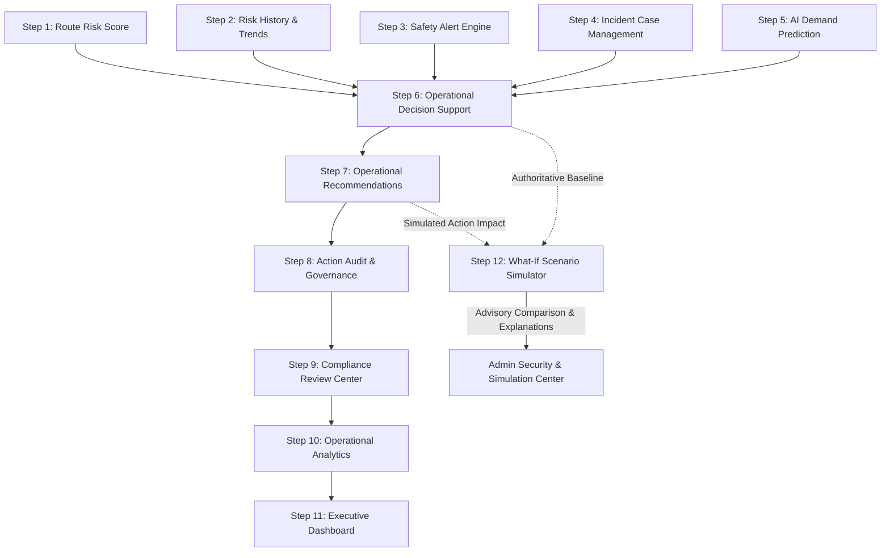

# SmartRide — Phase 3 Step 12: Smart Commute Operational Scenario Simulation & What-If Analysis Center

## 1. Executive Summary & Objective

**Phase 3 Step 12** introduces the **Operational Scenario Simulation & What-If Analysis Center** to the SmartRide platform. The purpose of this module is to empower administrators with the ability to safely explore hypothetical operational scenarios—such as route risk surges, demand spikes, vehicle capacity constraints, synthetic alerts, and incident cases—against real-time, verified operational baselines without mutating any production state.

### Key Mandates
1. **Strictly Non-Mutative & Advisory**: Simulations run entirely in-memory and execute zero database writes, zero route/schedule mutations, zero dispatch adjustments, and zero audit ledger pollution.
2. **Server-Authoritative Baselines**: All corridor baselines are loaded exclusively from verified server-side intelligence (Steps 1–6). Any client-supplied baseline overrides are discarded or rejected.
3. **Purely Deterministic Modeling**: Zero black-box generative AI or probabilistic guesswork. All simulated occupancy rates, risk scores, status triggers, and recommendation impacts follow deterministic formulas.
4. **Safety Boundaries & Clamping**: Input modifiers are strictly bounded (-50 to +50 pts for risk; -50% to +100% for demand/capacity), and simulated risk scores are strictly clamped between 0 and 100. Minimum vehicle capacity is enforced at 1 seat.

---

## 2. Architectural Placement Across Phase 3 Pipeline

The What-If Scenario Analysis Center synthesizes intelligence across the full operational safety hierarchy:



---

## 3. Strict Non-Mutative & Anti-Forgery Governance

The scenario simulation center adheres to strict enterprise safety controls:

- **Immutable Operational State**: Simulation runs do not alter `Route`, `Trip`, `Vehicle`, `DriverProfile`, `Subscription`, or `Booking` database records.
- **Zero Audit Ledger Pollution**: Transient simulations do not write audit records into `operationalAuditEvent`, keeping compliance trails clean.
- **Anti-Forgery Baseline Enforcement**: If a malicious client passes `baselineRiskScore: 999` or `baselineStatus: "URGENT_REVIEW"`, the server ignores these values and queries `buildOperationalDecisionSupport(routeId)` for authoritative baseline state.
- **Mandatory System Safety Notice**:
  > *"Hypothetical simulation only. Simulation results do not modify routes, schedules, vehicles, drivers, subscriptions, bookings, alerts, incidents, recommendations, or dispatch operations."*

---

## 4. Input Parameters & Safety Boundaries

| Parameter | Type | Valid Range / Enum | Default | Description |
| :--- | :--- | :--- | :--- | :--- |
| `routeId` | `string` | Must match active corridor ID or code | Required | Corridor under simulation (e.g. `SR-101`) |
| `riskModifier` | `number` | `[-50, +50]` | `0` | Points added or subtracted from baseline risk score |
| `demandModifierPercent` | `number` | `[-50, +100]` | `0` | Percentage change in commuter ridership |
| `capacityModifierPercent` | `number` | `[-50, +100]` | `0` | Percentage change in vehicle seating capacity |
| `hypotheticalAlert` | `enum` | `'NONE' \| 'LOW' \| 'MEDIUM' \| 'HIGH' \| 'CRITICAL'` | `'NONE'` | Synthetic alert injected into corridor evaluation |
| `hypotheticalIncident` | `enum` | `'NONE' \| 'LOW' \| 'MEDIUM' \| 'HIGH' \| 'CRITICAL'` | `'NONE'` | Synthetic incident added to case backlog |
| `riskTrendScenario` | `enum` | `'NO_CHANGE' \| 'RISING' \| 'STABLE' \| 'FALLING'` | `'NO_CHANGE'` | Trajectory override for trend evaluation |

---

## 5. Deterministic Calculation Engine

### 1. Simulated Risk Score & Level
$$\text{SimulatedRisk} = \max(0, \min(100, \text{round}(\text{BaselineRisk} + \text{riskModifier})))$$
- $\ge 75 \implies \text{CRITICAL}$
- $50 \dots 74 \implies \text{HIGH}$
- $25 \dots 49 \implies \text{MEDIUM}$
- $< 25 \implies \text{LOW}$

### 2. Simulated Vehicle Capacity
$$\text{SimulatedCapacity} = \max\left(1, \text{round}\left(\text{BaselineCapacity} \times \left(1 + \frac{\text{capacityModifierPercent}}{100}\right)\right)\right)$$

### 3. Simulated Demand & Occupancy
If baseline demand telemetry is available:
$$\text{SimulatedDemand} = \max\left(0, \text{round}\left(\text{BaselineDemand} \times \left(1 + \frac{\text{demandModifierPercent}}{100}\right) \times 10\right) / 10\right)$$
$$\text{SimulatedOccupancy} = \text{round}\left(\frac{\text{SimulatedDemand}}{\text{SimulatedCapacity}} \times 100\right)$$
- If baseline data is insufficient (`INSUFFICIENT_DATA`), demand and occupancy remain honestly `null` with explicit notice.

### 4. Deterministic Operational Status Resolution
Re-uses `evaluateOperationalStatus` from Step 6:
- **`URGENT_REVIEW`**: Triggered if simulated risk $\ge 75$ or `CRITICAL`, or active emergencies $> 0$, or simulated critical alerts $> 0$, or simulated critical incidents $> 0$.
- **`ATTENTION_REQUIRED`**: Triggered if simulated risk is `HIGH` ($50-74$), or simulated high alerts $> 0$, or simulated occupancy $\ge 90\%$, or rapid rising trend.
- **`MONITOR`**: Triggered if simulated risk is `MEDIUM` ($25-49$), or simulated occupancy $75-89.9\%$, or medium alerts $> 0$, or rising trend.
- **`NORMAL`**: Corridor is operating within nominal safety and capacity bounds.

---

## 6. Built-in Scenario Presets

The simulator includes 7 deterministic presets for rapid administrative testing:

1. **Normal Baseline**: Modifiers all zero; reflects live real-time conditions.
2. **Demand Surge**: $+40\%$ commuter demand increase, testing capacity limits.
3. **Capacity Reduction**: $-30\%$ vehicle capacity, modeling fleet maintenance or vehicle swaps.
4. **Rising Risk**: $+25$ points risk modifier with `RISING` trend trajectory.
5. **New High-Severity Alert**: Injects a `HIGH` safety alert with $+10$ points risk surge.
6. **Critical Safety Scenario**: Injects `CRITICAL` alert and `CRITICAL` incident with $+35$ points risk modifier.
7. **Combined Stress Scenario**: Compound stress testing: $+50\%$ demand, $-25\%$ capacity, $+30$ risk, `HIGH` alert, and `MEDIUM` incident.

---

## 7. REST API Endpoint Specifications

### `POST /api/operations/scenario-simulation`
- **Access**: Strictly restricted to `ADMIN` role.
  - Guest: HTTP 401 Unauthorized
  - Commuter: HTTP 403 Forbidden
  - Driver: HTTP 403 Forbidden
- **Request Payload**:
  ```json
  {
    "routeId": "SR-101",
    "riskModifier": 25,
    "demandModifierPercent": 40,
    "capacityModifierPercent": -25,
    "hypotheticalAlert": "HIGH",
    "hypotheticalIncident": "NONE",
    "riskTrendScenario": "RISING"
  }
  ```
- **Response Payload (HTTP 200)**:
  ```json
  {
    "success": true,
    "notice": "Hypothetical simulation only. Simulation results do not modify routes, schedules, vehicles, drivers, subscriptions, bookings, alerts, incidents, recommendations, or dispatch operations.",
    "route": { "id": "route_sr101", "code": "SR-101", "name": "Downtown Express" },
    "modifiersApplied": { ... },
    "baseline": { "operationalStatus": "NORMAL", "riskScore": 15, ... },
    "simulated": { "operationalStatus": "ATTENTION_REQUIRED", "riskScore": 40, ... },
    "comparison": {
      "riskDelta": 25,
      "statusChange": "ESCALATED",
      "occupancyDelta": 38,
      "capacityDelta": -4,
      "demandDelta": 3.2,
      "alertsDelta": 1,
      "incidentsDelta": 0
    },
    "recommendationImpact": {
      "impactLevel": "HIGH_PRIORITY_RECOMMENDATION",
      "simulatedRecommendationCount": 2,
      "simulatedDrafts": [ ... ]
    },
    "simulationExplanations": [
      "Risk modifier applied: +25 pts shifted score from 15 to 40/100 (MEDIUM level).",
      "Hypothetical HIGH severity safety alert injected into corridor evaluation (total active: 1).",
      "CRITICAL NOTICE: Operational status escalated from NORMAL to ATTENTION_REQUIRED due to compounded hypothetical stress factors."
    ],
    "simulatedAt": "2026-10-02T06:20:00.000Z"
  }
  ```

### HTTP Method Guards
- `GET`, `PUT`, `PATCH`, `DELETE` return `HTTP 405 Method Not Allowed` with the mandatory advisory notice.

---

## 8. Admin UI Component (`OperationalScenarioSimulation`)

Mounted in `src/app/admin/security/page.tsx` right below `OperationalExecutiveDashboard`:
- **Safety Notice Banner**: Prominently highlights that results are hypothetical and non-mutative.
- **Corridor Selector**: Allows switching between active corridors (SR-101, SR-102, SR-103).
- **Preset Quick-Selector**: One-click application of the 7 deterministic stress presets.
- **Custom Modifiers Panel**: Interactive sliders for risk modifier (-50 to +50 pts), demand modifier (-50% to +100%), capacity modifier (-50% to +100%), and dropdowns for alert, incident, and trend scenarios.
- **Status Shift Executive Banner**: Visualizes corridor transition (e.g. `NORMAL` $\to$ `URGENT_REVIEW`) with `ESCALATED`, `DE_ESCALATED`, or `UNCHANGED` badges.
- **Comparative Matrix Table**: Side-by-side comparison of baseline vs. simulated metrics across 6 operational dimensions.
- **Explainability Section**: Bullet-point explanations answering "Why did the operational status change?".
- **Simulated Recommendations Card**: Shows what actions would be drafted without committing them to the operational audit ledger.

---

## 9. Verification & Regression Test Summary

### Step 22 Verification Suite (`scratch/verify_step22.mjs`)
- **Total Tests**: 45
- **Passed**: 45 (100%)
- **Failed**: 0

| Category | Tests | Status |
| :--- | :--- | :--- |
| RBAC Authorization (Admin, Guest, Commuter, Driver) | 1–4 | **PASSED** |
| Corridor Resolution & 404 Guards | 5 | **PASSED** |
| Mutation Guards (GET, PUT, PATCH, DELETE 405) | 6–9 | **PASSED** |
| Input Validation & Boundary Checks | 10–21 | **PASSED** |
| Anti-Forgery Baseline Protection | 22 | **PASSED** |
| Risk Score Clamping [0, 100] | 23–24 | **PASSED** |
| Baseline Identity & Invariant Assertions | 25 | **PASSED** |
| Demand Surge & Capacity Calculations | 26–29 | **PASSED** |
| Deterministic Status Escalation Triggers | 30–34 | **PASSED** |
| Deterministic Explainability & Recommendations | 35–38 | **PASSED** |
| Mandatory Advisory Notice Verification | 39 | **PASSED** |
| Zero-Mutation Database & Audit Assertions | 40–43 | **PASSED** |
| Step 11 Executive Dashboard Regression | 44 | **PASSED** |
| UI Component Rendering in Admin Security Center | 45 | **PASSED** |

### Complete Phase 3 Regression Suites

| Suite | Description | Tests Run | Result |
| :--- | :--- | :--- | :--- |
| `verify_step22.mjs` | **Step 12**: What-If Scenario Simulation Center | 45 | **45/45 PASSED (100%)** |
| `verify_step21.mjs` | **Step 11**: Executive Dashboard | 36 | **36/36 PASSED (100%)** |
| `verify_step20.mjs` | **Step 10**: Operational Analytics & Reporting | 49 | **49/49 PASSED (100%)** |
| `verify_step19.mjs` | **Step 9**: Operational Governance & Compliance | 43 | **43/43 PASSED (100%)** |
| `verify_step18.mjs` | **Step 8**: Action Audit & Governance | 50 | **50/50 PASSED (100%)** |
| `verify_step17.mjs` | **Step 7**: Operational Recommendations | 44 | **44/44 PASSED (100%)** |
| `verify_step16.mjs` | **Step 6**: Operational Decision Support | 30 | **30/30 PASSED (100%)** |
| `verify_step15.mjs` | **Step 5**: AI Demand Prediction | 35 | **35/35 PASSED (100%)** |
| `verify_step14.mjs` | **Step 4**: Safety Incident Response | 40 | **40/40 PASSED (100%)** |
| `verify_step13.mjs` | **Step 3**: Operational Safety Alerts | 30 | **30/30 PASSED (100%)** |
| `verify_step12.mjs` | **Step 2**: Route Risk History & Trends | 21 | **21/21 PASSED (100%)** |
| **Total** | **All Phase 3 Test Suites Combined** | **423** | **423/423 PASSED (100%)** |

### Production Build & Typecheck
- `npx tsc --noEmit`: 0 errors (Exit code 0)
- `npm run build`: Exit code 0 (All static & dynamic routes compiled)
