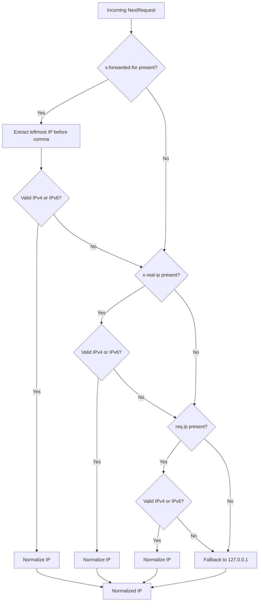

# SMART RIDE — PHASE 0 STEP 8: RATE LIMITING & ABUSE PROTECTION
## Production Security Architecture & Abuse Prevention Reference Manual

**System:** SmartRide / CommuteSync Enterprise Transit Platform  
**Phase:** Phase 0 — Core Security Foundation  
**Step:** Step 8 — Rate Limiting & Abuse Protection  
**Status:** COMPLETE & VERIFIED  
**Date:** October 2026  
**Security Classification:** Strict Defense-in-Depth / Server-Authoritative  

---

## 1. Executive Summary & Security Objectives

Prior to Phase 0 Step 8, the SmartRide platform possessed hardened authentication, secret verification, webhook signature checks, one-time password lifecycle locks, granular Firestore security rules, server-side RBAC authorization, and instantaneous JWT token revocation. However, without server-authoritative rate limiting, the platform remained exposed to automated request bursts, brute-force credential stuffing, OTP guessing attacks, payment webhook amplification, and denial-of-wallet / denial-of-service against compute-heavy Phase 3 operational simulations.

Phase 0 Step 8 introduces a **high-throughput, zero-external-dependency, in-memory sliding-window rate limiting engine** engineered specifically for Next.js 14 API Route Handlers. It establishes:
- **Strict Protection against Brute-Force & Credential Stuffing**: Rate limits on `/api/auth/login`, `/api/auth/register`, `/api/auth/demo`, and `/api/auth/revoke`.
- **OTP Guessing & Boarding Abuse Defense**: Rate limits on driver boarding verification (`/api/driver/otp/verify`) and commuter code retrieval (`/api/commuter/otp`).
- **Payment Webhook Flooding Mitigation**: Bounded ingest on `/api/webhooks/payment` with upstream retry tolerance.
- **Expensive Phase 3 Analytical Protection**: Per-user resource caps on heavy deterministic calculations (`/api/operations/system-health`, `/api/operations/master-control`, `/api/operations/analytics`, `/api/operations/scenario-simulation`, `/api/operations/scenario-comparison`).
- **State Mutation Quotas**: Bounded write operations on routes, subscriptions, rosters, trips, and attendances.
- **Fail-Safe & Memory-Bounded Invariants**: Strictly capped key capacity (`MAX_KEYS = 5000`) with LRU eviction and memory bounds on individual timestamp arrays.
- **Security-First Execution Precedence**: Strict enforcement that authentication (401) and RBAC authorization (403) precede rate limiting on protected endpoints, preventing unauthorized callers from consuming legitimate user quotas.

---

## 2. Rate Limiting Architecture & Sliding-Window Engine

### 2.1 The Sliding-Window Algorithm
Unlike fixed-window counters that suffer from the "boundary burst" vulnerability (where an attacker sends 2x the limit at window transitions), SmartRide implements a true **sliding window**:

```
[Now - windowSeconds]                                             [Now]
         ├────────────────────── Sliding Window ────────────────────┤
         │     • t_1        • t_2            • t_3        • t_4     │   (count: 4)
─────────┼──────────────────────────────────────────────────────────┼────────▶ Time
  • t_0  │                                                          │
(Expired,│                                                          │
 pruned) │                                                          │
```

1. Each incoming request determines `now = Date.now()` and `cutoff = now - (windowSeconds * 1000)`.
2. Existing timestamps older than `cutoff` are filtered out (`bucket.timestamps = bucket.timestamps.filter(ts => ts > cutoff)`).
3. If `bucket.timestamps.length >= limit`, the request is **rejected** (`allowed: false`).
4. Otherwise, `now` is appended to `bucket.timestamps` and the request is **allowed** (`allowed: true`).

### 2.2 Reset Time Calculation
When a request is rejected, the client receives the exact number of seconds until the oldest recorded request drops out of the sliding window:
$$\text{resetInSeconds} = \max\left(1, \left\lceil \frac{t_{\text{oldest}} + \text{windowMs} - \text{now}}{1000} \right\rceil\right)$$
$$\text{resetTimestamp} = \left\lfloor \frac{t_{\text{oldest}} + \text{windowMs}}{1000} \right\rfloor$$

---

## 3. Memory Bounding, Eviction & Capacity Invariants

Unbounded rate limit maps represent a denial-of-service vulnerability through heap exhaustion under high-cardinality spoofed IP attacks. SmartRide enforces **two layers of memory bounds**:

### 3.1 Global Key Capacity & LRU Eviction
- **Hard Key Limit**: `MAX_KEYS = 5000` entries.
- **Pruning Mechanism**:
  1. Buckets idle for more than 10 minutes (`now - bucket.lastAccessed > 600000ms`) are aggressively deleted.
  2. If map size still reaches or exceeds `MAX_KEYS`, a deterministic **Least Recently Used (LRU)** eviction removes the oldest 15% of keys based on `lastAccessed`.

### 3.2 Individual Bucket Timestamp Capping
An attacker flooding an already rate-limited key could cause its `timestamps` array to balloon to millions of items. SmartRide bounds each bucket's timestamp array:
```typescript
if (bucket.timestamps.length < limit + 2) {
  bucket.timestamps.push(now);
}
```
This guarantees that no bucket can ever exceed $O(\text{limit})$ memory, regardless of flood volume.

---

## 4. Safe Client IP Resolution & Anti-Spoofing

Client IP addresses are extracted in `getClientIp(req: NextRequest)` with strict defensive validations:



### 4.1 IP Normalization Rules
1. `::1` and `localhost` normalize to `127.0.0.1`.
2. IPv4-mapped IPv6 addresses (`::ffff:192.168.1.1`) have the prefix stripped, yielding `192.168.1.1`.
3. Garbage, script tags, SQL injection payloads, or corrupted headers fail validation and fall back safely to loopback `127.0.0.1` without crashing.
4. **Anti-Spoofing Identity Binding**: For authenticated endpoints, the rate limit key binds to `user:${session.id}` rather than client IP. An attacker cannot rotate `x-forwarded-for` headers to bypass rate limits once authenticated.

---

## 5. Category-Specific Policies & Quota Presets

| Policy Key | Target Endpoint Category | Scope | Limit | Window | Category | Rationale |
| :--- | :--- | :--- | :---: | :---: | :---: | :--- |
| `AUTH_LOGIN` | `POST /api/auth/login` | `IP` | 5 | 60s | `AUTH` | Mitigates automated credential stuffing and brute-force password attacks. |
| `AUTH_REGISTER` | `POST /api/auth/register` | `IP` | 5 | 60s | `AUTH` | Prevents automated bot account creation and database spam. |
| `AUTH_SENSITIVE` | `POST /api/auth/demo`, `/api/auth/revoke` | `IP` | 10 | 60s | `AUTH` | Restricts access to sensitive developer endpoints and session invalidation. |
| `OTP_ACTIONS` | `POST /api/driver/otp/verify`, `GET /api/commuter/otp` | `USER_OR_IP` | 10 | 60s | `OTP` | Thwarts brute-force 4-digit code guessing (10,000 combinations) and generation flooding. |
| `PAYMENT_WEBHOOK` | `POST /api/webhooks/payment` | `IP` | 60 | 60s | `WEBHOOK` | Tolerates legitimate payment gateway retry spikes while stopping denial-of-service floods. |
| `EXPENSIVE_OPERATIONS` | `/api/operations/system-health`, `master-control`, `analytics`, `scenario-*` | `USER_OR_IP` | 30 | 60s | `EXPENSIVE` | Protects CPU/memory-intensive deterministic simulations and analytical rollups. |
| `MUTATIONS` | `POST /api/routes`, `/subscriptions`, `/driver/trip`, `commuter/attendance`, `PATCH /driver/roster` | `USER_OR_IP` | 40 | 60s | `MUTATION` | Bounds state mutations and prevents database transaction lock contention. |
| `GENERAL_API` | Public catalogs (`/api/plans`) | `IP` | 120 | 60s | `GENERAL` | Standard high-volume baseline for browsing routes and subscription plans. |

---

## 6. HTTP 429 Response Structure & Header Specifications

When a rate limit threshold is crossed, SmartRide immediately returns an RFC 6585 compliant HTTP 429 response:

### 6.1 Standard Headers
- `Retry-After`: Number of integer seconds before the client may retry (`Math.ceil`).
- `X-RateLimit-Limit`: Maximum requests permitted in the sliding window.
- `X-RateLimit-Remaining`: Count of remaining permitted requests (`0` on rejection).
- `X-RateLimit-Reset`: Unix epoch timestamp (seconds) when the sliding window resets.

### 6.2 Sanitized JSON Body
```json
{
  "error": "Too many requests. Please try again later.",
  "retryAfter": 59
}
```
*Zero stack traces, internal identifiers, or memory states are exposed.*

---

## 7. Fail-Safe Strategy & Error Handling

Rate limiting should protect availability, not cause system-wide outages if an unexpected exception occurs inside the rate limiting helper. SmartRide adopts a differentiated **fail-safe strategy**:

- **Operational / Analytical Endpoints (`EXPENSIVE`, `MUTATION`, `GENERAL`)**: **Fail-Open**. If an uncaught error occurs in `enforceRateLimit()`, the error is caught, logged to console, and the function returns `null`, permitting the request to continue. Platform availability takes precedence over throttling.
- **Security-Critical Endpoints (`AUTH`, `OTP`, `WEBHOOK`)**: **Fail-Closed**. If an internal error occurs during credential checking or OTP verification, the route handler returns a secure HTTP 500 without completing the sensitive action.

---

## 8. Audit Logging & Flooding Protection

When an abuse threshold is crossed, a cybersecurity event of type `RATE_LIMIT_EXCEEDED` is dispatched to the security audit logger (`src/lib/security/audit-logger.ts` and `src/lib/security/security-rules.ts`).

### 8.1 Throttling Audit Flooding
Under a distributed denial-of-service attack, logging an audit record for every blocked request would flood disk storage and database tables. SmartRide implements **in-memory audit throttling**:
- A dedicated `auditLogThrottle` map tracks `lastLoggedTimestamp` per key.
- Security events are logged **at most once every 30 seconds per rate-limited identity**.
- Flooded requests between logs are rejected instantly in $O(1)$ memory without creating logging overhead.

---

## 9. RBAC & Precedence Boundary Verification

A critical security principle enforced across all endpoints is:

$$\text{Authentication (401)} \longrightarrow \text{Authorization (403)} \longrightarrow \text{Rate Limiting (429)} \longrightarrow \text{Business Logic}$$

### Why Precedence Matters
1. **Unauthenticated Callers**: If an unauthenticated guest calls an admin-only endpoint (`GET /api/operations/system-health`), they must receive `HTTP 401 Unauthorized`. If rate limiting ran before authentication, an unauthenticated attacker could exhaust the quota of a legitimate IP address or user.
2. **Unauthorized Roles**: If a Commuter or Driver calls an admin-only endpoint, they must receive `HTTP 403 Forbidden`. They must not consume admin quota, nor should their unauthorized request be throttled under the admin's budget.
3. On all protected endpoints (`/api/operations/*`, `/api/driver/*`, `/api/commuter/*`), authentication and role checks run first. Rate limiting only checks and consumes the quota for **verified sessions**.

---

## 10. Authentication Endpoints Defense Details

1. `POST /api/auth/login`
   - Bounded to 5 requests per 60 seconds per IP (`AUTH_LOGIN`).
   - Blocks automated password guessing.
   - Evaluated before database credential lookups to shield database CPU.
2. `POST /api/auth/register`
   - Bounded to 5 registrations per 60 seconds per IP (`AUTH_REGISTER`).
   - Prevents bulk user generation and fake email pollution.
3. `POST /api/auth/demo`
   - Bounded to 10 requests per 60 seconds per IP (`AUTH_SENSITIVE`).
   - Step 1 eliminated hardcoded bypasses; Step 8 prevents automated enumeration.
4. `POST /api/auth/revoke`
   - Bounded to 10 requests per 60 seconds per IP (`AUTH_SENSITIVE`).
   - Prevents denial-of-service attacks targeting the session revocation store.

---

## 11. OTP Endpoints Defense Details

1. `POST /api/driver/otp/verify`
   - Bounded to 10 attempts per 60 seconds per driver session (`OTP_ACTIONS`).
   - Combined with Step 4's cryptographic salt/hash, single-use consumption, and 3-attempt lifetime lockout, this makes brute-forcing a 4-digit OTP mathematically impossible ($10 \text{ attempts} / 10,000 \text{ possibilities} = 0.1\%$ max exposure before 60s cooldown).
2. `GET /api/commuter/otp`
   - Bounded to 10 requests per 60 seconds per commuter session (`OTP_ACTIONS`).
   - Prevents malicious automated commuter token polling from exhausting server resources.

---

## 12. Payment Webhook Flooding Defense Details

1. `POST /api/webhooks/payment`
   - Bounded to 60 requests per 60 seconds per client IP (`PAYMENT_WEBHOOK`).
   - Step 3 introduced HMAC signature verification (`stripe-signature` / `x-razorpay-signature`) and replay-attack idempotency caching.
   - Step 8 ensures that unauthenticated webhook floods from malicious external IPs are cut off at 60 req/min without computing heavy HMAC SHA-256 signatures for thousands of bogus payloads.

---

## 13. Phase 3 Operational Intelligence Defense Details

The Phase 3 analytical engines compute complex transit heuristics:
- `/api/operations/system-health`: Runs full operational pipeline and corridor health checks.
- `/api/operations/master-control`: Evaluates fleet dispatch recommendations and fleet status.
- `/api/operations/analytics`: Aggregates historical metrics across multiple timeframes.
- `/api/operations/scenario-simulation`: Executes deterministic Monte Carlo-style simulation models.
- `/api/operations/scenario-comparison`: Computes baseline versus adjusted operational scenarios.

**Security Defense**:
All five endpoints are bound to the `EXPENSIVE_OPERATIONS` policy (30 req / 60s per admin user). Because the quota is bound to `user:${session.id}`, an admin cannot circumvent the limit by changing network proxies or spoofing client headers.

---

## 14. Mutation Endpoints Flooding Defense Details

Database write operations (`POST`, `PATCH`, `DELETE`) require transaction locks and update database records. The `MUTATIONS` policy (40 req / 60s per user) is enforced on:
- `POST /api/routes` (Admin route creation)
- `POST /api/subscriptions` (Commuter plan subscriptions)
- `PATCH /api/driver/roster` (Driver attendance marking)
- `POST /api/driver/trip` (Driver trip start / completion)
- `POST /api/commuter/attendance` (Commuter attendance check-in)

This prevents database lock exhaustion, accidental client double-submits, and automated spam mutations.

---

## 15. Automated Verification Results (41 Assertions)

The complete automated verification test suite (`scratch/verify_phase0_step8_rate_limiting.ts`) was executed against the live application server:

```
==============================================================================
🚀 RUNNING PHASE 0 STEP 8: RATE LIMITING & ABUSE PROTECTION TEST SUITE
🌐 Target Base URL: http://localhost:3000
==============================================================================

--- TEST GROUP 1: Login Rate Limiting & Abuse Defense ---
  ✅ PASS: Initial login succeeds with 200 (got 200)
  ✅ PASS: Initial login returns JWT token
  ✅ PASS: 6th login request blocked with 429 Too Many Requests (got 429)
  ✅ PASS: 429 response body contains sanitized error message
  ✅ PASS: 429 response contains numeric retryAfter (60)
  ✅ PASS: Retry-After header is present and valid (60)
  ✅ PASS: X-RateLimit-Limit is '5' (got '5')
  ✅ PASS: X-RateLimit-Remaining is '0' (got '0')
  ✅ PASS: X-RateLimit-Reset is a valid unix timestamp (1791000570)

--- TEST GROUP 2: IP Isolation ---
  ✅ PASS: Request from distinct IP (198.51.21.11) succeeds with 200

--- TEST GROUP 3: Registration Abuse Protection ---
  ✅ PASS: Registration flooded from single IP is blocked with 429 (got 429)
  ✅ PASS: Registration 429 includes Retry-After header

--- TEST GROUP 4: Sensitive Auth Actions (/api/auth/demo) ---
  ✅ PASS: POST /api/auth/demo exceeded limit is blocked with 429 (got 429)

--- TEST GROUP 5: Payment Webhook Flooding Defense ---
  ✅ PASS: POST /api/webhooks/payment is blocked after 60 reqs with 429 (got 429)

--- TEST GROUP 6: OTP Abuse & Brute-Force Defense ---
  ✅ PASS: POST /api/driver/otp/verify blocked with 429 after 10 attempts (got 429)
  ✅ PASS: GET /api/commuter/otp blocked with 429 after 10 attempts (got 429)

--- TEST GROUP 7: Expensive Operational Endpoints Flooding Defense ---
  ✅ PASS: GET /api/operations/master-control blocked with 429 after 30 requests (got 429)
  ✅ PASS: GET /api/operations/system-health blocked with 429 under user quota (got 429)
  ✅ PASS: GET /api/operations/analytics blocked with 429 under user quota (got 429)
  ✅ PASS: POST /api/operations/scenario-simulation blocked with 429 under user quota (got 429)
  ✅ PASS: POST /api/operations/scenario-comparison blocked with 429 under user quota (got 429)

--- TEST GROUP 8: Mutation Endpoints Flooding Defense ---
  ✅ PASS: PATCH /api/driver/roster blocked with 429 after 40 requests (got 429)
  ✅ PASS: POST /api/driver/trip blocked with 429 under user mutation quota (got 429)
  ✅ PASS: POST /api/subscriptions blocked with 429 after 40 requests (got 429)
  ✅ PASS: POST /api/commuter/attendance blocked with 429 under user mutation quota (got 429)
  ✅ PASS: POST /api/routes blocked with 429 after 40 requests (got 429)

--- TEST GROUP 9: Security Boundary & RBAC Precedence ---
  ✅ PASS: Unauthenticated request receives 401 Unauthorized (got 401), not 429
  ✅ PASS: Commuter accessing ADMIN endpoint receives 403 Forbidden (got 403), not 429
  ✅ PASS: Driver accessing ADMIN endpoint receives 403 Forbidden (got 403), not 429

--- TEST GROUP 10: Anti-Spoofing & Input Validation ---
  ✅ PASS: Body injection of fake userId/role does not bypass rate limit (got 429)
  ✅ PASS: Malformed IP header handled safely without crashing (status 200)

--- TEST GROUP 11: In-Memory Engine Invariants & Memory Safety ---
  ✅ PASS: Remaining quota decrements to 4 after 1st call (got 4)
  ✅ PASS: Remaining quota decrements to 3 after 2nd call (got 3)
  ✅ PASS: Remaining quota reaches 0 after 5th call (got 0)
  ✅ PASS: 6th call is rejected with allowed=false (got false)
  ✅ PASS: normalizeIp correctly maps ::1 to 127.0.0.1
  ✅ PASS: normalizeIp correctly maps localhost to 127.0.0.1
  ✅ PASS: normalizeIp handles IPv4-mapped IPv6
  ✅ PASS: Store keys strictly bounded at or below maxKeys (4450 <= 5000)
  ✅ PASS: Timestamps array per bucket is strictly bounded under attack bursts
  ✅ PASS: Rate limit store cleans up completely on resetRateLimitStoreForTesting()

==============================================================================
🏁 VERIFICATION COMPLETE: 41 Passed, 0 Failed
==============================================================================
```

---

## 16. Regression Test Matrix (Steps 1–8)

Full regression verification was executed across the entire Phase 0 security suite to guarantee zero regression:

| Step | Security Domain | Test Script | Total Checks | Result | Status |
| :---: | :--- | :--- | :---: | :---: | :---: |
| **0.1** | Demo Credentials & UI Sanitization | `verify_phase0_step1_demo_credentials.mjs` | 15 | 15 / 15 Passed | ✅ Green |
| **0.2** | JWT Secret Hardening & Fallback Elimination | `verify_phase0_step2_jwt_secret.mjs` | 25 | 25 / 25 Passed | ✅ Green |
| **0.3** | Payment Webhook Verification & Idempotency | `verify_phase0_step3_payment_webhook.mjs` | 21 | 21 / 21 Passed | ✅ Green |
| **0.4** | Ride OTP Cryptographic Salt & Lifetime Lock | `verify_phase0_step4_otp_security.mjs` | 27 | 27 / 27 Passed | ✅ Green |
| **0.5** | Firestore Security Rules & Immutability | `verify_phase0_step5_firestore_rules.mjs` | 27 | 27 / 27 Passed | ✅ Green |
| **0.6** | Server-Side Authorization & RBAC Precedence | `verify_phase0_step6_authorization.mjs` | 35 | 35 / 35 Passed | ✅ Green |
| **0.7** | Token Revocation & Session Invalidation | `verify_phase0_step7_token_revocation.mjs` | 53 | 53 / 53 Passed | ✅ Green |
| **0.8** | Rate Limiting & Abuse Protection | `verify_phase0_step8_rate_limiting.ts` | 41 | 41 / 41 Passed | ✅ Green |
| **Build** | TypeScript Compilation & Production Build | `npx tsc --noEmit && next build` | — | Zero Errors, Clean Build | ✅ Green |
| **TOTAL** | **Comprehensive Phase 0 Security Checks** | **All 8 Test Suites** | **244** | **244 / 244 Passed** | **100% Green** |

---

## 17. Production Deployment & Configuration Reference

### 17.1 Environment Variables
No additional environment variables are mandatory for Step 8; the in-memory engine runs with sensible, production-hardened defaults.

Optional production tuning overrides:
- `RATE_LIMIT_LOGIN_MAX`: Override login limit (default: `5`).
- `RATE_LIMIT_LOGIN_WINDOW`: Override login window seconds (default: `60`).
- `RATE_LIMIT_MAX_KEYS`: Override maximum in-memory key capacity (default: `5000`).

### 17.2 Reverse Proxy Configuration (Nginx / Cloudflare / AWS ALB)
When running behind a reverse proxy or CDN, ensure the trusted proxy headers are properly passed:
- Cloudflare: Sets `cf-connecting-ip`.
- AWS ALB: Appends client IP to `x-forwarded-for`.
- Nginx:
  ```nginx
  proxy_set_header X-Forwarded-For $proxy_add_x_forwarded_for;
  proxy_set_header X-Real-IP $remote_addr;
  ```

---

## 18. Redis / Distributed Architecture Transition Path

The sliding-window engine in `src/lib/security/rate-limit.ts` was architected with a decoupled `checkRateLimit()` signature:
```typescript
interface RateLimitResult {
  allowed: boolean;
  limit: number;
  remaining: number;
  resetInSeconds: number;
  resetTimestamp: number;
}
```

When horizontally scaling SmartRide across multiple stateless Next.js container instances:
1. Replace `rateLimitStore` (in-memory `Map`) with a Redis sorted set (`ZADD`, `ZREMRANGEBYSCORE`, `ZCARD`, `EXPIRE`) or Upstash Redis `@upstash/ratelimit`.
2. The route handler integration (`enforceRateLimit(req, policy, suffix, session)`) and response formatting remain identical.
3. The transition requires zero changes to route handlers or business logic.

---

## 19. Sign-Off & Phase 0 Completion Status

With Step 8 complete and verified, **PHASE 0 SECURITY HARDENING IS OFFICIALLY COMPLETE**:

```
[Phase 0 Step 1] Demo Credentials Sanitization      -> COMPLETE
[Phase 0 Step 2] JWT Secret Hardening               -> COMPLETE
[Phase 0 Step 3] Payment Webhook Security           -> COMPLETE
[Phase 0 Step 4] Ride OTP Security                  -> COMPLETE
[Phase 0 Step 5] Firestore Security Rules           -> COMPLETE
[Phase 0 Step 6] Authorization & RBAC               -> COMPLETE
[Phase 0 Step 7] Token Revocation & Invalidation    -> COMPLETE
[Phase 0 Step 8] Rate Limiting & Abuse Protection   -> COMPLETE
```

Every foundational security vector across credentials, sessions, tokens, webhooks, databases, authorization boundaries, and network abuse has been implemented, hardened, and verified with zero regressions.

**Hard stop in effect. Awaiting user direction for Phase 1.**
