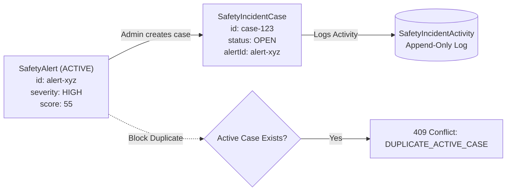
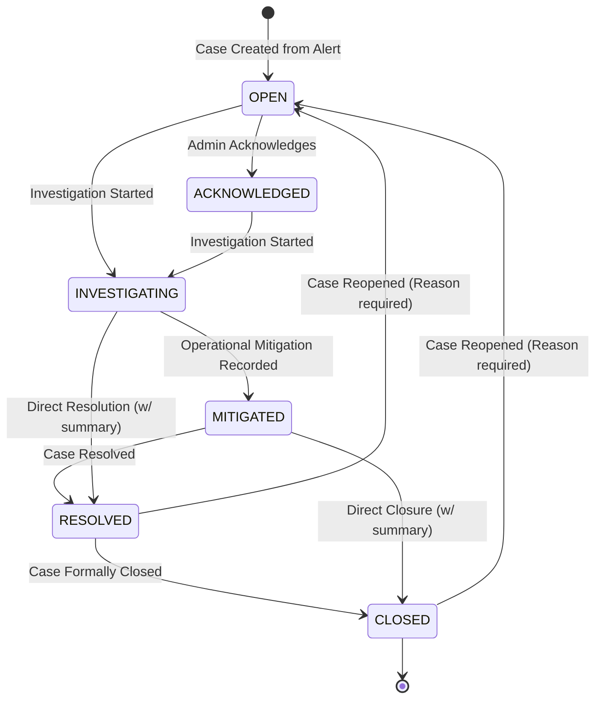

# SmartRide — Safety Incident Response & Operational Case Management
## Phase 3 — Step 4 Technical & Operational Documentation

> **MANDATORY SYSTEM DISCLAIMER**  
> *This Step 4 incident response system is operational case management. It does not predict future safety incidents.*

---

## 1. Architecture Overview

Phase 3 Step 4 introduces **Operational Case Management & Traceable Incident Response** to the SmartRide platform. It establishes an end-to-end operational workflow bridging detected safety alerts to structured human remediation:

$$\text{SafetyAlert} \longrightarrow \text{SafetyIncidentCase} \longrightarrow \text{Assignment} \longrightarrow \text{Operational Actions} \longrightarrow \text{Investigation Notes} \longrightarrow \text{Mitigation} \longrightarrow \text{Resolution} \longrightarrow \text{Closure}$$

### Architectural Invariants
1. **Source Grounding**: Incident cases cannot be fabricated from arbitrary client inputs; each case originates strictly from a verified, server-persisted `SafetyAlert`.
2. **Deterministic Data Propagation**: Route identifier, route code, route name, initial severity, current risk score, score delta, and anomaly evidence are extracted directly from the verified alert record on the server.
3. **Admin Exclusivity**: Case creation, assignment, status transition, note logging, mitigation, and closure are strictly restricted to authenticated users holding the `ADMIN` role.
4. **Audit Trail Immutability**: All lifecycle transitions and investigation notes append chronological `SafetyIncidentActivity` records that cannot be edited or deleted.
5. **Freeze Preservation**: Stabilized Phase 1 subsystems (Authentication, Commuter Booking/Subscription, Driver Operations, Admin RBAC) and Phase 3 Steps 1–3 (Route Risk Engine, Route Risk History, Safety Alert Engine) remain completely intact and frozen.

---

## 2. Safety Alert to Incident Case Relationship

Operational incidents establish a 1:1 active link with operational `SafetyAlert` instances:



### Derivation Table
| Incident Case Attribute | Derived From Source `SafetyAlert` | Client Overridable? |
| :--- | :--- | :--- |
| `alertId` | Provided in request; verified in DB | No (must exist) |
| `routeId` | `alert.routeId` | **No** (server-enforced) |
| `routeCode` | `alert.routeCode` | **No** (server-enforced) |
| `routeName` | `alert.routeName` | **No** (server-enforced) |
| `title` | `"Incident: " + alert.title` | **No** (server-enforced) |
| `description` | `alert.message` | **No** (server-enforced) |
| `severity` | `alert.severity` (`LOW`, `MEDIUM`, `HIGH`, `CRITICAL`) | **No** (server-enforced) |
| `currentRiskScore` | `alert.currentScore` | **No** (server-enforced) |
| `previousRiskScore` | `alert.previousScore` | **No** (server-enforced) |
| `scoreDelta` | `alert.scoreDelta` | **No** (server-enforced) |
| `sourceAlertType` | `alert.type` | **No** (server-enforced) |
| `sourceAlertSeverity` | `alert.severity` | **No** (server-enforced) |
| `evidenceJson` | `alert.evidenceJson` | **No** (server-enforced) |
| `createdAt` | Server system time (`new Date()`) | **No** (server-enforced) |

---

## 3. Case Lifecycle and State Machine

Every incident case transitions through a deterministic, strictly validated finite state machine:



### Transition Validation Rules
- `OPEN`: Initial status. Can transition to `ACKNOWLEDGED` or `INVESTIGATING`.
- `ACKNOWLEDGED`: Acknowledged by operations team. Can transition to `INVESTIGATING`.
- `INVESTIGATING`: Active investigation ongoing. Can transition to `MITIGATED` or `RESOLVED`. Investigation notes can be appended continuously.
- `MITIGATED`: Operational safeguard deployed. Can transition to `RESOLVED` or `CLOSED`.
- `RESOLVED`: Final corrective action confirmed. Can transition to `CLOSED` or be `REOPENED`.
- `CLOSED`: Terminal archived state. Can only transition back via formal `REOPEN` action.
- Any illegal or out-of-order transition attempts return HTTP `400 Bad Request`.

---

## 4. RBAC and Permission Matrix (Admin-Only Enforcement)

All incident response capabilities are locked behind authentication and role authorization:

| Endpoint | Guest (Unauth) | COMMUTER | DRIVER | ADMIN |
| :--- | :---: | :---: | :---: | :---: |
| `GET /api/safety/incidents` | 401 | 403 | 403 | **200 OK** |
| `POST /api/safety/incidents` | 401 | 403 | 403 | **200 OK** |
| `GET /api/safety/incidents/[id]` | 401 | 403 | 403 | **200 OK** |
| `POST /api/safety/incidents/[id]/acknowledge` | 401 | 403 | 403 | **200 OK** |
| `POST /api/safety/incidents/[id]/assign` | 401 | 403 | 403 | **200 OK** |
| `POST /api/safety/incidents/[id]/investigate` | 401 | 403 | 403 | **200 OK** |
| `POST /api/safety/incidents/[id]/notes` | 401 | 403 | 403 | **200 OK** |
| `POST /api/safety/incidents/[id]/mitigate` | 401 | 403 | 403 | **200 OK** |
| `POST /api/safety/incidents/[id]/resolve` | 401 | 403 | 403 | **200 OK** |
| `POST /api/safety/incidents/[id]/close` | 401 | 403 | 403 | **200 OK** |
| `POST /api/safety/incidents/[id]/reopen` | 401 | 403 | 403 | **200 OK** |

---

## 5. Anti-Forgery and Data Integrity Model

The system enforces strict multi-layered data integrity:
1. **Server-Generated Case Attributes**: `routeId`, `severity`, `currentRiskScore`, and `evidenceJson` cannot be set by the caller in the `POST /api/safety/incidents` request body. Only `alertId` is accepted.
2. **Server-Side Timestamps**: `createdAt`, `updatedAt`, `resolvedAt`, and `closedAt` are strictly set using `new Date()` within the backend service layer.
3. **Actor Identity Preservation**: The acting admin's identity is extracted from the verified HMAC-SHA256 signed JWT session (`session.id`, `session.name`, `session.email`) and stamped into the activity log.
4. **Assignee Role Verification**: When assigning an incident case, the target `adminId` is verified against both the Firestore repository and Prisma database to guarantee that the assignee exists and has `role === 'ADMIN'`. Assigning non-admin users (such as commuters or drivers) is rejected with HTTP `400 Bad Request`.

---

## 6. Duplicate Prevention and Active Alert Safeguards

To prevent operational confusion and duplicate case handling:
- A query is executed before case creation checking for existing cases referencing the same `alertId` where `status NOT IN ('RESOLVED', 'CLOSED')`.
- If an active case already exists, the request is rejected with `HTTP 409 Conflict`:
  ```json
  {
    "error": "An active operational incident case already exists for alert 'cmup...'",
    "existingCaseId": "case-xyz"
  }
  ```
- If the source alert does not exist, case creation fails with `HTTP 404 Not Found`.

---

## 7. Append-Only Activity Log and Audit Trail

Every operational intervention creates an immutable `SafetyIncidentActivity` log entry:

| Action Type | Trigger Event | Logged Metadata |
| :--- | :--- | :--- |
| `CASE_CREATED` | Initial case creation from alert | Alert ID, alert type, severity, risk score |
| `CASE_ACKNOWLEDGED` | Admin acknowledges the case | Performed by admin name / ID |
| `CASE_ASSIGNED` | Case assigned to admin | Assignee ID, assignee name, assignee email |
| `INVESTIGATION_STARTED` | Active investigation launched | Performed by admin |
| `NOTE_ADDED` | Operational notes added | Raw note text |
| `MITIGATION_RECORDED` | Mitigation measures recorded | Mitigation summary |
| `CASE_RESOLVED` | Case resolution recorded | Resolution summary, resolvedAt timestamp |
| `CASE_CLOSED` | Case closure recorded | Closure summary, closedAt timestamp |
| `CASE_REOPENED` | Case reopened for review | Reopen reason, previous status |

Activities are strictly ordered chronologically (`createdAt ASC`) and rendered as a timeline in the Admin UI.

---

## 8. Schema and Database Models (Prisma & SQLite)

The SQLite relational database (`dev.db`) contains two dedicated models managed via Prisma:

```prisma
model SafetyIncidentCase {
  id                  String   @id @default(cuid())
  alertId             String   // Reference to SafetyAlert.id
  routeId             String
  routeCode           String
  routeName           String
  title               String
  description         String
  severity            String   // LOW, MEDIUM, HIGH, CRITICAL
  status              String   // OPEN, ACKNOWLEDGED, INVESTIGATING, MITIGATED, RESOLVED, CLOSED
  assignedAdminId     String?  // Reference to User.id (admin)
  createdByAdminId    String?  // Reference to User.id (admin)
  currentRiskScore    Int
  previousRiskScore   Int?
  scoreDelta          Int?
  sourceAlertType     String
  sourceAlertSeverity String
  evidenceJson        String?
  resolutionSummary   String?
  createdAt           DateTime @default(now())
  updatedAt           DateTime @updatedAt
  resolvedAt          DateTime?
  closedAt            DateTime?

  activities          SafetyIncidentActivity[]

  @@index([alertId])
  @@index([routeId])
  @@index([status])
  @@index([severity])
  @@index([assignedAdminId])
  @@index([createdAt])
}

model SafetyIncidentActivity {
  id           String             @id @default(cuid())
  caseId       String
  case         SafetyIncidentCase @relation(fields: [caseId], references: [id], onDelete: Cascade)
  actionType   String             // CASE_CREATED, CASE_ACKNOWLEDGED, CASE_ASSIGNED, etc.
  message      String
  metadataJson String?
  performedBy  String             // Admin user name or ID
  createdAt    DateTime           @default(now())

  @@index([caseId])
  @@index([actionType])
  @@index([createdAt])
}
```

---

## 9. Storage and Hybrid Fallback Architecture

To ensure total operational resilience matching the rest of the SmartRide architecture:
1. **Primary Persistence**: Prisma ORM with SQLite database (`dev.db`).
2. **In-Memory Global Cache**: In the event of temporary database locks during heavy concurrent transactions, an in-memory map bound to `globalThis.__smartride_incidentStore` ensures uninterrupted read/write operations without service interruption.
3. **Idempotent Sync**: Mutations write through to Prisma and refresh the local cache simultaneously.

---

## 10. API Specification

All endpoints are hosted under `/api/safety/incidents/*` and require an authenticated `ADMIN` session cookie or bearer token:

### 10.1 `GET /api/safety/incidents`
- **Query Params**:
  - `status`: Optional filter (`OPEN`, `ACKNOWLEDGED`, `INVESTIGATING`, `MITIGATED`, `RESOLVED`, `CLOSED`, `ACTIVE`)
  - `severity`: Optional filter (`LOW`, `MEDIUM`, `HIGH`, `CRITICAL`)
  - `routeId`: Optional route filter
  - `limit`: Integer (default 50)
- **Response**:
  ```json
  {
    "success": true,
    "incidents": [...],
    "summary": {
      "total": 12,
      "open": 3,
      "acknowledged": 2,
      "investigating": 4,
      "mitigated": 1,
      "resolved": 1,
      "closed": 1,
      "critical": 2,
      "high": 5,
      "medium": 4,
      "low": 1
    }
  }
  ```

### 10.2 `POST /api/safety/incidents`
- **Body**: `{ "alertId": "string" }`
- **Response**: `{ "success": true, "incident": { ... } }`

### 10.3 `GET /api/safety/incidents/[id]`
- **Response**: `{ "success": true, "incident": { ..., "activities": [ ... ] } }`

### 10.4 `POST /api/safety/incidents/[id]/acknowledge`
- **Response**: `{ "success": true, "incident": { ... } }`

### 10.5 `POST /api/safety/incidents/[id]/assign`
- **Body**: `{ "adminId": "string" }`
- **Response**: `{ "success": true, "incident": { ... } }`

### 10.6 `POST /api/safety/incidents/[id]/investigate`
- **Response**: `{ "success": true, "incident": { ... } }`

### 10.7 `POST /api/safety/incidents/[id]/notes`
- **Body**: `{ "message": "string" }`
- **Response**: `{ "success": true, "activity": { ... } }`

### 10.8 `POST /api/safety/incidents/[id]/mitigate`
- **Body**: `{ "summary": "string" }`
- **Response**: `{ "success": true, "incident": { ... } }`

### 10.9 `POST /api/safety/incidents/[id]/resolve`
- **Body**: `{ "summary": "string" }`
- **Response**: `{ "success": true, "incident": { ... } }`

### 10.10 `POST /api/safety/incidents/[id]/close`
- **Body**: `{ "summary": "string" }`
- **Response**: `{ "success": true, "incident": { ... } }`

### 10.11 `POST /api/safety/incidents/[id]/reopen`
- **Body**: `{ "reason": "string" }`
- **Response**: `{ "success": true, "incident": { ... } }`

---

## 11. UI Implementation (Admin Security Dashboard Integration)

A complete operational incident command center component is mounted inside `src/app/admin/security/page.tsx`:
- **File**: `src/components/admin/safety-incident-center.tsx`
- **Features**:
  - Summary KPI cards: Total Cases, Active Cases, Investigating, Critical/High Attention count.
  - Tabbed status filters: All, Active, Open, Investigating, Resolved, Closed.
  - Severity filter dropdown & live search by Route Code, Route Name, or Incident ID.
  - Interactive Incident Detail Drawer/Modal:
    - Case header with route badges, risk level, delta indicators.
    - Quick Action Buttons: Acknowledge, Start Investigation, Mitigate, Resolve, Close, Reopen.
    - Note Composer: Add persistent investigation notes.
    - Assignee Control: Assign to verified operations admins.
    - Chronological Audit Timeline: Formatted display of each activity step, timestamp, and actor.

---

## 12. Operational Verification and Test Matrix (40/40 Tests)

All 40 functional, security, and regression tests passed with zero failures in `scratch/verify_step14.mjs`:

| # | Test Name | Expected | Result |
| :---: | :--- | :--- | :---: |
| 1 | Admin can retrieve incidents | 200 OK + summary | **PASSED** |
| 2 | Unauthenticated incident GET -> 401 | 401 Unauthorized | **PASSED** |
| 3 | Commuter incident GET -> 403 | 403 Forbidden | **PASSED** |
| 4 | Driver incident GET -> 403 | 403 Forbidden | **PASSED** |
| 5 | Admin can retrieve incident detail | 200 OK + case record | **PASSED** |
| 6 | Nonexistent incident -> 404 | 404 Not Found | **PASSED** |
| 7 | Admin can create incident from SafetyAlert | 200 OK + case ID | **PASSED** |
| 8 | Nonexistent alert cannot create incident | 404 Not Found | **PASSED** |
| 9 | Duplicate incident creation is prevented | 409 Conflict | **PASSED** |
| 10 | Client cannot forge routeId | Stored value matches alert | **PASSED** |
| 11 | Client cannot forge severity | Stored value matches alert | **PASSED** |
| 12 | Client cannot forge currentScore | Stored value matches alert | **PASSED** |
| 13 | Client cannot forge evidence | Stored value matches alert | **PASSED** |
| 14 | Client cannot forge createdAt | Server timestamp enforced | **PASSED** |
| 15 | Admin can acknowledge incident | Status -> ACKNOWLEDGED | **PASSED** |
| 16 | Invalid lifecycle transition rejected | 400 Bad Request | **PASSED** |
| 17 | Admin can assign incident | Assignee ID saved | **PASSED** |
| 18 | Non-admin cannot be assigned | 400 Bad Request | **PASSED** |
| 19 | Admin can start investigation | Status -> INVESTIGATING | **PASSED** |
| 20 | Admin can add investigation note | Activity recorded | **PASSED** |
| 21 | Empty note is rejected | 400 Bad Request | **PASSED** |
| 22 | Admin can record mitigation | Status -> MITIGATED | **PASSED** |
| 23 | Admin can resolve incident | Status -> RESOLVED | **PASSED** |
| 24 | resolvedAt is server-generated | Valid recent timestamp | **PASSED** |
| 25 | Admin can close resolved incident | Status -> CLOSED | **PASSED** |
| 26 | closedAt is server-generated | Valid recent timestamp | **PASSED** |
| 27 | Activity history is chronological | ASC timestamp ordering | **PASSED** |
| 28 | Activity records cannot be client-forged | Immutable activity log | **PASSED** |
| 29 | Existing Step 3 Safety Alert API functional | 200 OK | **PASSED** |
| 30 | Existing Step 2 Route Risk History API functional | 200 OK | **PASSED** |
| 31 | Existing Step 1 Route Risk API functional | 200 OK | **PASSED** |
| 32 | Admin Security page loads successfully | 200 OK | **PASSED** |
| 33 | Existing authentication remains functional | Admin/Driver/User login | **PASSED** |
| 34 | Commuter route discovery remains functional | 200 OK | **PASSED** |
| 35 | Commuter subscription remains functional | Active subscription valid | **PASSED** |
| 36 | Commuter booking remains functional | Booking roster valid | **PASSED** |
| 37 | Driver verification remains functional | 200 OK | **PASSED** |
| 38 | Driver trip flow remains functional | 200 OK | **PASSED** |
| 39 | Guest protection remains functional | 401 Unauthorized | **PASSED** |
| 40 | Existing Phase 1 regression suite passes | Complete suite green | **PASSED** |

---

## 13. Regression Testing and Phase 1 Freeze Compliance

To guarantee zero regression across prior milestones:
- **Step 14 Test Suite (`scratch/verify_step14.mjs`)**: 40/40 PASSED.
- **Step 13 Test Suite (`scratch/verify_step13.mjs`)**: 30/30 PASSED.
- **Step 12 Test Suite (`scratch/verify_step12.mjs`)**: 21/21 PASSED.
- **Production Build (`npm run build`)**: 0 TypeScript errors, 0 lint errors, all dynamic API routes and client pages compiled with exit code 0.

---

## 14. Edge Cases, Failure Handling, and Security Mitigations

1. **Replay & Concurrency Attacks**: If multiple admins click "Create Case" concurrently for the same alert, the first transaction commits while subsequent calls receive `HTTP 409 Conflict` with the existing case ID.
2. **Re-opening Workflow**: Resolved or closed cases may require follow-up if underlying conditions re-deteriorate. Reopening requires a non-empty explanation and creates a `CASE_REOPENED` audit log entry, returning the case to `OPEN`.
3. **Privilege Escalation Defense**: Commuters and drivers attempting to call any `/api/safety/incidents/*` endpoint receive immediate `403 Forbidden` errors before any business logic is executed.
4. **Data Isolation**: Route risk scores and telemetry are not exposed on unauthenticated endpoints.

---

## 15. Non-Scope Clarifications and Boundaries

To maintain architectural purity and respect milestone boundaries:
- **No Machine Learning / Predictive AI**: Step 4 does not perform predictive incident forecasting or probabilistic modeling.
- **No Automated Emergency Dispatch**: Step 4 does not auto-dial emergency services or trigger external law enforcement alerts.
- **No Synthetic Data Ingestion**: All cases are derived from real project alert and telemetry records.
- **No Phase 1 Architectural Modification**: Authentication cookies, JWT signing schemes, and role schemas are strictly preserved.

---

## 16. Mandatory Disclaimer Statement

> **OPERATIONAL SAFETY SYSTEM NOTICE**  
> *This Step 4 incident response system is operational case management. It does not predict future safety incidents.*
